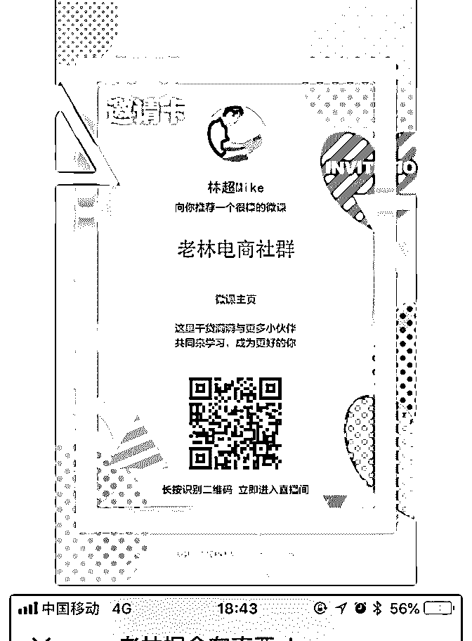
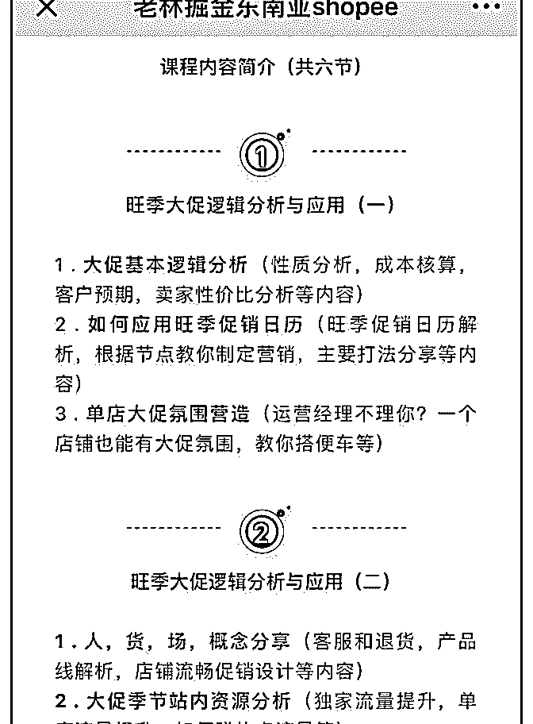
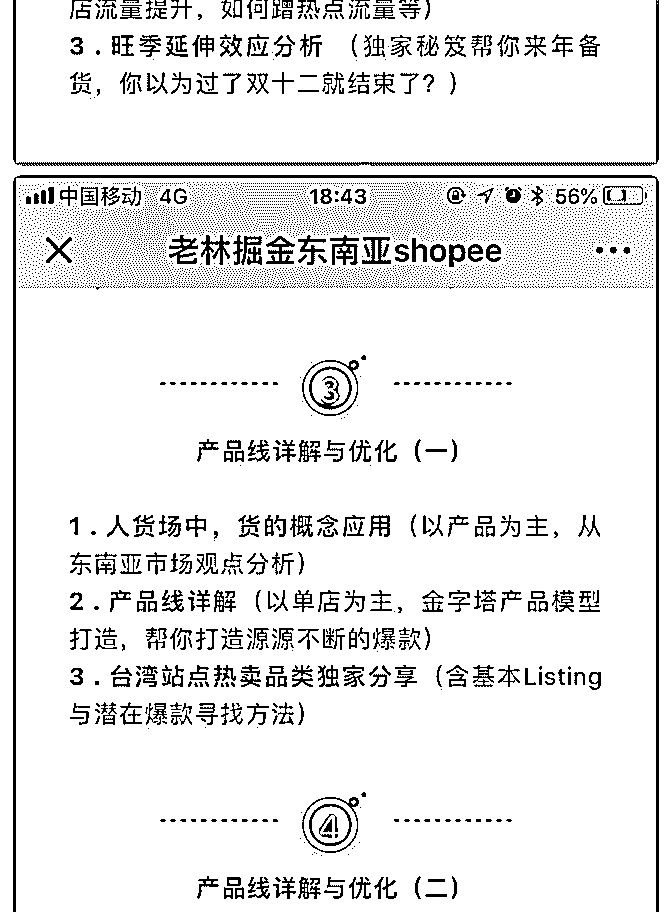
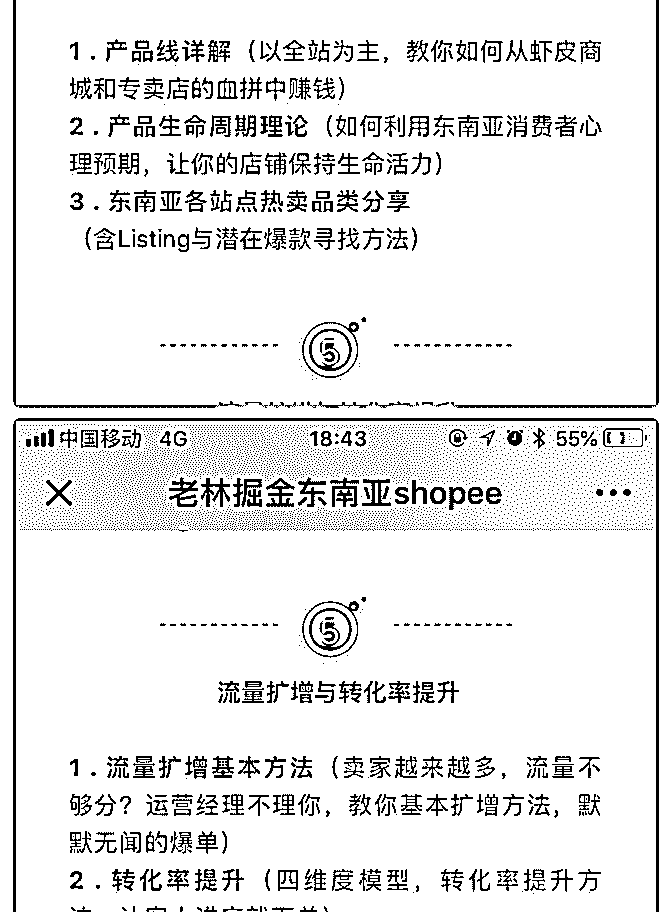
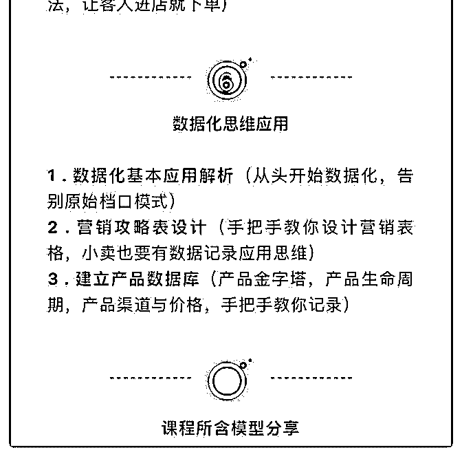
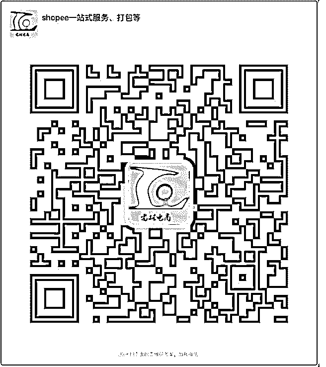

# 523.发个小福利，先说明

林超 Mike : 发个小福利，先说明一下： 1.这是老林的课程，不是 Mike 的，虽然我们都姓林，但我们从 不认识，所以暂不清楚课程质量如何。 2.老林希望我在公众号给他打下广告，为此对于星球里的成 员，若参加可以微信找他领 10 块钱红包（最后的二维码）。 3.三张白底图为他的课程简介，看起来感觉不错，所以 Mike 也 购买了。 4.如果已经有小伙伴参加，可以去领取 10 块红包，另外说说你 们的听课感受，供其他小伙伴参考。 5.投资有风险，付费需谨慎，各位确定需要再购买，不买也没 关系。 6.如果要购买，扫描下面 Mike 的分享卡，微信扫描第一次为关 注，扫描第二次便会弹出课程。

2018-08-20

评论区：

林超 Mike : 课程目前只开了一课，其他的未开课。

林超 Mike : 微信扫描 Mike 的邀请卡，第一次扫描为关注荔枝微课公众号，第二次扫描就会弹出课程，购买后加最后的客

服，说是 Mike 的星球成员便可以领取 10 元红包。

ViVian : 多少钱，这是网络课程吗？

林超 Mike : 价钱是 89，购买后领 10 块红包，即 79。网络直播微课，也可回播，各课程的开始时间扫描后应该可以看到。

林超 Mike : “很棒”是他们系统生成的，我自己还不确定是不是真的“棒”。

林超 Mike : 有去参加的小伙伴可以在评论下方发个“1”，Mike 统计下人数，后面好为大家谋更多的福利。

随风 : 1

咚 : 2

