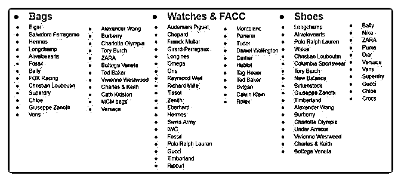

# 538.20180807<

01、印尼热卖产品咨询

02、印尼易侵权品牌，标题若包含相关名称，会被下架。

（见下图 1）

03、8 月第二周周报

04、泰国 Important Information Sharing

05、马来 Important Information Sharing

2018-08-07

评论区：

Marqos : 如上新推荐所示，竞品销量如何估算，热销款式如何甄别

林超 Mike : 你好。除了每周周报，你还可以在前台自己搜索特定产品，各站点前台链接在《百科全书》上附有。目前虾皮

除台湾可以看到销量外，其他站点只能看到评价和点赞度。我个人倾向于以评价的 2-3 倍估算销量，未必准确，只供参考。

每周周报里都是近期热销款式，在前台你也可以通过“综合”“销量”两个维度去筛选，注意综合第一列有“广告”字样的为购买

广告的商品。

Marqos : “以评价的 2-3 倍估算销量”是指历史总销量吧？是否说明各站点的留评率高达 30%-50%？

林超 Mike : 嗯，但这个数据是我凭自己情况的估算，事实未必如此。官方现在还没开放销量的数据。

