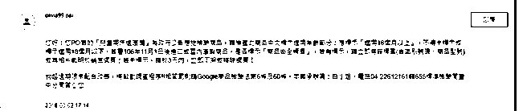
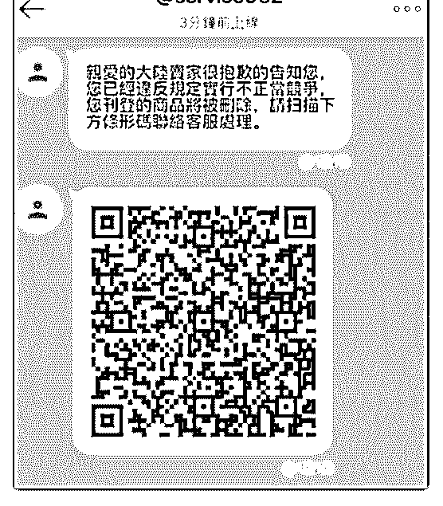

# 544.20180803<

01、【产品的 Product ID 存档方法】（官方：关于大家 listing

的各种问题咨询，我们都需要大家提供 Product ID 才能帮助大

家。鉴于很多卖家反馈找不到 Product ID, 没有记录产品的

Product ID 下面的文档有告诉大家如何保存自己店铺产品的

Product ID, 请大家务必仔细阅读并定期下载。）

02、安卓版最新安装包

03、【店铺扣分说明】

（1）单个店铺计分不超过 2

（2）公司名下扣分达到 4 的店铺数量不可超过此公司名下所

有店铺总数的 5% ，否则将无法开通新店

请您务必确保店铺计分每个季度达到标准，暂无人手经营的

店铺，建议联系商户经理及时关闭.

您可以在 【卖家中心 - 设置 - 卖家计分系统】了解您店铺目

前的计分情况及计分原因详情。

请您务必保存并仔细阅读下面链接文档，了解 Shopee 平台各

个站点的计分规则，避免店铺计分。

若屡教不改，扣分超过 2 分的店铺将被冻结甚至关闭 04、台湾站点近期有卖家收到如下图类似的通知，已确认是 诈骗信息，请大家不要回复操作（下图）Shopee+APK_ 免费 高速下载|百度网盘-[分享无限制](https://yiqixie.com/s/home/fcABQWvNRNDc84U31t5Hfu8qu) [Shopee+](https://yiqixie.com/s/home/fcABQWvNRNDc84U31t5Hfu8qu)[平台卖家计分系统](https://yiqixie.com/s/home/fcABQWvNRNDc84U31t5Hfu8qu)

2018-08-04

