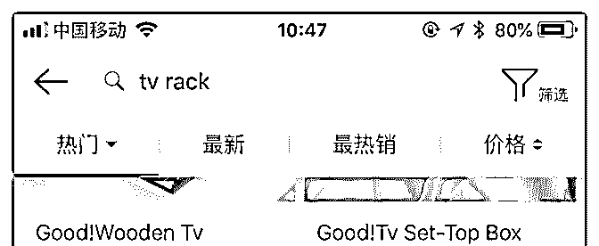
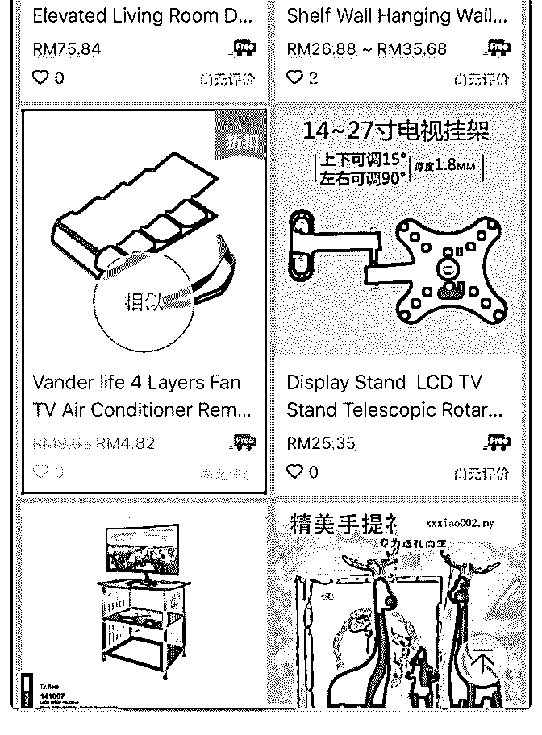
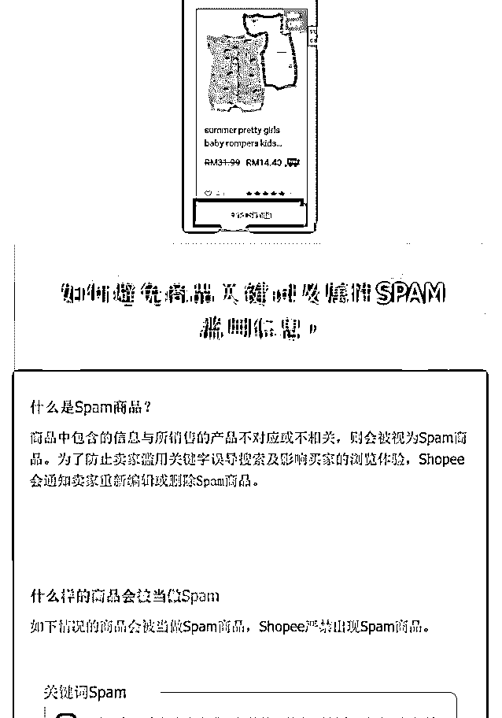
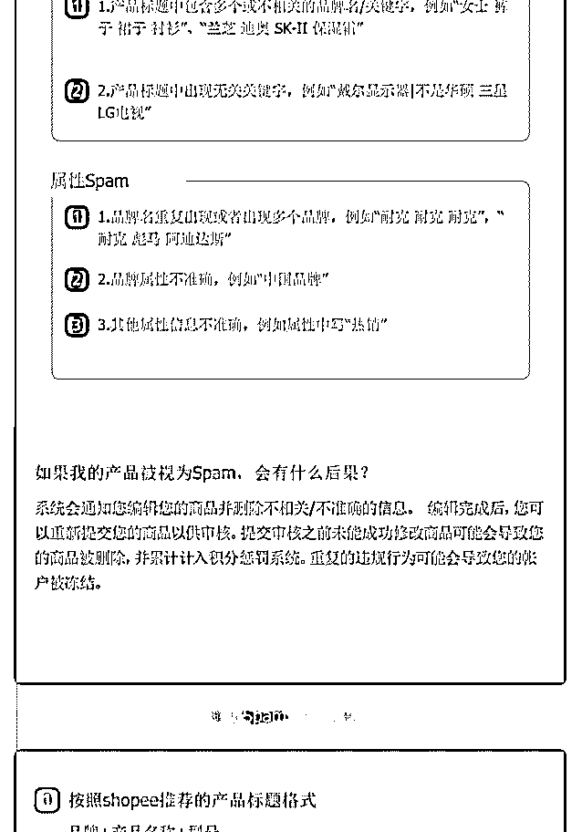
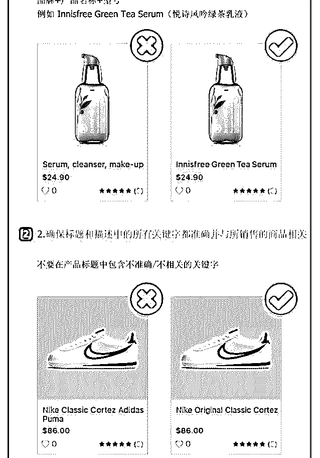
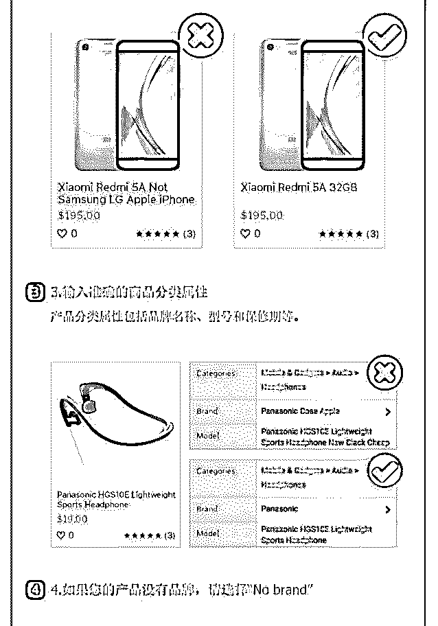
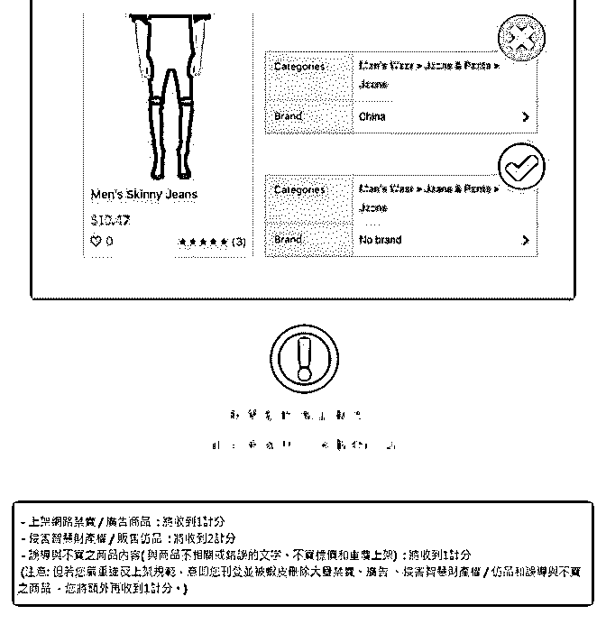

# 571.20180712<

1、Shopee 最近上线了找相似产品的功能，手机端主图长按即

可，目前还不太稳定，经理说只是测试，可能不会那么快全

面上线（若上线影响一定很大，见图 1、2）

2、卖家中心可以查扣分违规详情，具体戳链接：

3、马来站系统每周会检测 Spam 商品，一旦发现未及时更改被

扣分，将对店铺流量有巨大影响，具体看下图 3。

4、台湾现严查品牌和卡通形象侵权，见下图 4。

5、受台风影响，7.10-12 的包裹可能出现大面积延迟和取消，

卖家注意和消费者沟通。另，近来包括东南亚地区也是多

雨、台风天气，各位包裹注意防潮。

6、平台对惩罚积分的监控将会越来越严格，严重违规者将可

能不再得到经理的支持（资料见压缩

包）[How+do+I+check+penalty+point+details?+–+Shopee+Mal...](https://help.shopee.com.my/hc/en-us/articles/360001664747-How-do-I-check-penalty-point-details-)

2018-07-12

评论区：

程远 : 这个好像下载到 2%，就会断掉。是我一个这样吗？

林超 Mike : 什么 2%？

程远 : 就是下载进度条到 2%，就显示下载失败了

林超 Mike : 下载什么？你可以用网页端，还是不行的话找我微信，晚点发给你。

程远 : 网页端不行，不知道你微信哎，Mike

Amandine : 这个压缩包无法下载，手机上打不开，也就不能保存了，有什么办法？

林超 Mike : 电脑端保存打开，百度知识星球，

林超 Mike : 20180710 1.七月第 2 周周报

2.泰国最新禁售明细