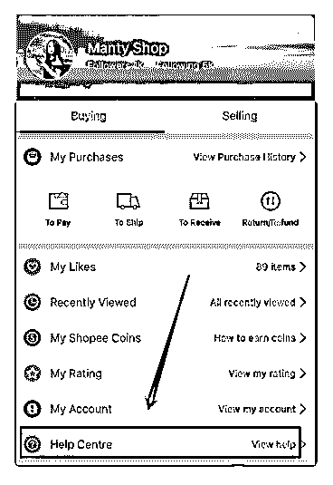
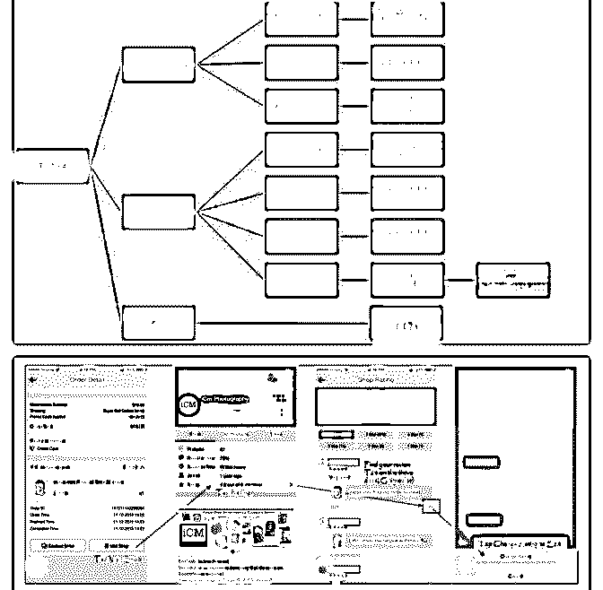
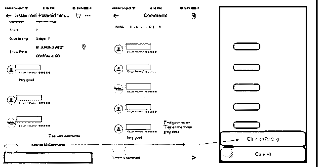

# 593.送大家 4 张很有用的

林超 Mike : 送大家 4 张很有用的图。1、指引帮助中心的位 置。当遇到有买家不知怎么付款或相关操作，可以使用。2、 常见物流问题解决方法。3 和 4 是万一被客户差评后，客户想 修改评价的流程。5、sls 物流异常登记表，大家 sls[有什么问 题，可以在这个网页登记和找到对应的客服联系方式。](https://yiqixie.com/s/home/fcAClsnyqrgJ8Rcls3n4RFsBI?forcerecalc=true)[物流](https://yiqixie.com/s/home/fcAClsnyqrgJ8Rcls3n4RFsBI?forcerecalc=true)  [查件工作簿](https://yiqixie.com/s/home/fcAClsnyqrgJ8Rcls3n4RFsBI?forcerecalc=true)[Cherry](https://yiqixie.com/s/home/fcAClsnyqrgJ8Rcls3n4RFsBI?forcerecalc=true)

2018-06-20

关注公众号"懒人找资源"，星球资源一站式服务

594.老大 我这次没有优

用户 : 老大 我这次没有优选，我看了电脑版的绩效指标，是因为发货时间比标准慢了一天 有一个

spam 产品，是这两个原因没被评上吗 spam 产品在哪里查看？是被平台直接删除了吗

2018-06-20

回答：发货时间不在优选的考核范畴，主要的考核指标看后面的链接。spam 商品你可以在 app 或网页 中的通知查看，如果没找着，可能被删了，可以联系你的经理帮你看下这次没上优选的具体原因。<e

type="web" href="http%3A%2F%2Fshopee.cn%2Fzxxx%2Finfo_6.aspx%3Fitemid%3D216%26lcid%3D10" title="Shopee%E4%B8%9C%E5%8D%97%E4%BA%9A%E4%B8%8E%E5%8F%B0%E6%B9%BE%E5%B

cache="http%3A%2F%2Fcache.zsxq.com%2F201806%2F284e0f304b3d2a150900d1bccac3b001aedc19844f68

/>