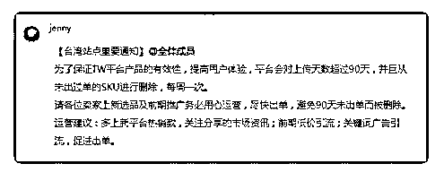

# 637.台湾站点要开始对 9

林超 Mike : 台湾站点要开始对 90 天没出单的 SKU 进行删除 了，每周一次。其他的站点还会远吗？

2018-05-14

评论区：

Tim : 应该不会。你去看看台湾访问日均 ip 其他平台就差了一个数量级，砍 sku 肯定是因为站内搜索比例上去了，可以自动

筛选出优秀产品。其他站点发展还要有段日期。

林超 Mike : 嗯，是的，应该短期内不会跟进台湾的政策。但今年招商好猛，其他站点即使可以铺，流量红利感觉也不多

了。

