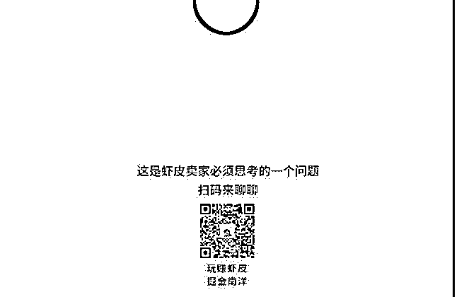

# 639.本周日文章的主题，

林超 Mike : 本周日文章的主题，以后文章都会固定周日发 布。欢迎你先留言跟我说说的你的想法或问题，你的只言片 语，也可能让人醍醐灌顶。

2018-05-10

评论区：

Tim : 前期做杂货铺是利用平台流量红利期。但是任何平台迟早会限制杂货铺的流量。我感觉后期要找到几条适合自己发展

的产品线，其他产品下不下架或者什么时候下架要看周转率怎么样。有一个标准，那么不舍得时候也会舍得。把这部分占

用的资金运用到自己的产品线上去，提高自己核心竞争力。

林超 Mike : 好，谢谢你的分享。

爱唱夜曲的小 马* : 在理

