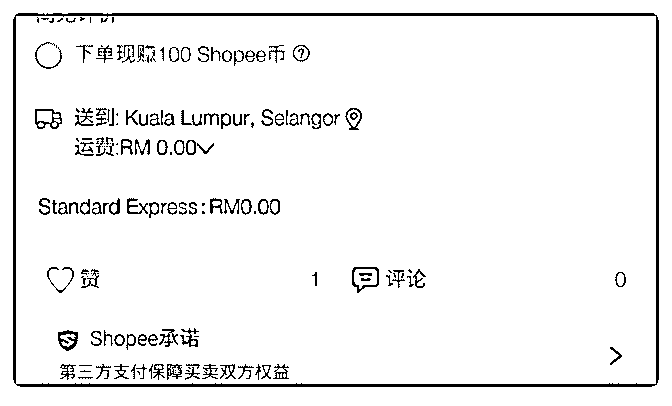

# 640.大林，附图为什么我

王先生 : 大林，附图为什么我的运费是 0，这表示我要支付所 有运费吗？还是什么意思没搞明白。（上传后预览） 这个产品后台设置重量后显示的是 19.99 马币。重量 2.3kg 实际 运费应该是 2300*0.011+6.1+8（拆过 1kg 后每 0.25kg 增加 1- 2rm）=39.5RM 这 39.4 是谁出？ 我可不可以理解为，虾皮出 19.99 剩下的 39.4-19.99=19.41 这个 费用我出？是这么理解吗？

2018-05-10

评论区：

王先生 : 也就是说还是按照 7.99 或者 5.99 计算就对了。

林超 Mike : 嗯，多出的藏价。

回答：显示是 0 是地区问题，你选择其他地区就正常了，A 区 5.99，BC 区是 7.99，系统会根据用户的地址自动变化。多出的 运费，请隐藏在价格里面。不需要你出，但需要你隐藏在价格 里向客户“收”，前台默认显示 5.99-7.99 是为了突出运费“便

宜”。