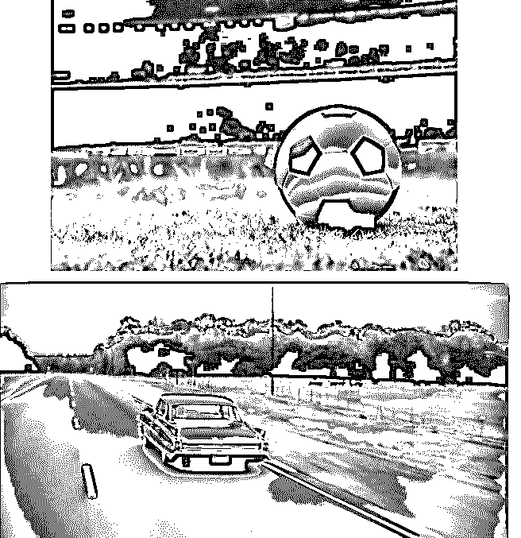
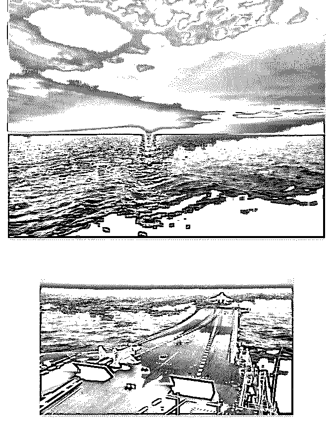
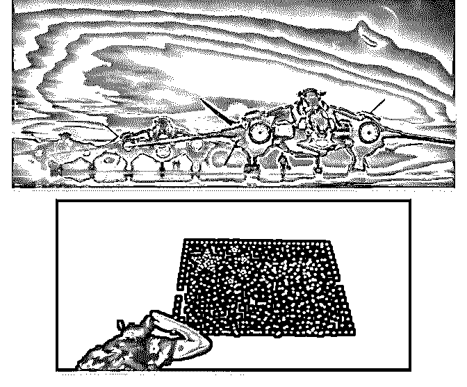

# 今天是教师节，我们

司令 : 今天是教师节，我们时代的老师正在消失。我们记忆中 老师的样子也正在逐渐模糊...

这个社会基础结构的变化，从具象的地方来观察，最具代表 性的就是"路"。城市，农村和路是三个观察社会变革的关键 点。人类社会组织结构变化的观察点，包括教师，医生和美 女。

要观察哪个行业兴旺发达，看哪个行业的美女多就知道了

——以前航空业是高附加值的，空姐都是百里挑一，现在空

姐质量大幅下滑。也许个体的诉求各不相同，但从整体的来

看，美貌是一种能够立刻兑现的资源——随着信息差的弱

化，连接密度的增加，折旧率高的资产兑现的速度会越来越

快。因此，美女会加速聚集在风口行业快速兑现。

教师和医生资源从来都是一个社会的刚需资源。怎么样分配 这种资源，怎么样追求这样的资源的投入和产出比？决定了 一个社会的结构特征。不管西方如何强调人的平等。有两个 基本性的平等，从骨子里大家都是不认的——医生保证肉体 的平等，教师保障精神的平等。这两个核心的东西，是需要 靠购买力来决定的。所以任何社会不管怎么宣传，从根本上 不可能做到，就是生命体对资源的无限需求和有限能力的终 极矛盾决定的。无论个体还是整体创造增量，都是在缓解这 个终极矛盾。

曾经有一段时间，我们人为的强行分配这种资源。古巴做得 更过分，它不计成本的投入医疗资源，包括培养医科学生， 将过剩的医疗人员分配到社区，采用包干到户社区蹲点的方 式去提供医疗服务和保障。让所有的医疗从业人员拿很少的

薪水。这种普世性的公平和保障其实是难以为继的。因为它 把社会上创造增量的资源挪用集中到一个地方。在人体中， 某一个器官过于侵占资源，会被看成病变的肿瘤，因为会危 及整个人体的生存

今天的教育是一种大众化的一种产业。从幼儿园开始老师会 将学生视为商品。因为老师的背后也是商业机构，受市场指 标的驱使。很多人看不清这一点，还停留在以往的思维惯性 之中。如果你都不能给予自己的小孩教育，不要指望商业性 的机构能够弥补你的不足，你的小孩在他们那里只是一个商 品。或者某一个具体的执行者有所不同，但整体不会改变。

小镇青年的悲哀在于：当他们刚刚接触到外面的世界的时 候，互联网迅猛发展，铺天盖地的收割，占据了他们充满好 奇的大脑。他们通过小镇的网吧，本来想了解外面世界的精 彩。然而，所有游戏的推广，首先想到的就是这些网吧。于 是，他们看到的外面的世界是扭曲的。扭曲的视角会形成自 我遮蔽并自我强化。即便有机会都需要费好大的劲才能矫 正。而绝大多数情况下，人会在扭曲中顺着某一种轨迹不断 的坠入深渊。

一个时代终结了。今天是教师节，突然有一种清明节的感 觉，向一个时代告别...

2019-09-10(19 赞)

评论区：

Kevin Yu : 反正社会更需要螺丝钉。我只是希望孩子能做特种的螺丝钉[害羞]

