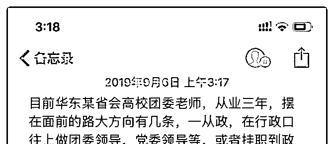
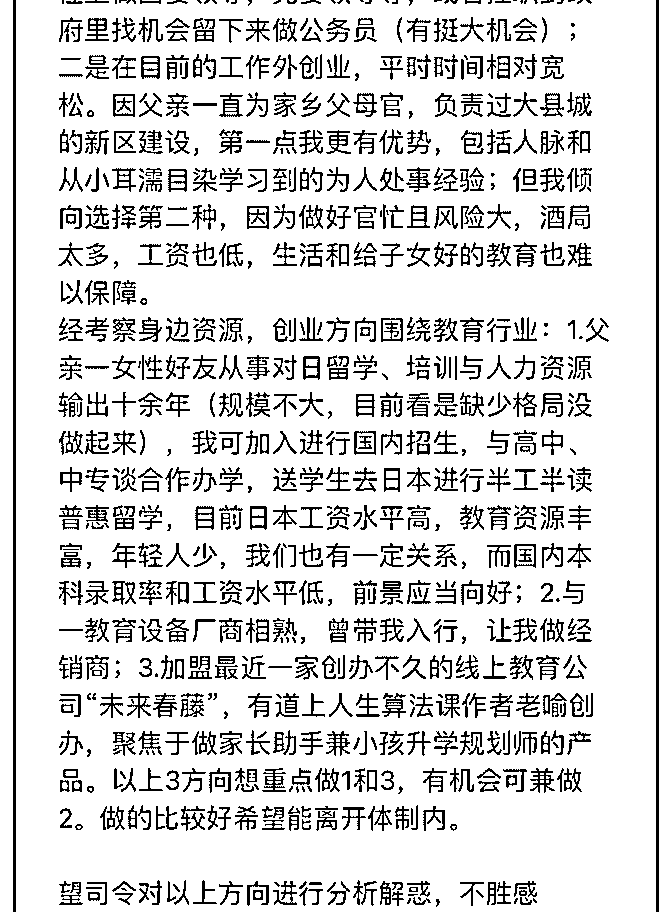
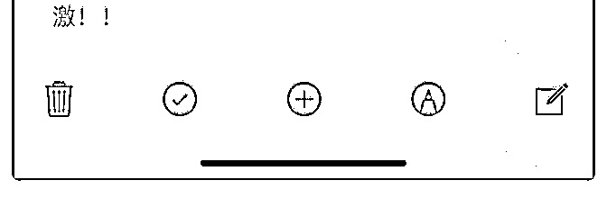

# 司令，就未来的发展

(提问)匿名用户 : 司令，就未来的发展问题请教一下：

2019-09-06

回答：你是一个不太想冒风险，也缺乏开拓特质的性格。你

渴望把手上现有的资源用上，起目的是为了摆脱让自己感到

压抑的现状。 可以这么说，从你列出的所有方案中。你都试

图在存量里面打转。且不管你的方案合不合理，你把故事的

主角换成别人也成立。一个放之四海皆准的模型，往往不会

成为适合某个个体的求存策略。因为所有的策略都是自身作

用于现实的传导工具。 从本质上说，你并不知道自己要什

么。你列举了很多东西都是现成的，并习惯性强化自己现有

资源在未来竞争中的决定意义。这背后恰恰透露出你对自我

存在无力感。坦白讲，你的性格并不适合做开创性的工作。

你只是过于强烈的渴望逃离现在让你不舒服的环境和状态。

你或许时而有冲动，但遇到问题的时候也会时常有退意。你

身上存在的目标感不清晰的自我犹豫。不存在志在必得的勇

气和魄力。你的性格更像一个知识分子，你需要重新审视自

己，而不是你现在拥有的东西。搞清楚你真正要什么，真正

害怕什么真正不能接受什么，不能接受的这个东西的驱动力

有多强。(20 赞)

