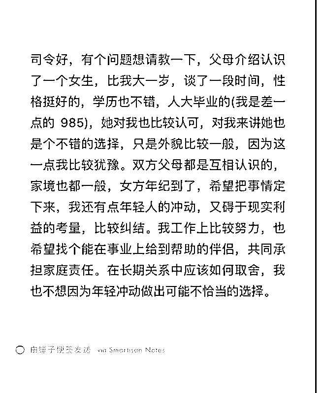

# 没找到付费设置，已

(提问)匿名用户 : 没找到付费设置，已在其他问题下打赏，麻 烦司令了

2019-08-28

回答：你心中已经有答案了，你还问什么呢？任何一种双边

关系都是这样的，从一开始就存在鄙视，它必将导向破裂。

因为鄙视一番会觉得自己亏了，他有一个心魔无药可医。除

非发生重大变故，让自己变成弱势的一方，对方还不离不

弃，出于感激和自我重新定位，这种鄙视的心魔才会缓解活

消散。 而且你对自己的定位和评价都是挺高的，而且你的诉

求有两点：1\. 漂亮 2\. 帮衬 从你的描述来看两个核心需求都不

满足。你现在是碍于情面或者对自己缺乏坚定的信心，才模

拟两可，被裹挟着往前走。则可以预见的未来，一定是心不

甘情不愿，会找各种其他的由头去发泄内心的不满。 一件事

情，然后一开始就做错了，他需要 4 个补救措施，继而需要 16

个措施来补救这 4 个。何必呢！(16 赞)

评论区：

随枫而逝 : 真是一阵见血。

罄 : 哪 4 啊？

