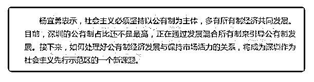

# 司令好！自从要理直

(提问)原来如此 : 司令好！自从要理直气壮发展和壮大国有企 业以来，感觉各个行业都不景气，民营企业在生存边缘挣 扎，似乎除了体制内以及部分相关人员能活下去，其他体制 外的绝大多数都在煎熬！去年底，我们行业的很多客户，感 觉马上就要倒闭了，过完年，又都勉强活了，可能是放水暂 时救活了。目前依然感觉有点像去年的行情，有可能年底比 去年还差！我本人是做国企的代理，对国企有一定了解。国 企的任何一个合同都有可能涉及利益输送，无论他的监管怎 么无死角都无法避免，除非不让他们签订任何合同？既然国 企不属于高管，那么高管完全可以用国家的资源建立自己的 人脉与关系网，相互利益输送！监管严就无竞争力，不严就 会腐败！无产权无恒心？为什么要发展壮大国企？

2019-08-19

回答：你这个问题问的好，就像为什么要建立官僚体系一

样。统治结构的效率很低，问题多多，但它有一个特征——

它能建立起稳定的结构，力量通过结构来聚集也通过结构来

释放。一个动物如果长得很大，首先是它的骨架会先长大，

它的体型越大，越需要骨架的支撑。 你自己创业的时候你就

知道，当你的组织扩大的时候，你不得不建立流程，建立官

僚体系。虽然它会带来各种各样的效率问题，但是它能保证

整体的有序运转，否则就是无穷无尽的内耗。 不管是民营还

是国营，规模达到一定程度，在产业中占据一定分量以后，

它一定是在组织上趋于一致。你所看到的都是下游，甚至低

端，有些本来就是过剩的。 现代企业都是按照股份制，国有

资本占比高，它就是国企，国有资本占地位低，它就是混合

所有制企业。深圳作为一个新的试验田，更多会在股权和资

本的层面，而不是在下游的传导体系上面做文章。目前国有

企业也在改制，改成股份制。所以最后区分国企还是民企核

心，在于股权所有。其它的是治理体系的问题。治理体系中

的各种问题，包括腐败效率低，激励机制，知道到了一定规 模，不管是哪种体制都会存在。以前国企的规模很大，而民 企的规模都非常小，所以把组织的官僚体系和治理体系中的 各种问题归于国企的问题。以前我的公司里负责跟客户充值 的人都拿人家回扣，我们可是 100%的私人企业。这是治理问 题，跟所有制没关系。 另外一个就是要统筹，它是个实验 田。1978 年的实验田而今天的实验田是不同的。1978 年的实 验田上面的人真没有概念。也没有政策研究和配套的规划机 构。今天是带着方向性顶层设计规划的产业政策，他们需要 一个传导体系去统筹执行政策。过去建个厂来料加工就可以 解决吃饭和普通人的就业问题。今天的实验田是做芯片，高 端产业。这些东西的长周期重投入，完全靠自然生长，那个 时间比较漫长。但迫在眉睫的现实往往不会给你那么多时 间。(9 赞)

评论区：

原来如此 : 非常感谢司令！之前的思维模式一直停留在国企会低效腐败利益输送等等！是过度关注国企存在的问题，私企

壮大了也低效腐败利益输送，与国企一样！私企壮大后，发展到一定阶段，就是准国企，国企存在的那些毛病一样都不

少！国家不一定需要控股私企，通过金融窗口指导也能完全控制一家大型民企！例如前几年的首富万达！

Dilink（撸房帮* : 阿里，京东，百度，腾讯。这些大企业也都有腐败。有权利就会有腐败，这个跟制度无关。权力和腐败就

像是阴和阳本来就是一体的。

