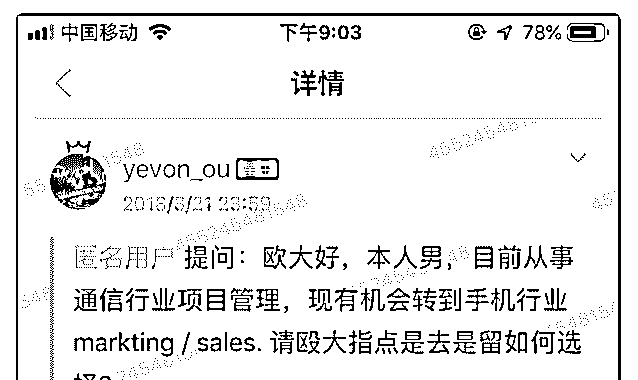
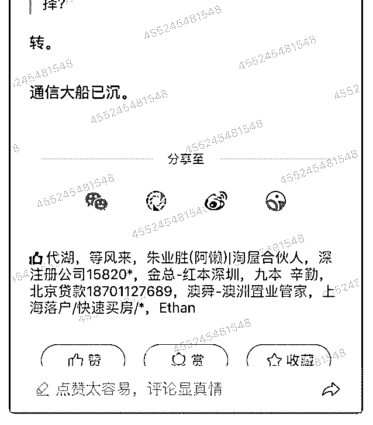

# 司令大人，看 18 年

(提问)奥特曼 : 司令大人，看 18 年欧神判断通信行业大船已 沉，并规劝通信行业从业者换工作。

可天天看新闻菊厂那么牛逼，更是国家重点扶持对象，怎么 会不行呢？

有点想不明白

2019-08-17

回答：结论不重要，重要的是得出结论的方式。任何人都可

以得出一个结论会的一个判断，但这个结论和判断怎么得出

来，这才是关键之所在。为什么有的人得出结论和判断是正

确的，而你得出的结论和判断是错误的？所以关键要搞清楚

那个思路和认知的出发点。 我记得我曾经说过，当一种技术

或者一种资源被广泛利用的时候，它一定会向上累积出一个

产业继而形成一种瓶颈。产业一般有 4 个周期，萌芽期，快速

发展期，成熟期和衰退期。创造一个行业，创造大机会大行

情的是第 1 个周期。比如说 15 年前的电商。这个周期是创造大

机会大行情的，但最大的痛苦在于不确定性的因素太多，可

以支撑的东西太少，很容易死在黎明前。挣大钱，挣快钱的

周期是第 2 个周期。这个时候野蛮生长，烈火喷油，跑马圈

地。初期的混乱和出奇的增长。承受稳定期，是并购的时

候，是能发挥规模，资质，资金优势的巨头们的机会。这是

一个整合和收割阶段，加速淘汰也强者很强。这个周周期，

某一种技术一定会成为一种底层标准，在这个为了这个技术

或者这个资源做成的产品，一定去标准化，极度薄利，只有

高效率大规模集约化才能存活下去。第 4 个周期是逃生的时

候，睿智的者这个时候会卖掉，不惜代价，但绝大多数人看

不见危险，关注眼前小利，会等到图穷匕见那一刻，最后沉

没。 通讯行业现在确实处于稳定期。通讯行业的核心一是运

营商，二是通讯设备制造商。这二者最好的时候是 10 年前。 今天这二者的业务确实比较饱和。一个产业处于衰退的时 期，谁扶持都没有。诺基亚可是芬兰的国家支柱产业和品牌 象征。他会举国之力支持的，但是依然救不了他。创造增量 的是市场，权力只是分配资源，更好的去创造增量。分配就 是这里多了，那里就会少。如果这种资源配置不能在这里创 造增量，那要维持它的繁荣，就是挤压了别人的。你觉得今 天华为是挤占别人的资源吗？华为在创造增量！ 大家不要把 通讯行业和基于通信之上的数字服务混淆了。产业是一层一 层往上累积的，上一层的空间和规模比下一层要大得多。今 天手机业务也好终端服务也好，企业云也好，人工智能和芯 片也罢，这种东西不是通讯行业。而是基于数字服务和消费 衍生出来的产业。 就通讯本身而言，他没有萎缩，只是他在 成为更底层的基础服务，一旦一个东西成为基础服务态度， 必然形成市场垄断和规模化。普遍性的机会肯定没有了。(13 赞)

评论区：

司令 : 欧同学习惯于直接说自己的结论，但从不解释。你们一个个只会在后面点赞，拍手，膜拜，然后自己一知半解，知

其然而不知其所以然。[偷笑]

。 : [强]

奥特曼 : 谢谢司令解答[玫瑰]

司令 :