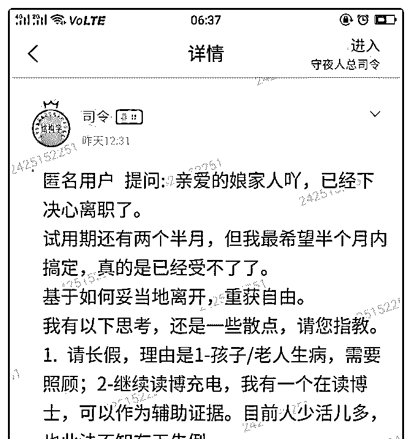
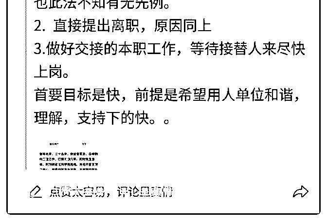

# 解铃还需系铃人，跟

(提问)匿名用户 : 解铃还需系铃人，跟你的领导谈好好谈一 下，他如果理解的话，他会把那些事情都给你处理好的，他 如果不理解，你硬来的话，你做各种操作都会有纰漏。

所以你找他好好坦诚的谈一下，把你真实的想法，你的诉 求，你要离开的原因。以及后面的交接，如何不影响正常的 运作都跟他谈清楚。他理解了就会把那些扫尾的事情给你做 好不留痕迹。

您感觉在谈的时候，需要如何做，能最大限度得到对方理 解。有哪些忌讳？谢谢啦

2019-08-03

回答：竟然是要赢得别人的理解，那首先得搞清楚对方的诉

求，你不能在对方最关心的事情上硬来。同时必须明确的传

递信息，不要含糊不清，以免对方误会你在矫情或者是在为

博弈创造筹码。 具体来说，首先曾要感激别人给予的机会，

承认自身的不足，并表明自身的这种不足在现有的状态中对

组织和自身造成的不便。要传递的信息有两点：1.这种纠结不

是通过某个细节的调整能够改变的，感谢别人给予的机会，

和其他人创造的条件，但自身确实做不到。2.自身极度渴望从

中解脱出来。在表述的时候务必态度诚恳，不要提意见，也

不要抱怨。 其次，要从人家的视角出发，如何做保持原有体

系正常运转，也就是说不给人家添麻烦。对方真正在意的事

情是，你走了以后，他手下会不会乱成一锅粥，他对上上下

下是否能够有个交代？如果你都安排妥当了，别人也不那么

强烈的挽留。人家怕的就是你把一个烂摊子扔在你不管自己

拍屁股走了，你让他怎么做，你让他怎么向周围和上下交

代。所以在谈的时候，务必打消人家的这种疑虑。以事实说

话表明一切都安排妥当，无缝衔接，不影响运作，也不影响

业绩。 最后，诚恳的向对方表达你，在脱离这个组织以后， 能够为对方提供什么样的价值。这方面实事求是，不夸大其 词不信口开河。态度明确了，问题谈清楚了，交接安排清楚 了，最后来个甜点——即便我离开了，不管是与单位还是与 这位领导，都可以有其他方面的，有价值的合作或者服务。 这些点都处理好了，对方没有必要去为难你。剩下来就是一 个流程。(8 赞)

