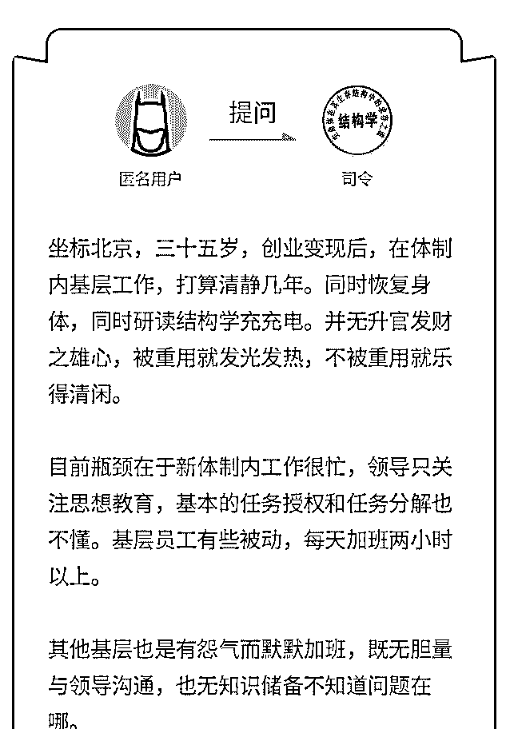

# 亲爱的娘家人吖，已

(提问)匿名用户 : 亲爱的娘家人吖，已经下决心离职了。 试用期还有两个半月，但我最希望半个月内搞定，真的是已 经受不了了。

基于如何妥当地离开，重获自由。 我有以下思考，还是一些散点，请您指教。

1\. 请长假，理由是 1-孩子/老人生病，需要照顾；2-继续读博 充电，我有一个在读博士，可以作为辅助证据。目前人少活 儿多，也此法不知有无先例。

2\. 直接提出离职，原因同上

3.做好交接的本职工作，等待接替人来尽快上岗。

首要目标是快，前提是希望用人单位和谐，理解，支持下的

快。。

2019-08-02

回答：解铃还需系铃人，跟你的领导谈好好谈一下，他如果

理解的话，他会把那些事情都给你处理好的，他如果不理

解，你硬来的话，你做各种操作都会有纰漏。 所以你找他好

好坦诚的谈一下，把你真实的想法，你的诉求，你要离开的

原因。以及后面的交接，如何不影响正常的运作都跟他谈清

楚。他理解了就会把那些扫尾的事情给你做好不留痕迹。(0

赞)

评论区：

大海 : 一线城市 哪有企业不加班的？

光影间 : 你能看完题再喷吗

