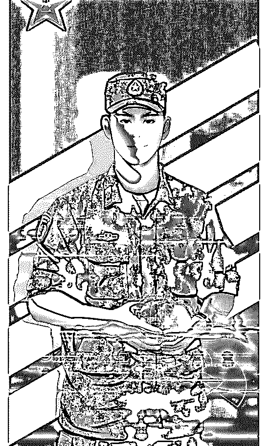
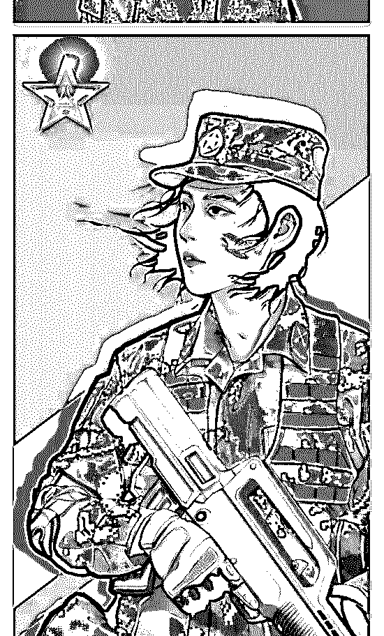
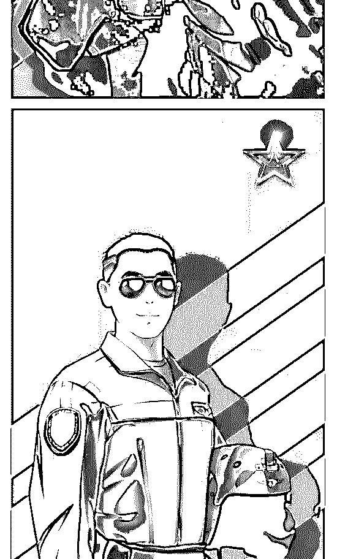
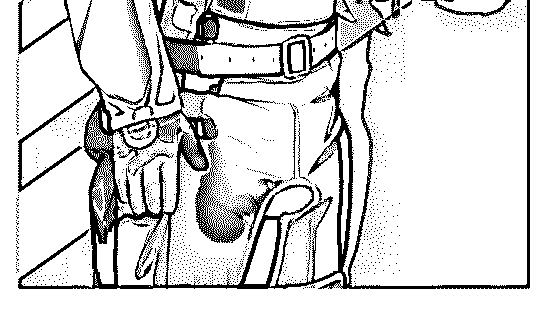

# 军队是一个完备的体

司令 : 军队是一个完备的体系，万人敌的勇略，绝非逞匹夫之 勇：一个信念，一个组织，一套规则！

在 960 万平方公里的陆地和 300 万平方公里的海洋之上，一 个波澜壮阔的时代图景正在编织之中，不管有意还是无意， 你我都参与其中：我们正在完成一个社会基础结构的整体性 升级。

斗争不一定是紧握钢枪，棋在局之外，我们为自己执棋，落 子无悔。一个蓬勃发展的社会，鼓励他的个体在任何领域进 行各种可能的探索，并会给予这种探索以丰厚的回报。民族 的复兴并非宏大的叙事，它就在生活的日常之中… 力出一 孔，力争上游。

从这个意义来说，每个在自己生存结构中寻找出口的人都是 战士——人与天奋斗，其乐无穷；人有地奋斗，其乐无穷； 人与人奋斗，其乐无穷！奋斗是不坐地打滚，是解决问题， 是寻求突破。

大丈夫，当如卫霍，驱十万众，纵横沙漠，开拓漠北，封狼 居胥。这是自由的国土，勇士的家乡。向秩序的守卫者和开 拓者致敬！

2019-08-01(27 赞)

评论区：

罄 : 司令要当司令了？

晒太阳的海豹 : 八一建军节

TK : 封狼居胥[强]

冥宙 : 兵典千年史，血肉铸刀锋

