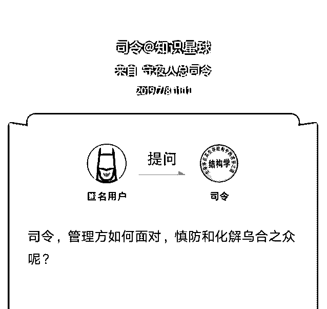
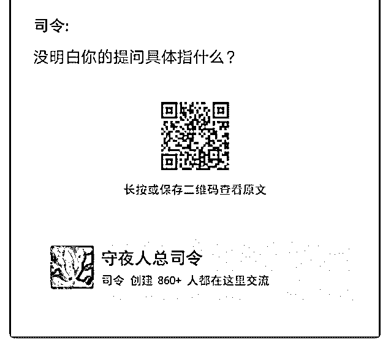

# 司令，对于客户群体

(提问)匿名用户 : 司令，对于客户群体有时候无底线投诉（例 如买贵了退房，或者被限价品质有下降），或者面对修建某 设施被民众投诉，或者面对 sz 南面城市的群体案例。管理方应 该怎么化解？处理？因为听到最多是法不责众，只要人数 多，人数多就意味着占据道德制高点，就能给对方施加压 力，期待迫使对方接受己方的诉求。

2019-07-08

回答：这么简单的事你都不会处理吗？《结构学》怎么学

的？我给你举个例子你就会懂了，你看来给你讲理论没有

用。有一次我去参加街道办的一个座谈会。那个主任在座谈

的时候呢，聊着聊着就突然问了一个问题。他说假如各位是

我的话，面对一群人来堵门闹事，你们会怎么处理？因为我

坐的位置靠他比较近，他就先让我来说。 我说，这事简单：

政府是人民公仆吗？你不能让人民都堵在门口，对吧？你得

把他请到屋里来坐，但是屋子里坐不下呀，对吧，就请他们

派出代表到屋子里面来谈。只要他们推选出代表，不管几

个。他们就形成一种信任捆绑。那想代表，既代表他们的利

益，同时对他们也有所约束。如果没有这种影响力，他们就

不会推举他。你看，你把要面对的群体缩小了，一下就缩小

了，而且他们自己形成了一种互相影响的捆绑。然后把这几

个人请到屋子里去，每人上一杯茶。 这几个人刚开始肯定是

义愤填膺的，对吧？我会先听着，听了一会儿以后我告诉他

我级别不够，我得请你们推举一位代表到管事的办公室去面

对面谈，解决问题。慢慢的他们就会由人多势众，变成形影

单调。但是他们已经用生活中的信任，彼此担保了，捆绑在

一起。只要与最后那个人达成了协议，他就会去说服你外面

的那几个人，然后外面几个人就会说服门外面的那一群人。

这个结构特征决定了这样的一个结果导向。 所以现在的问题

就变得简单了，该客气客气，该讲政策讲政策，该严肃纪律

就得严肃纪律，讲明后果。在办公室里面是你一群专业的 人，对他一个没有准备的人。难道还讲不清政策，达不成协 议，解决不了问题？ 结果那个主任很高兴，拍拍我的肩膀说 你可以从政。而我脱口而出说了一句非常愚蠢，收不回来的 蠢话：我对刀笔小吏不感兴趣！感觉空气瞬间凝固了，他的 表情很丰富，我也非常的尴尬撇嘴

评论区：

行云流水 : 司令确实适合从政，而且是要做大领导的那种，不然真的太浪费你的才华了。[偷笑]

bfhrhd : 学习了！

司令 : 这都是些雕虫小技，不要沉迷于术。结构学本身的那些原理决定了这些浅层次的术应用。

TK : 原来司令也会有尴尬的一刻[呲牙] 那我就放心多了

c z : 司令搭建好理论，拆掉了脚手架，理论建筑充满了美感，我们学习起来却是有些难了。司令有空的话多来点案例[呲牙]

Rosebud : 司令适合在党政军任职。

yean : 一加一等于几，二，拖出去，你知道的太多了！

白马非马 : [捂脸][捂脸][捂脸]

