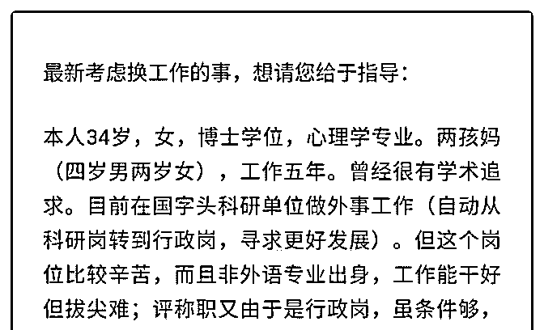
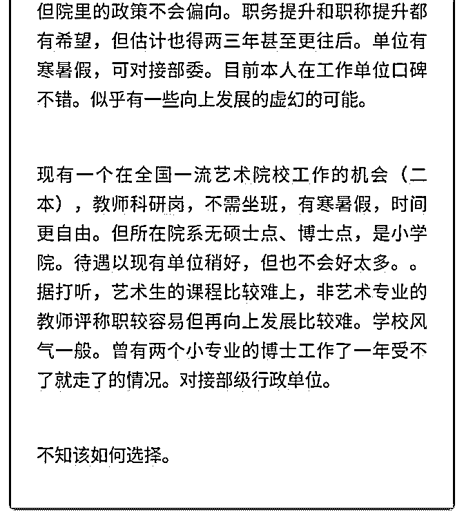

# 司令 本人太太，有

(提问)匿名用户 : 司令 本人太太，有职业选择事宜请教，恳请 您指导。

2019-07-07

回答：你的困惑在于你没有目标同时设置条条框框太多。你

已经没有了学术追求，却只能待在学术单位里面，这本身就

是一种自我束缚。广阔天地才大有作为，那个天地不广阔。

研究型的学术机构是行政机关的咨询机构，平时他就是按部

就班的稳定输出，除非国家战略处于某种结构性调整，它就

会突出，比如说，嗯，之前研究海洋的那些人现在就吃香

了，因为国家战略开始推向海洋，所有对海洋，地缘，甚至

水文和环境有研究的人，都会变成香馍馍，因为这是国家战

略的方向，所以是资源往那里投。 我不知道你现在是什么样

的研究机构，侧重于哪个方向？所以无从判断他现在处于什

么样的周期之中。如果在一个没有周期切换的赛道之中，只

能稳定的按部就班的输出，没有太大的波澜，你几乎能一眼

看到多年后自己的样子。你内心到底是追求突破还是安稳？

这一点你务必问自己问清楚。另外，如果你是想突破，往哪

个方向突破，加官进爵是一种突破，在一个细分领域搞出自

己独特性的成绩也是一种突破，这种突破前期会比较艰难，

但是这个细分领域一旦成型，你就会成为这个细分领域的权

威。那你要问自己驱动自己的原动力是什么？这种原动力是

否可以持续？一种不能持续的原动力，很容易受周边环境所

影响，你会将你的时间精力东一榔头西一榔头的投入。曾经

有一个师兄，也是一个博士，他本来在部委的一个很好的单

位，然后他一会又跳到那个部位的那个单位里面去，他这些

年不停的折腾。一方面我惊叹于，他居然能在不同的部委里

面来回穿梭，这说明能力非常强。另一方面，他一直处于那

种状态，白白浪费了他的才华和能力，没有做出什么来。有

一天他积攒着在想人脉和前期的优势消散以后，他就没有动

的筹码了，也就没有人买他的账了。所以他现在开始有点茫 然和焦虑，甚至抱怨书读多了。 我发现你存在一个明显的悖 论，一方面呢，你放弃了专业优势去选择行政方向，这说明 你存在一种在金字塔中向上的野心，但是你有厌恶风险和艰 难的挑战，如果存在一条快速上升的通道，还没有风险和挑 战，那还不挤破头啊。任何获得都需要支付对价的成本。欲 将取之，必先予之。 你要想清楚你到底适不适合挑战，如果 你不适合挑战你厌恶风险，你遇到困难的时候会退缩。你渴 望按部就班的稳定，我觉得你还是在原有单位慢慢熬，期待 时间去熬出机会来。如果你发现那种渴望出人头地，有野 心，驱动力源自于对自我价值的认定，那一两样的话，你可 以选择后者，因为别人失败并不表示你会失败，大家处于不 同的环境之中，人各不相同。破格获取必须忍受不确定，自 己是去创造增量，创造条件，搭建结构。把自己擅长的地方 做成一个新的赛道。那样才能快速的异军突起，哪怕是一个 细分领域。 抛开自身的特征来谈选择，这是错误的。生命体 的求存之道首先源自于自身，其次源自于自身所处生存结 构，然后我们才根据其目的来谈求存之道。(20 赞)

