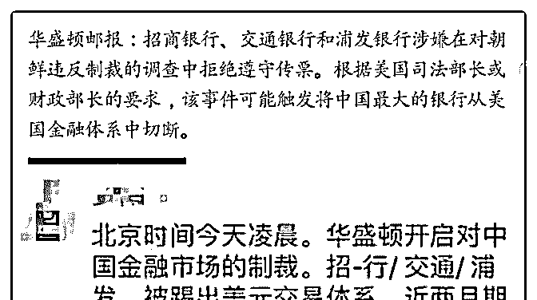
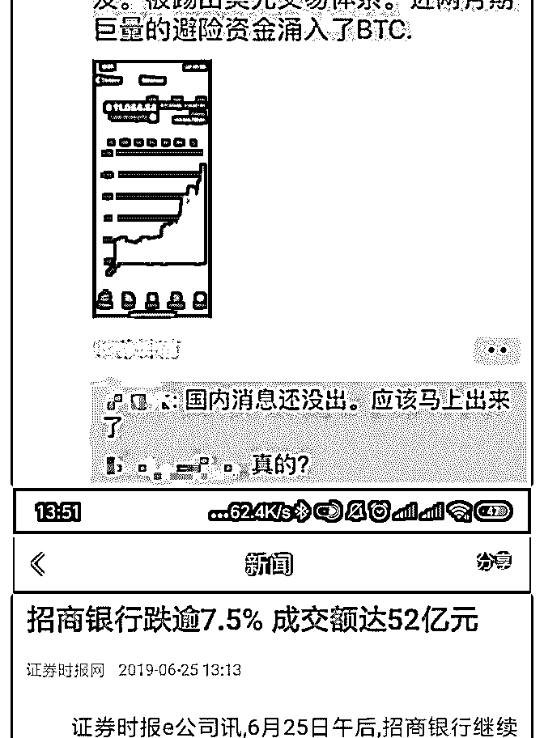
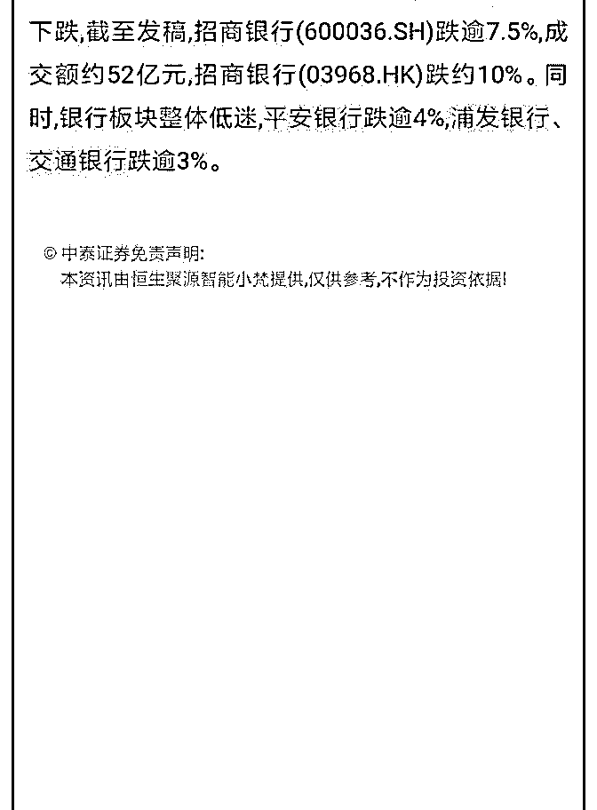
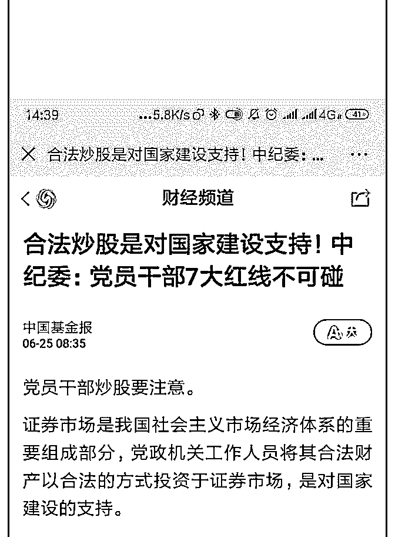
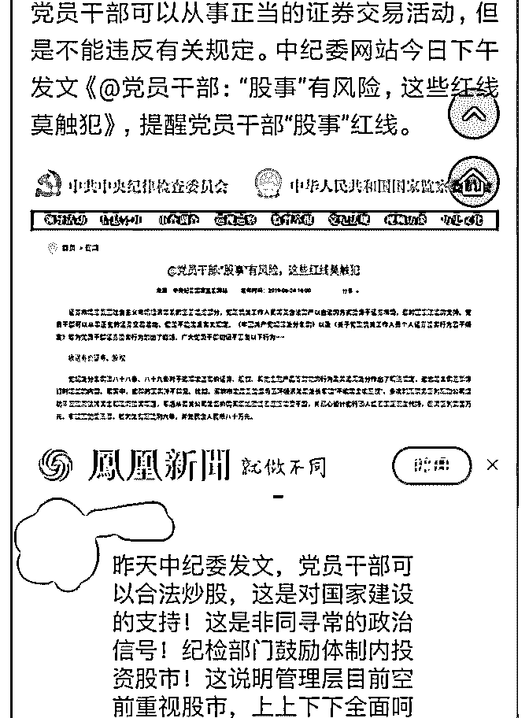
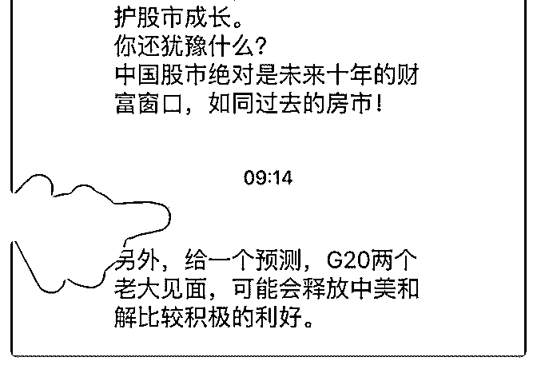

# 司令，对于合法炒股

(提问)匿名用户 : 司令，对于合法炒股的指导文件。可以解读 为制造预期，对冲可能的市场动荡吗？

基于生命体的求存策略。这种口号式的指导文件应该不会有 多少作用吧。

2019-06-25

回答：就是里面不是有一篇文章写过吗？不要对科三板抱有

太大的希望，阐述了原因。你自己去看看。这些都是借口，

其实是早晚的事，我们在 A51 帝国必将远征里面阐述清楚了。

自成体系正在加速，撕裂也在加速。大宗商品会跌，黄金会

有一波涨。石油上涨的预期主要源自于供应成本的提高——

生产没问题，需求其实是下降的，上涨预期主要是运输的成

本和风险增加了。 最近我一直空仓，而且从不碰银行和科技

股。(9 赞)

评论区：

司令 : 我记得年初的时候好像说过不要去碰银行股，也不要碰科技股，因为在大行情下，我们做出了一个判断贸易战的判

断。我不知道你们有没有执行纪律，反正我自己是执行这个纪律的。

