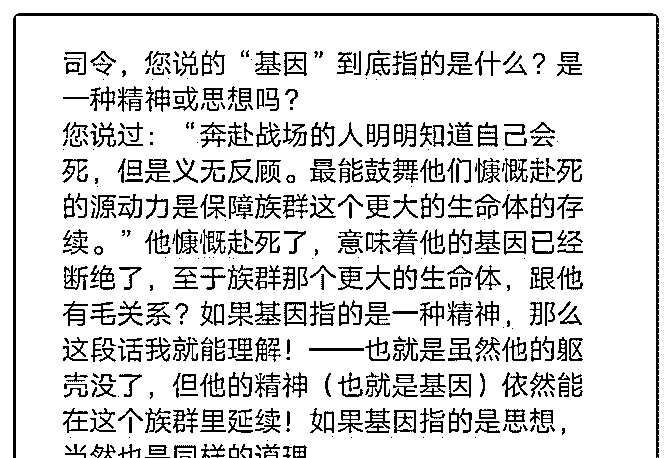
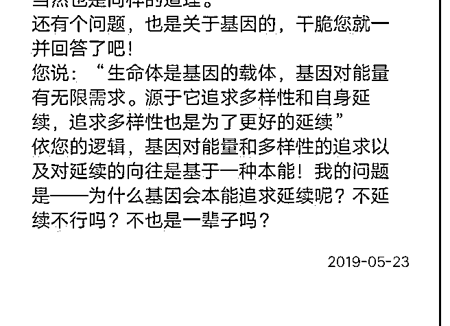

# 两个问题：1、您说

(提问)匿名用户 : 两个问题：1、您说的“基因”到底指的是什 么？2、为什么基因会本能追求延续呢？不延续不行吗？不也 是一辈子吗？感谢

2019-05-23

回答： 自己读一下没写完的《结构学概论》很多东西都已经

写在文章里面了。说了先把精华里面的看完，然后再看别人

的讨论。就是不看，然后不停的问重复的问题。 我刚才又忘

记关手机了，突然被吵醒。你们凌晨一两点都不睡觉么？(3

赞)

评论区：

罄 : 简单点 就是你要活在必须吃饭，你能不吃饭一辈子吗？

1800 口 : 这样说吧，你的祖上能一直延续到你这一代，都是基因求存求续的结果。而你不打算续下去了，是你祖上基因的某

一部分断了，大部分还在延续。而你自己的基因因此全断了，那是别的基因对你的基因的完胜，基因还是延续的，不过不

是你的基因而已。所以基因的本能是求存求续，选择断链，即使是主动，客观上也是因为总体上输掉了竞争而断续

丛林法则 : 第一次看原文时，就有一种灵魂寻找宿主肉体的诡异感。为了家人治病，求神拜佛的事做了不少。神婆会问重

病之人的父辈有没有未成年即亡的人？如果有，生存机会就要被人抢夺

