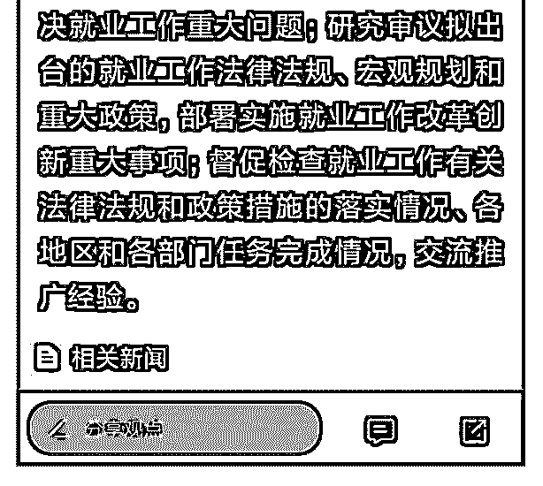

# 司令，这是国家在未

(提问)Dilink（撸房帮* : 司令，这是国家在未雨绸缪为持久战 做准备，还是说经济运行数据已经差到如此恶劣的情况了？

2019-05-22

回答：(2 赞)

评论区：

Dilink（撸房帮* : 明白了，这是政策的延续

司令 : 我一个多月前在觉悟社跟你们说过，不要去碰科技股，选择跟生活息息相关的利润好的有规模的企业。为啥呀？现

在知道了吧！

Rosebud : 比如说教育

Dilink（撸房帮* : 刚才的追问被吃了。不清楚哪里触发敏感词了

小麦 : 维持经济体系稳健发展吧！ 产业转型升级、新旧动能转化，体系转变，结构优化，供求匹配调整。 我们本来就是学

习香港的，一丢丢的毕业生，农民工，改善就业和再就业的解决方案，建立职业培训机制，改革就业法规和政策也差不多

到了进程。 就不能乐观的向往国家变好的路子看？希望任何一个公民不落队，难道总是天天的扶植优等生吗？

Dilink（撸房帮* : 与民生相关的行业接下来会有经济刺激措施吗？司令认为会以什么样的形式保民生保就业？

司令 : 8, 放开环保，停止城市的整治，允许低端产业。放开基建，总之能够创造低端就业的都会逐步放开。先要渡过难

关。

Dilink（撸房帮* : [玫瑰]

