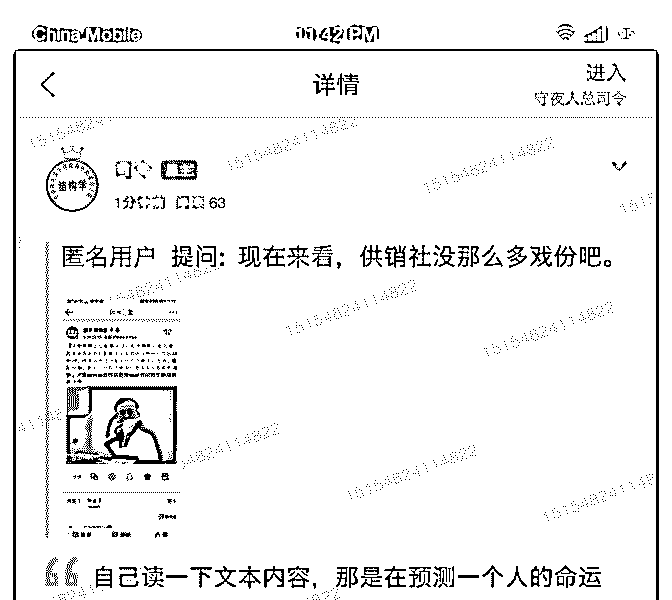
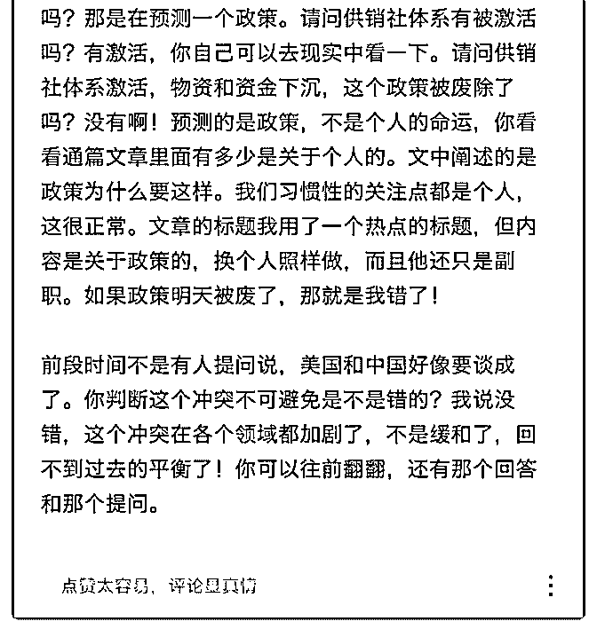

# 刚才那个提问被系统

司令 : 刚才那个提问被系统瞬间删除了，留个截图底稿。应该 不让讨论这个问题。那个回答和这个回答是差不多的。我们 一直说预测的是政策，不是个人的命运，大家可以重新回去 读一下 C12，看看文章的主体讲什么？如果政策被彻底废除 的，那就是我错了，如果政策没有废除，换个人照样执行。 2019-05-19(8 赞)

评论区：

Dilink（撸房帮* : 供销社是个体系，体系的重建不因个人而废止[强]

1800 口 : 有点不明白。决策者又不是司令，决策者有自己的精神结构，司令是凭什么推断决策者会选择这样的政策的？

