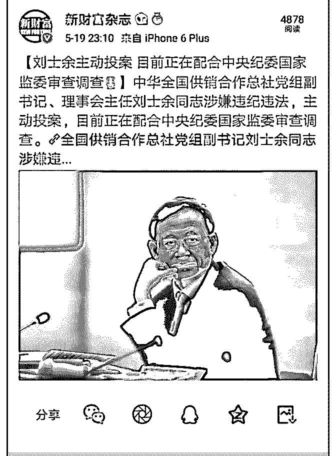
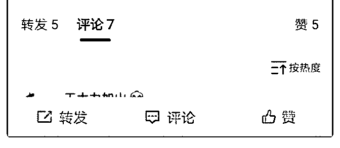

# 现在来看，供销社没

(提问)匿名用户 : 现在来看，供销社没那么多戏份吧。

2019-05-19

回答：自己读一下文本内容，那是在预测一个人的命运吗？

那是在预测一个政策。请问供销社体系有被激活吗？有激

活，你自己可以去现实中看一下。请问供销社体系激活，物

资和资金下沉，这个政策被废除了吗？没有啊！预测的是政

策，不是个人的命运，你看看通篇文章里面有多少是关于个

人的。文中阐述的是政策为什么要这样。我们习惯性的关注

点都是个人，这很正常。文章的标题我用了一个热点的标

题，但内容是关于政策的，换个人照样做，而且他还只是副

职。如果政策明天被废了，那就是我错了！ 前段时间不是有

人提问说，美国和中国好像要谈成了。你判断这个冲突不可

避免是不是错的？我说没错，这个冲突在各个领域都加剧

了，不是缓和了，回不到过去的平衡了！你可以往前翻翻，

还有那个回答和那个提问。(5 赞)

评论区：

Kevin Yu : 我倒是更多的感慨人。司令评价过，上头对刘工作还是认可的。但现在看来，调离，或许就注定了这一天。搞政

治的有搞政治的无奈。

司令 : 个人的命运越到高位越难以左右，那是经过多方博弈的。人到无限风光时，往往就是险象环生之时。树欲静而风不

止。所以才有人在江湖，身不由己的感叹。 我更关心政策的延续性。外部冲突加剧，必须开发内部市场。中国社会必须由

生产型社会转变为消费型社会。内生的市场必须下沉扩大和延展。这是结构性特征决定的及未来发展的方向。拼多多已经

展示了市场下沉的巨大威力。

。 : 产业加速中高端攫取利润+进口替代，大量就业人口转向消费服务业？

司令 : 产业结构升级，是这个方向。不过过程没那么顺利，有很多现实问题需要来来回回的折腾。方向绝对是这个方向不

会切换。低端淤积过剩的产业会向东南亚转移。

。 : 那只有各种各样的服务业，能填补低端制造业转移之后的就业岗位了

小麦 : 产业升级不止是国内，一路一带将要带着高铁，华为，格力，，，并跑，领跑的角色投资全世界。走出去战略棋局

包括自己也打造苹果宝洁星巴克再工业化的全球战略价值。

小麦 : 完成不了政略任务，废了废了，顺便把保管的国家财富退回来。 供销社强化原始创新，增强源头供给，战略布署从

来不是加戏。

小麦 : 哈，好像没有结合多间上市公司 st 的事情

