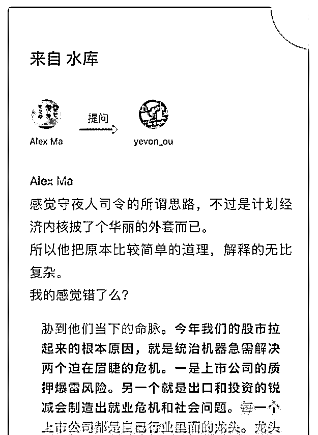
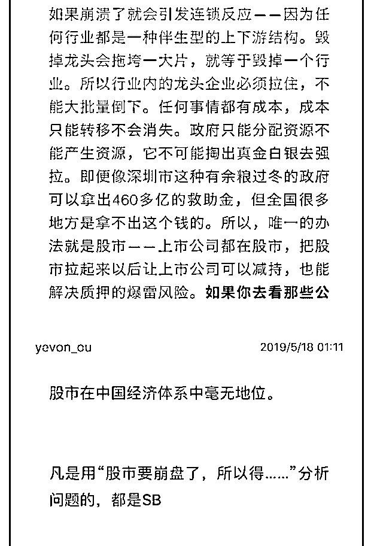

# 司令，你如何看待欧

(提问)匿名用户 : 司令，你如何看待欧神的这个回答？

2019-05-18

回答：我有种不好的预感，有人试图耍猴，而我不想成为那

只猴！我知道你们期待什么，但是我不会上当！如果真的有

问题需要跟欧成效争论的话，会直接辩论，而不是用这种方

式。这个之前就争论过，关于暴力，他认为只存在原始暴

力，我认为原始暴力满足不了越来越多的需求，会虚拟出购

买力，继而还会虚拟出认知力，后者以前者为基础。为了解

释清楚，那天我晚上说到凌晨 3 点，我的性格习惯于用逻辑阐

述清楚，而不是简单以武断的方式来盖棺定论 对于同一个问

题，每一个人都可以有自己的看法，但是说服人的是逻辑，

不是立场。不劳你两边煽风点火了，这个没什么意思。我不

会改变我的判断，也不需要谁的认可。何况我自己下注去验

证自己的判断。我没有忽悠你去买哪一只股票，也没有忽悠

你去买哪个楼盘。结构学提炼的逻辑，框架、思路都是公开

的。 昨天有人试图拉我进什么群，我婉言谢绝了，感谢大家

的抬举，我真的不喜欢随便加人微信，也不愿意被人加。我

只保持 150 个人的有效规模，每一个我都认真对待，多了我照

顾不过来，偶尔还会删一两个。 觉悟社，不是德云社，我更

不是郭德纲，我没有义务去逗大家笑，如果你们就求一乐

子，走错地方了。有时候你自认为自己把别人当猴耍的时

候，其实你才是被耍的那个。至少我是平等的对待你的，我

认为你和我处于对等的位置上，对于你们的任何一个问题也

是严肃认真对待的。我不耍你们，也希望你不要试图自作聪

明的来耍我。(38 赞)

评论区：

水原十口（水原管家） : [憨笑][憨笑]

黄 河 : 老大，有的人就想做那只猴，你也阻止不了啊！[呲牙]

SUNJ : [强]

John Smith : 精力旺盛啊[微笑]

陈校长 : 嗯。何必，何苦。好好学点东西不行嘛，非得搞破坏

行走人间 : 一针见血，说得好！

时光 : 何必呢何必呢，不认可可以走，何必小人嘴脸。

点点 : 实践出真知，感觉有什么用？你想让自己思考的更全面更深刻，所以讨教所有人，但你考虑过被提问者的感受吗，

他们是被你带入角斗场的，而你却是旁观者的角色。另外，没有自己思考出和实践经历的言论，并不是真正属于你的，便

不会完全理解，变无法成为，无法到达。那些真知灼见，就像风，虽然一时舒爽，但很快消失

