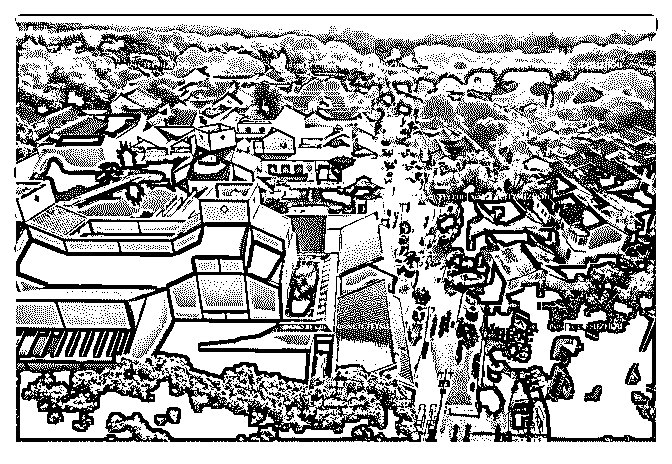
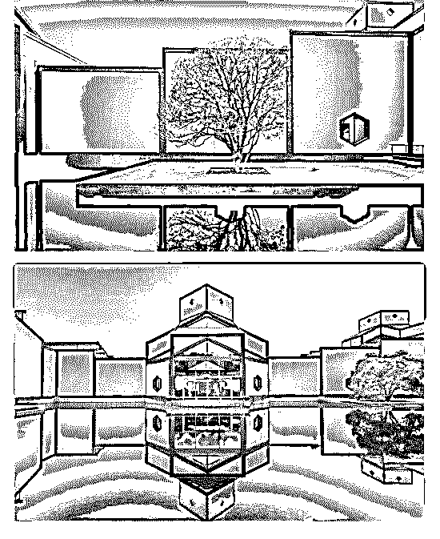

# 向贝聿铭致敬！我特

司令 : 向贝聿铭致敬！ 我特别喜欢建筑，建筑的设计无论多么夸张都必须遵守基本 的物理定律，所以，建筑所呈现出来的是一种基于理性的 美，同时又表达人类的感情。在千万年的时空中，唯一能代 表人类文明的，只有人造的建筑！

2019-05-17(26 赞)

评论区：

王雪 : 不朽的艺术

machelshan* : 贝聿铭非常善于设计金字塔造型建筑，金字塔式的统治结构才是人们崇拜的潜意识来源，意识来源于现实存

在[呲牙][呲牙][呲牙]

