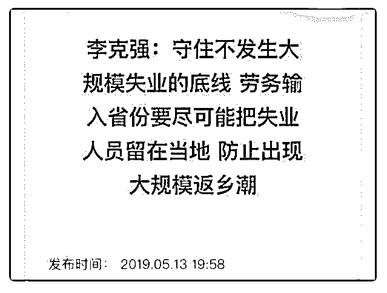
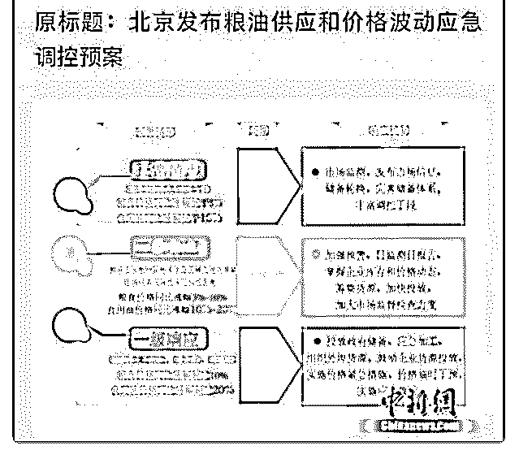

# https://t

司令 : [`t.zsxq.com/eM762jq`](https://t.zsxq.com/eM762jq)

2019-05-14(4 赞)

评论区：

星辰之海 : 是的。你的答案放不出去。但这个回答值得花 1 元观看，毕竟涉及到个人的生存环境。

不枉 : 请问怎么看回答？

小南 : 把链接复制到微信，在微信里付费打开就可以

小麦 : 努力奋斗吧。

小麦 : 债券期货做市业务开放 13 号公布了，沪港通，一路一带都是拉生意的。 如果出口和进口的关税长期卡壳在高位，最

大的后期不良反应是我国制造业技术和发展水平停滞不前，就业问题反而是短期的，印度的会爆发短期市场补缺。中美股

市将要跌宕起伏了 目前国内消费指数，工程指数，受教育人口指数均为良好增长。 哈，美国的飞机与大豆。东北人民快转

移，中国需要土地种大豆，养家畜满足人民肉类消费增长需求。 中国 2018 十月第一次大飞机试飞图片

小麦 :

小麦 :

冯阳阳 : 复制依然打不开

