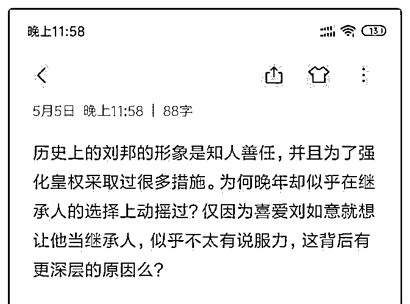
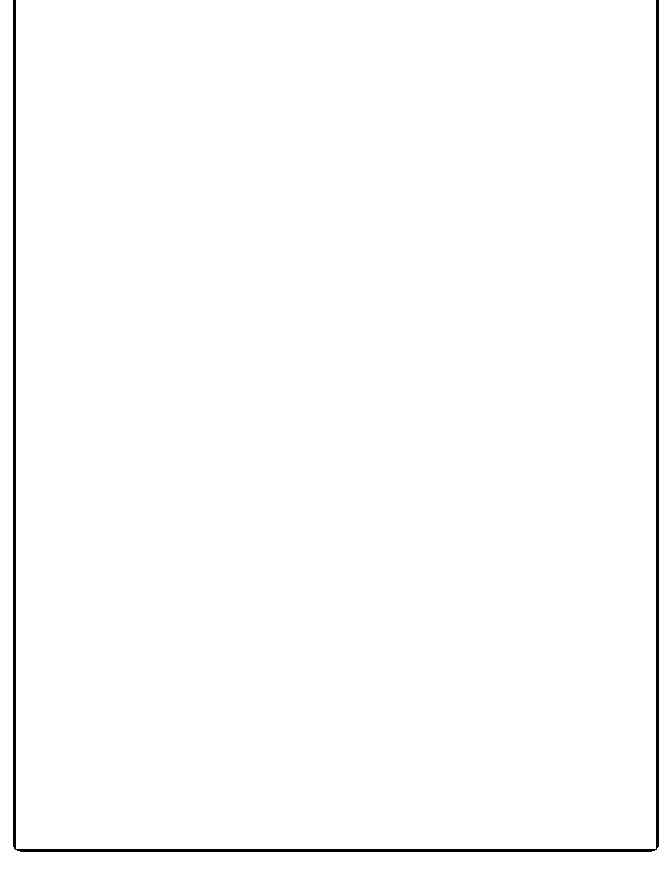

# 刚才提问居然遭遇了

(提问)匿名用户 : 刚才提问居然遭遇了审核，这次发图片重新 提问。

2019-05-06

回答：既然你知道遭遇审核，重复还不是一样！被删掉的又

不是你的问题，是我的回答。这个问题我的回答发不出去，

我刚才回答了一堆没有备份！(2 赞)

评论区：

司令 : 我刚才自认为回答很精彩，逻辑清晰，但就是通不过。

元瑶 : 问题是我问的。其实问之前心里有一个大致的答案，但更期待司令的答案看能不能对得上。我以为是我的提问内容

敏感所以重新发图提问，实在抱歉。

司令 : 如果你实在要或者这样的答案的话，你就去小红圈的觉悟社，那里没有审查，我有特权。

司令 : 知识星球的审查是越来越严格了！

John Smith : 简单猜测一下，老皇帝是以此来测试朝堂各方势力的真正力量。

灵儿 running : 正解，刘邦最后想废太子已经不是他一个人能决定的了，他相当于和整个官僚体系干，怎么可能成。

元瑶 : 我的想法恰恰相反，刘邦应该从来没考虑过让刘如意即位。

Felix : 对的

