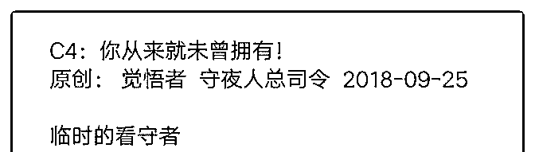
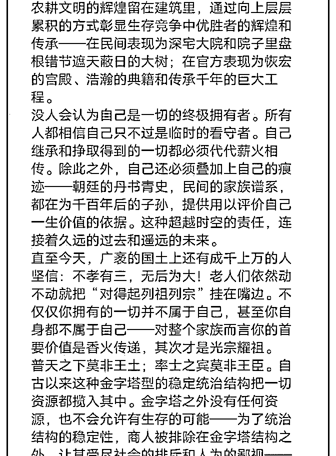
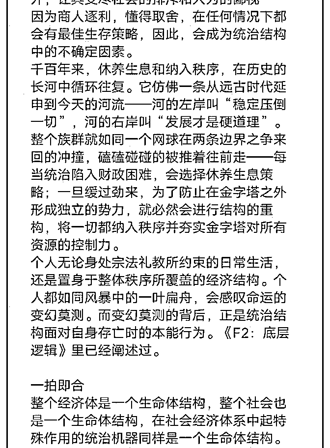
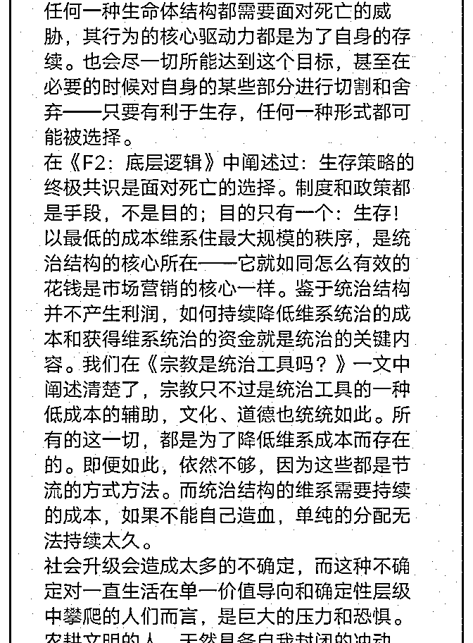
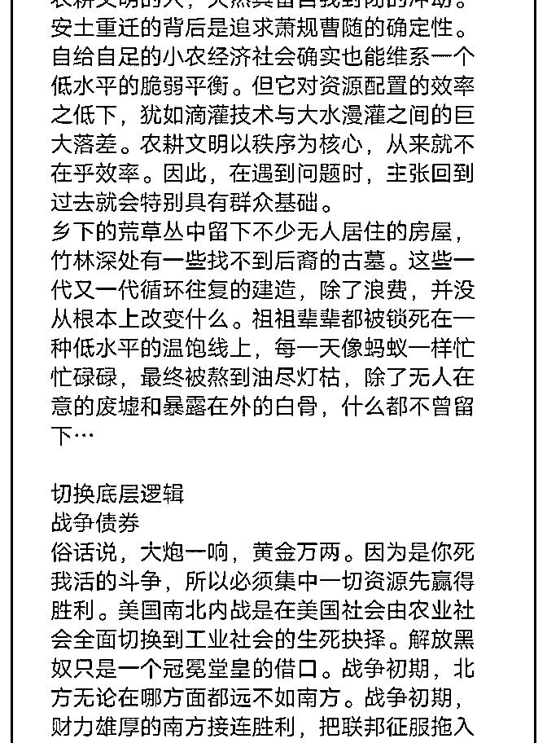
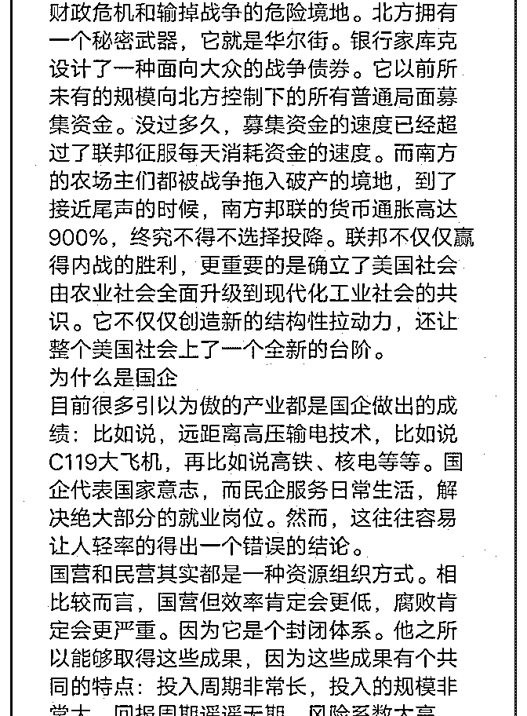
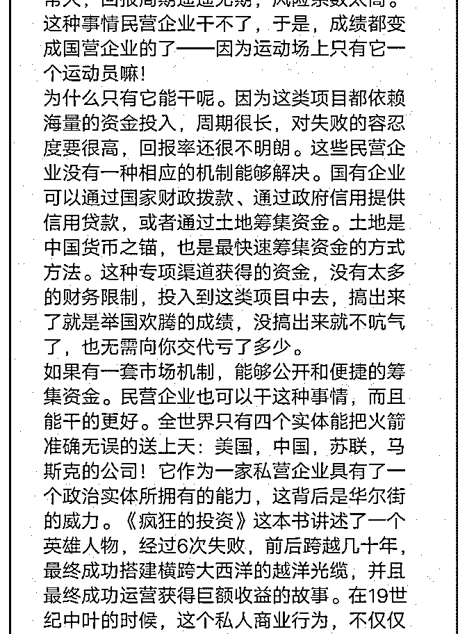
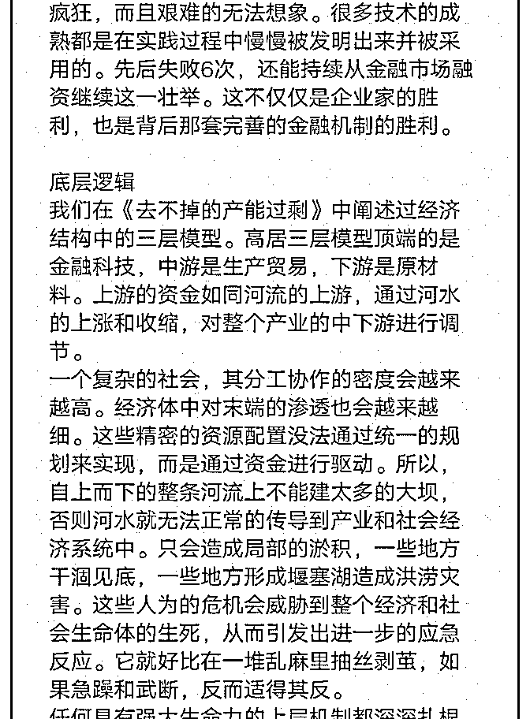
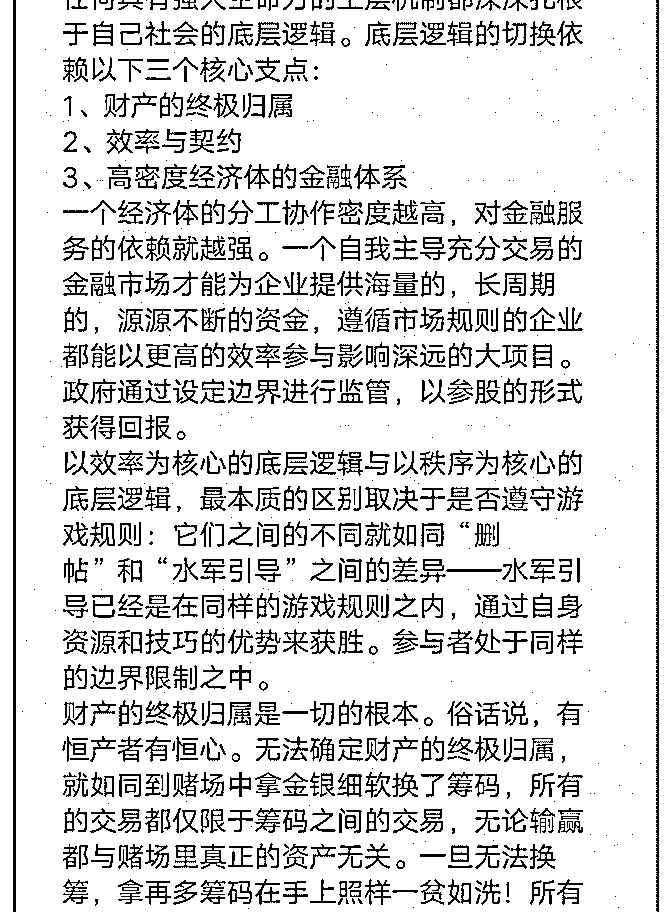
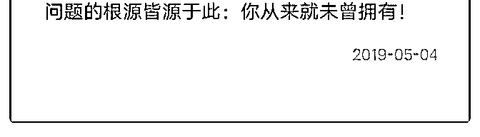

# 司令，《你从来就未

(提问)三明先生 : 司令，《你从来就未曾拥有》这一篇我好像 读懂了！ 你第一小段【临时的看守者】，描述了社会民众基因（也就 是文化）和统治逻辑（也就是制度）的状态及形成轨迹！ 第二小段【一拍即合】，讲解了文化和统治逻辑的相互雕塑 和稳定千年的原因，以及表达了农耕文明制度的落后性！ 第三小段【切换底层逻辑】，你用南北战争的战争债券举例 表达了制度之一金融制度的重要性，并用为什么是国企举例 表达了金融制度的落后性！ 第四小段【底层逻辑】，你指明了制度升级的方向！

问题 : 首先，我想知道我的理解对不对？其次，“临时的看守 者”这种思维，不是我们这个名族独有的吧？全世界人们不都 这么想的吗？

2019-05-04

回答：你比以前有进步了，但是没有可彻底读懂，如果彻底

读懂了，你不会有后面那个问题。(2 赞)

评论区：

向明 : 我觉得我全读懂了，最后一句话，你从来就未曾拥有，让我觉得买那么多房子没用，房子够住就行了，钱多有富裕

的话还不如把钱投到经济社会发展上，做点有意义的事情嘛，科技总是要发展的，社会总是要向前进步的。

向明 : 金字塔内，敬畏规则，不然就是坑害整体。

三明先生 : 不知道你在说什么...

向明 : 大概意思是遵守规则，把不良的控制在一定范围内，才能良性发展。

三明先生 : 你认为这是司令这篇文章要表达的核心思想？

向明 : 这篇文章表达了很多，我只捡了我想表达意见的地方说了几句。你想沟通哪些地方？你觉得核心是什么？

向明 : 核心应该是临时的看守者这 6 个字吧。

点点 : 你是良民[强]

