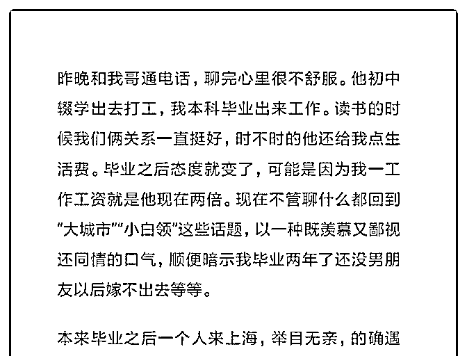
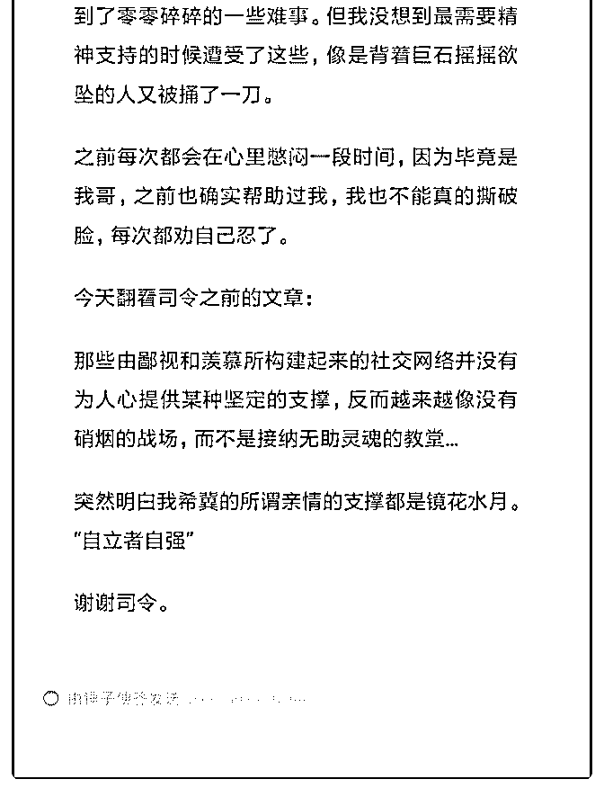

# 司令好！不是一个严

(提问)换换 : 司令好！不是一个严格的提问。

2019-04-27

回答：哈哈，不要放在心上。你从他的生存结构中去理解他

的行为，你就不会感到失落而是充满同情了...(8 赞)

评论区：

换换 : 谢谢司令，司令的文章常读常新[抱拳]

小麦 : 小白领需要优越感，亲人需要感恩来肯定 再明显不过了 生活需要俯下身子

换换 : 你意思是我需要优越感，我哥需要我的感恩？

小麦 : 彼此认可一下嘛 当然你可以自动付出 看见你哥哥的闪光点 接纳家人的不完美

换换 : 感谢提醒。但你评论的和我表达的应该不属于同一个核心主题。我从未鄙视我哥，我只是对他有更高的期待，这种

期待没有达到的时候产生了失落而已。 他站在他的视角觉得我鄙视他，如同你作为旁观者代入的时候觉得我有那种暗搓搓

的优越感一样。

原来如此 : 其实可以理解！在他们这个阶层的人，嫉妒心特别强，他们不会嫉妒王健林，但会嫉妒身边的人，哪怕是兄弟

姐妹！特别是当你和他的差距还不够大的时候，他嫉妒心就特别强，总想超越你，可以俯视你，在你面前有优越感！当你

超越他很多，让他望尘莫及形成绝对碾压优势，他就会反过来羡慕你，尊重你！阶层决定了眼光，格局！

小麦 : 时间维度吧 你哥的环境因素占重较大

小麦 : 这么说吧，除了环境因素 还有精神素质，知识面和知识结构，如何指挥自己 强行拨高人的品质很局限啊

