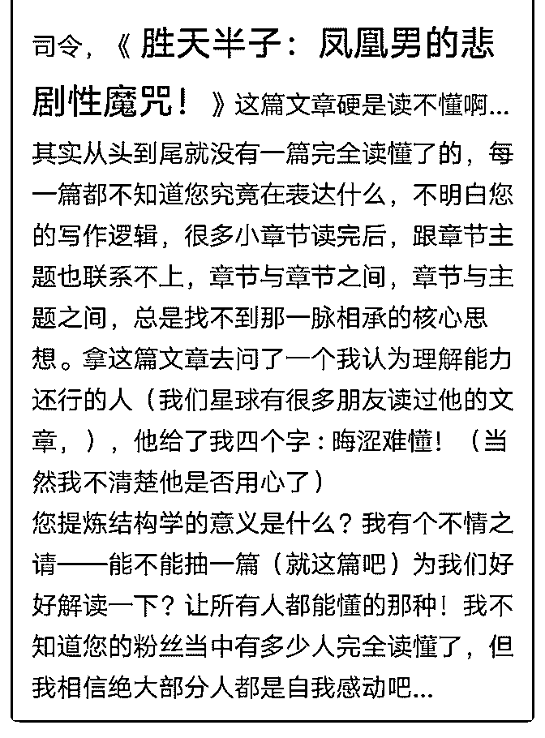

# 如果您不愿直接剖析

(提问)匿名用户 : 如果您不愿直接剖析，麻烦您发出去好吗？ 让星球读懂了的朋友来参与指教，让没读懂的朋友学习/消 化...

我一直在思考一个问题 : 看电影，自己本身的功底/阅历固然 重要。燃，当功底/阅历不足的情况下，如果能得知导演的表 达逻辑和核心思想，理解起来会不会容易得多呢？

2019-04-27

回答： 如果这一篇都是晦涩难懂的话，那这样的水平，F3 更

加没法读懂，C 系列也会不知所云。只能听得懂段落大意，中

心思想，中学水平的内容。(2 赞)

评论区：

罄 : 司令的原理没有写完，司令的整个体系是一个框架结构，而这里面太多东西是下面的地基。以及地基的解释。 觉悟社

是框架上面的东西，就是如何打造，根据个人具体分析。 而凤凰男这篇讲的是 框架之后该框架里面的人的抉择，所以在地

基一下的人，无法，也无需要完全明白别人的抉择。

c z : 震撼人心的力量，毁灭、重建与变迁，渺小人物的挣扎与悲剧，彗星般崛起的勇者，命运的斗争，生生不息，这些故

事难道不令人叹息，故事的背景难道不令人着迷？何况我们亦是其中一员。

凡 : 每个人有不同天然的环境，先天的基因后天的见闻认知，当某人从出卖劳动力的底层走到一个新的环境成为了工业分

工的组织者，他的环境就天翻地覆改变了，但也只是他肉身踏进了那个地方，他的行为模式和习惯如果不能融入新的环境

最后……

徐天护 : 哈哈哈！看提问很有意思！

小麦 : 既不读万卷书也不行万里路 说啥好[调皮]

Dilink（撸房帮* : 题主先看之前的文章吧。 弄懂生存环境，精神结构，生存策略的含义及关系，就可以可以看懂一点了。

foolish : 真的有人会读不懂吗？既然不懂又为付费入圈...这里面的底层逻辑是什么？

1800 口 : 我也没看懂，我只是逼着自己看。看能不能慢慢看懂。

