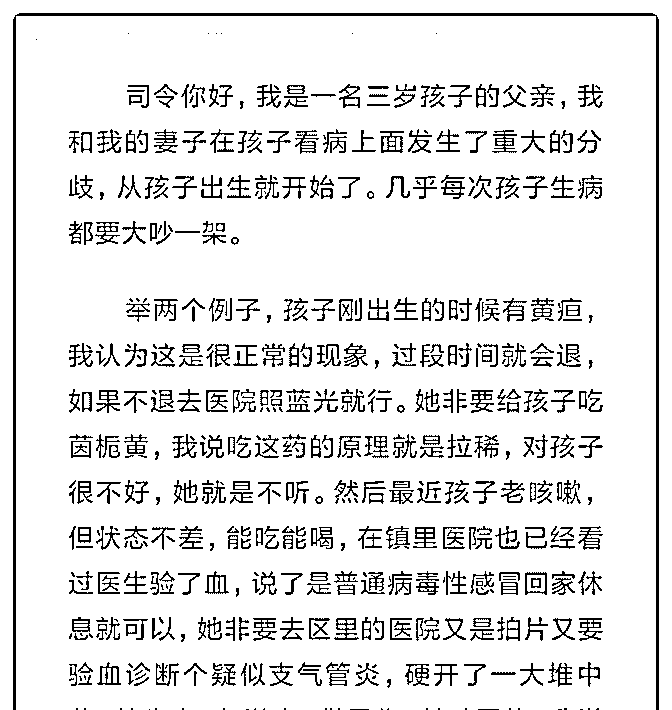
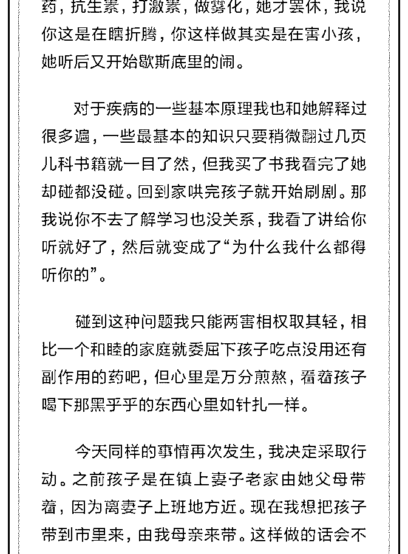
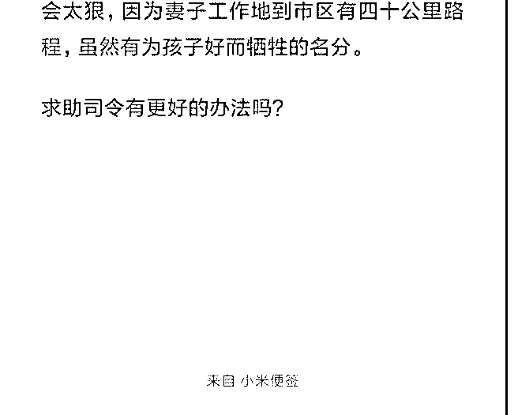

# 司令晚上好！问题比

(提问)匿名用户 : 司令晚上好！问题比较长我贴图片了，有劳 司令了！

2019-04-26

回答：你会发现弱者有一种共同的特征，他们会抵制很辛苦

的自我突破。他们希望以自己现有的状态应对一切，如果你

让它处于一种不安的状况，他会一种强烈斗争的姿态，来掩

饰自己的这种恐慌和需要为结果负责任。他们不能为自己负

责任，所以他们比较迷信权威。迷信权威并不是为了崇尚科

学，只是为了让自己心安。如果权威不是医生，而是宗教或

者一种习俗他们也很迷信！这是一种本能行为。 我小时候老

家有一个人吸毒。邻居们想帮忙，让他戒赌。把他送去戒毒

所，他妈死活不让，以死相逼。大家退而求其次，把他捆在

椅子上。其实只要熬过前一段时间就可以慢慢戒掉，他妈看

到惨叫又阻止。反反复复，最后大家就懒得理了。他儿子没

有钱吸毒就揍他妈。他妈被揍得鼻青脸肿，又到处哭诉，还

指责别人不管他儿子... 弱者有一套自己的逻辑，其核心就

是：1\. 缺乏理性，2\. 不能负责任. 所以才说，可怜之人必有可

恨之处。其实，都是自己搞出来的。第一，他们极度没有安

全感。为了让自己心安，会搞出一堆事情。第二，极度没有

存在感，深度自我质疑，所以特别渴望在自己能够得上的事

情上发挥主导性。第三，遇到失控的事情，首先在意的是情

绪，不能被指责，也不能接受后果，更不能承担责任。 让小

孩离开那个环境吧。小孩不是父母的实验品。不能为了满足

一个人的情绪而接受不必要的伤害。写过《A34：一个烂父亲

的危害有多大》以后再写一篇《一个自我定位为弱者的母亲

危害有多大》(13 赞)

评论区：

丛林法则 : 自己父母和对方父母哪一方更有带孩子的经验积累，就给哪一方带。我家孩子三岁前外婆带，三岁后上幼儿园

自己带。孩子要增加运动，不吃零食（我家小子从不吃零食，所以小学到初中，出游零钱都不用的），身体不会太差。

jesen : 孩子是大义名分。好像夫妻本身就有问题未解决，小孩被带进来不能以为和自己无关。 你从头到尾都在刻画一个糟

糕的母亲，和自己如何冷静趁着，这好像不合常理。 女方有工作，家在镇上，男方家在市里，女方似乎觉得自己不被尊

重，或许是自身弱，但也许她没有从你们的日常生活中体会到尊重，平等，考虑一下其中是否存在鄙视？ 我感觉你知道这 件事不能做，等着别人来劝你。 我想如果你老婆来叙述又是另一个版本。

涛涛 : 你是个万事尊重对方意见协商性格的人，改变自己相处方式，霸道一点，万事自己做单独主不要找老婆商量，做出 决定就容质疑更改！

小麦 : 三岁了，送去市里读好的学校。 生活的目的是为了过得更好吧 给你妻子上一堂孩子未来的战略性方案 而不是为了阻 断母子的隔离 妻子的本质，丈夫的软弱 不知道谁能突破

张志刚 : 题主自身的问题也很大，在我看来你不懂得如何经营婚姻生活，比起小孩吃些没用的药来说，你更应该要尊重理 解一下你的老婆，让你的孩子树立正确的三观，并有一个幸福的童年！

Karen : 妻子感觉到的爱不够。

炫蓝乐畅 : 以现有的状态应对一切……我头脑中各种措施让自己变强，但行为上确实只是刷剧，同时希望一切安然无恙。

依依东望.Isabe* : 题主，你能听取司令的建议就太好了。这是个大是大非的问题。不能让你的孩子去经受你和老婆之间认知

差距带来给他的无止境的伤害（包括孩子将有的困惑、困扰甚至难以平衡你们之间的矛盾和冲突而走向狡猾或者逃避的生

存状态）。更要避免因为迁就弱者（她毕竟是老婆和女人）而让孩子有机会成为弱智手上的筹码，和弱智一样站在你的对

立面，这样你家庭失去的不仅仅是和谐，将失去成长的希望。

