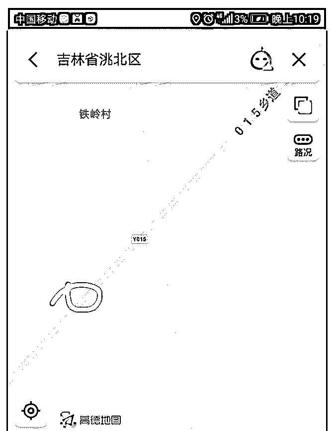
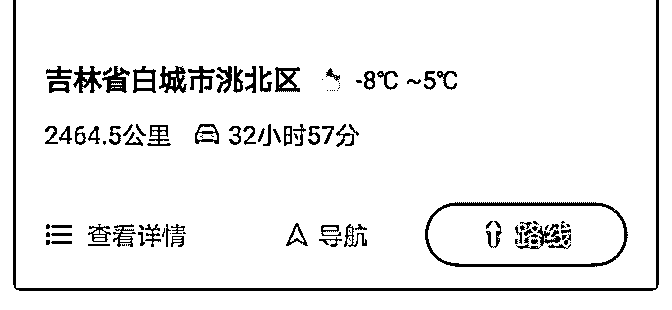

# 先生好！您怎样看东

(提问)匿名用户 : 先生好！您怎样看东三省的未来?老家吉林 有一块 4000 多平待确权的宅基地，市值约 7 .80 万，拿到产证 以后是不是贱卖了置换成一线的房子更好?还是应该长期持 有？现在缺钱买房结婚给彩礼，想贱卖掉又觉得可惜。烦请 先生指点迷津。

2019-03-28

回答：我不是很看好东北那个地方的发展。 这里面已经阐述

过了。 无论是人口结构还是产业周期，都处于下行的周期。

而且落屋又遭连阴雨，就是因为人口的外流和产业的过时，

所以，会让社会资源的组织方式变得非常的传统，而人员流

动性的固化严重。一个细节就看得出来。你到深圳上海去随

便找一个干部的话，他肯定不是本地人。但是你在东北找一

个干部的话，绝对是本地人！熟人圈的惯性与现代社会充分

的分工协作相矛盾。大家只看到制度的捆绑，没看到这种隐

形的束缚。这些束缚都一样的影响社会经济发展，影响人口

物资资金的流动。 除了内部结构与外部结构一样不乐观。俄

罗斯的边疆区，即便开发的拉动力也非常有限，它是远东。

在俄罗斯的核心范围远在万里之外中，间隔了一个巨大空洞

的西伯利亚无人区。然后，东北亚那疙瘩动不动就搞点事出

来。于是的不稳定影响政策的连续性。它会让交易成本非常

高。举个最简单的例子吧，比如说一个正常宽松的环境

下，10%的利润你就可以活的很好，你可以加大规模。但是

那个经营环境中存在某种因素会瞬间让你血本无归。那么你

必须要有 30%的利润，甚至 50%的利润才能对冲这个风险。即

便在制度，政策和其他都不变的情况下，依然在无形之中增

加了交易成本。所以那个地方的外部拉动力有限。除非你们

家处在某一种对外通道的路口。从综合性价值来看溢价性不

高。 如果能置换成一线的资产的话，肯定更好。不过七八十

万可能比较难置换成一线的资产。(7 赞)

评论区：

温心 : 宅基地可以卖？

林恒羽 : 广州新塘欢迎你[偷笑]

