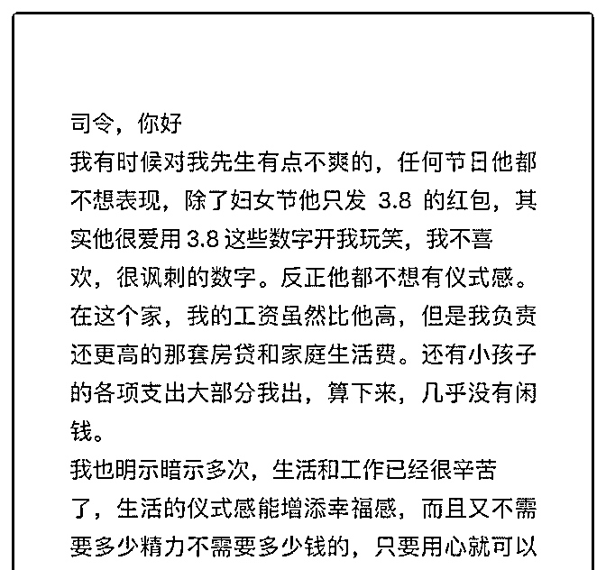
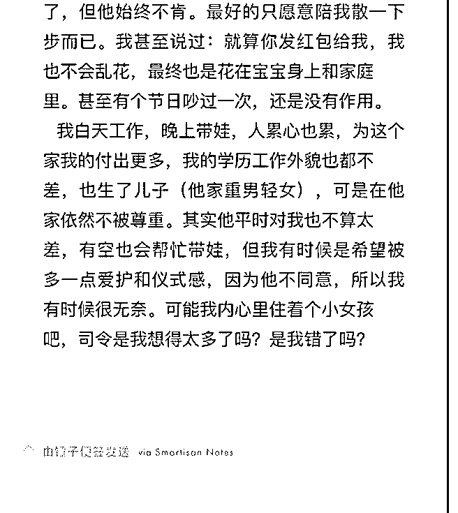

# 司令，你好，请看图

(提问)匿名用户 : 司令，你好，请看图

2019-03-17

回答：其实这个事情并不重要，我可以打赌你内心深处对此

并不那么强烈的建议。之所以今天抓住这个事情如此的介

意，是因为你内心有一种补偿心理没有得到满足。如果你一

开始就介意你根本不会嫁给他。如果他一开始就那么木讷，

他也不是你的菜。你反复在强调你的各种付出和优势，其实

是你内心不平衡的一种强烈表现。你真正渴望的是内心的这

种不平衡能够得到有效的缓解。我说一句不好听的话，即便

他满足了你的仪式感，只要这种内心的不平衡没有得到彻底

的舒缓。你依然会在其他生活细节上找到让自己觉得不值的

点！ 我们反过来考虑这个问题。这种事情是不是已经让你愤

怒到不离婚就无法忍受的地步？其实，你也只是想抱怨一下

并没有想过要为此而离婚。我对对和错不感兴趣，不仅仅因

为清官难断家务事——更主要的是，它会制造出一种假象，

让你忽视了人真正的诉求。也就是让人对问题的关键要素判

断错误。那么，在此之上开出的方子都无法有效的解决问

题。 我相信他不是木讷的人。只是随着年龄的增长和生活现

实的变化，人对一些事物的价值判断变了。价值判断一遍就

觉得形式都没有必要了。我举一个不恰当的现实例子：曾经

有一个哥们儿，大概在十几年前追一个女生。那哥们也是一

个直男癌——他第 1 次喜欢一个女生，在我们的怂恿下，他终

于迈开了脚步。但是他步子迈的有点大，一下就扯到蛋了！

他才认识人家三天，有大家在场的情况下吃了一顿饭。他就

跟人家女生送来九百九十九朵玫瑰，还送到人家办公室，搞

得人家下不了台！那姑娘把玫瑰花扔掉了，因为真的不知道

该怎么处理比较好。他却非常受伤，他觉得这是他的初恋，

又是他人生第 1 次这么用心送出的这么大的礼物。总而言之，

不断的在这个行为上叠加自己的真诚、付出和价值。然后自

我感动，越想越委屈。在我们的鼓励下，他依然没有放弃， 他还用心记住了那女生的任何喜好，也非常的周到。女生不 知可否的与她保持着一种普通的联系。就这样持续了半年， 但是他表白的时候还是被拒绝了。他曾经一度非常消沉，被 我们各种嘲讽。 后来振作起来，再也没有把心思用在这方 面。大概过了 5 年，他除了这方面依然很弱以外，其他方面都 做的还不错。有一天，再次遇到了这个女生，因为 5 年前被拒 绝过又没在其他人身上练习过，也就没什么想法。结果，过 一段时间以后，女生反而有想法了，还比较主动。这事对他 打击挺大的，而且在他内心得出了一个更直男的结论。他们 结婚的时候我们都去了。非常明显的看得出来，他已经没有 当年那样的发自内心的那种纯情。大家一起出来吃饭再也见 不到他当年的那种无微不至。反而是他老婆对他更加的细致 入微。他老婆也很优秀，有自己的生意。这不是一种趾高气 扬的大男子主义，对方也不是一种活不下去的乞讨。作为多 年的朋友，我确定他不是故意的，只是一种习惯。大家都对 生活对人对行为作出了新的判断。过去自己强行加戏覆盖在 其上的那些特殊意义都变得烟消云散了，我估计他能给他老 婆带来一种确定性的安全感。所以这些细节就不重要了。他 昔日的疯狂和今天的淡定，其实都源于一个同样的东西，就 是觉得他们俩比较合适，一起生活。与人相处是一个逐渐明 白自己要什么的过程，这就像大海一样，心底的确定，大海 就是宁静的。 你的内心如果一直有一种不值的心理暗示，你 就无法心平气和的跟他沟通。因为存在预设立场，继而无形 之中任何沟通都变成一种命令、诉求和指责。人的戒备之心 会采取多一事不如少一事的消极应对。就算你挣得比他多， 你也不要老是把这种类似的东西挂在嘴上。现实生活中有些 女生本来很优秀，但是她们就是没法与心仪的男生对上眼。 因为一上来她就会说她有房子车，然后不断的强调自己各种 所谓优势。但是她忘记一个最根本的东西：能够做到他对面 来跟他聊的男生这些东西通通都有，没有的话根本没有资格 坐到对面来聊。既然人家都有，他就不在乎你有还是没有。

他关心的是你这个人合不合适！然而这些女生却从来不会聊 自己这个人的性格和自己作为人的特征。所以那天他们看得 上的男生都转身走了。 虽然这个举例不恰当，但是，与人相 处是一个互相欣赏的过程——是人对人的欣赏，欣赏才能相 向而行！也就因为欣赏才能最坦诚的沟通。你们逐渐建立信 任，瓦解相互戒备，当你们都能够心平气和的时候，再坦诚 的沟通一下。(20 赞)

评论区：

小麦 : 你老公的防御性固执心理，身上还有股蛮勇劲儿：我就这样，你必须接受。无论你什么理由，我不接受。 哈哈哈

哈，一个抗争的红包。 你的问题反向是没懂你老公。你老公要的是什么？

张志刚 : 果然女生是一样的

小麦 : 本来统一名称就叫女人 还不能同一品种有相同属性呀！！！

