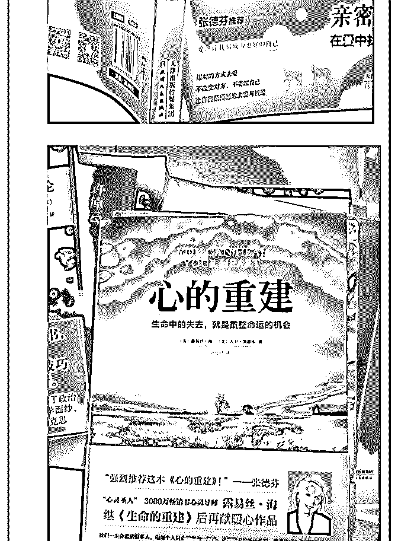

# 司令你好，我还是周

(提问)匿名用户 : 司令你好，我还是周二向你咨询的那个人， 现在又得知了一点新情况，现在感到束手无策，希望能够得 到你的意见 感谢

2019-03-14

回答：你妈的内心一直鄙视你爸。她有一种内心的诉求得不

到满足。所以，一直在找出口。即便把这件事按下来，也会

有下一件事。防不胜防！ F3：结构力量 中阐述过：情绪是一

种能够形成结构力量的基本元素，它会把不存在的资源当作

存在的资源影响精神结构的两个基本判断，继而基于失真的

判断形成新的生存策略，而且这会循环叠加自我强化。她无

论是与那些人的密集共振还是读这些没有逻辑只有情绪宣泄

的书都是在不断叠加那个循环。越是高密度刺激越不能有逻

辑，要越简单越情绪化效果就越好。否则就容易形成淤积，

刺激的频率就会降下来。所以，宗教或者宗教氛围的东西都

是强调封闭，强调排他性，强化自我的优越感和对别人的鄙

视。 看得出来你应该是一个女生，而且你的思维是女生式的

思维。在大地开裂的时候，你想用双脚去把它愈合是不可能

的。应该在裂缝的地方踹上一脚，让它早已坍塌！这一点都

不是自暴自弃的情绪化表述，而是理性行为。不管是你，还

是你父亲的乞讨行为，只会增加她内心的鄙夷，因为你们的

态度和行为佐证了她内心预先认定的东西。他的内心认定他

自己所有精神痛苦，那种被自己不断的循环叠加放大的痛

苦，那种想象的痛苦都是因为现有的束缚。这就好比一个社

会处于升级阶段，明明是社会结构造成的矛盾，是一个过

程。需要理性的去认知，主动的去调整和适应。但大众无法

理解复杂的事物，无法看清事物的本质，更无法让自己去面

对一种未知的挑战。所以会愤怒的指责外部。并且通过把这

种愤怒进行叠加和强化来消弥对自我的质疑和对未知的恐

惧。都是某种暴政的错误，所以我在生活中找不到出口，我

的无能都是别人造成的。有了这个借口，自己的内心就获得 了一种缓解——但是这个剂量的需求会越来越大。所以愤怒 感和压抑感都会越来越强，最后芒顾一切事实，就是要摧毁 它，摧毁一切秩序的束缚，这已经不是一种抉择了，而是一 种纯粹的发泄！这种强烈的摧毁现有“束缚”的意愿会给自己 带来神圣感。既然进一步强化它，并且对它充满渴望。 这个 时候讲任何道理都是听不进去的。你母亲如果不被隔离起 来，或者没有力量去隔离她。你做什么都没用，胳膊拧不过 大腿。那个合作伙伴，我估计不仅仅是合作伙伴，也不仅仅 是有共同爱好的人。还是一种精神寄托，还是一种内心的那 种一直得不到回应的渴望，投射的对象。或许那种完美的契 合是她想象出来的，让他沉溺其中不可自拔，因为她内心本 来在追逐的就是一个幻想，不是一个具体的人。这话只能说 到这个份上，而且是基于一种逻辑的推理，而不是事实的证 据。当然这个不重要，没有这个投影的对象，也会有那个投 影的对象，因为找不到出口的是她内心的诉求。 我觉得你们 内心有一种恐惧，是因为社会人际关系网给你们的压力。我 相信多年以来这种社会关系网，也给了她同样的压力。但是 她现在以不在乎的态度在获得反抗的愉悦和自由的假象。如 果你们表现出恐惧和在乎，反而佐证了她内心对自己勇敢的 肯定。反而彰显了她的自由和你们身处枷锁。 我可以告诉你 破解之道，但你做不到：以斗争求和平！只能以非理性去战 胜非理性。他如果要摧毁某种关系，你要比她更坚决，更果 断，更绝情，更不在乎！所有的宗教最害怕的，不是敌对的 行为，不是封锁，不是打压也不是包容。所有的宗教最害怕 的是比他更激进的宗教，那样会竭泽而渔。如果我是你，这 个事我绝对做的出来：先摧毁、再隔绝、最后用理性和智慧 去把她心里化脓的刺一根一根拔掉。但是我不相信你能做的 出来，你父亲也做不出来。所以，既然你明白了，你什么都 做不了... 如果你什么都做不了，你没有这样的理性，以及贯 彻理性的果决，那么你的求助，也不过是一种心理安慰—— 另一种形式的安慰。我这个人对安慰不感兴趣，要么就直接

解决问题。要么干脆什么都不知道，浑浑噩噩的生活。(13 赞)

评论区：

罄 : 摧毁不难，隔离也不难，难在用智慧和理性把他妈心理的刺拔出来!这需要超越哪些洗脑术理性至上的能力!

依依东望.Isabe* : 提问的女孩：我曾经遇到过类似的女性朋友，几乎耗尽耗干了我所有的智慧和心力，而结果与司令上次给

你分析的一致，她断绝了和真正的朋友的往来，继续投入到她又恨又爱的灵修圈去了，伤痕累累却乐此不疲。这种状态在

我看来是一种“病”，一种瘾，确实可能只有如司令所说的那种理性和智慧才能帮到你的妈妈，也只有你才能这么做，因为

看得出你和她之间是有真正的爱和关心的，其他人很难被她信任更多一点或者伤害更少一点。我想给你的建议是带她去做

整个身体的中医治疗（火罐，艾灸，刮痧，熏蒸，针灸等），我刚刚说到的哪位女性朋友我带她去把脉，确定她其实是一

种症，西医可能会说是抑郁症。可惜她看不上我推荐的这位名医而没有坚持（本质上说，她看不上任何人，看得上的都是

即将破碎的幻觉中的大师）。从身体入手可能也会帮得到她，不过你的对她保密，换个角度去尝试。她不会接受人家认为

她有“病”，她不好这类的观点和感觉的。你哄着她宠着她崇拜着她的态度去吧。[拥抱]

c z : 学生时迷茫去听过心里课，老师各种推荐胡因梦，张德芬之类的，把图书馆这类心灵类的书看了一遍，发现说来说去

都那几句。 后来反思，为什么有人愿意信教、算命、占卜、比特币、一夜暴富、传销、加盟神话，是因为他愿意信，而且

他的信他是经过了思考和计算后的决定，急切的心态和他对问题的认识和分析决定了他只能这么选择。 大师们说：依我之

路，你将是会有福的。

airyxia : 怎么摧毁呢？

Dilink（撸房帮* : 能理解司令说的是可行的。但除了司令我不知道谁还能这样做到

得立 : 美好的东西需要捍卫。不要乞求，不要抱怨，不要想着别人应该怎样，先把自己的心打磨坚硬，确立边界，对一切

试图打破边界的言行勇敢的怼回去。你只需要勇敢一回，其后的关糸都会逆转。

罄 : 她妈不是要离婚吗？那就离呗

罄 : 她妈妈这样做，也是源于内心的不安全感，可能他们家庭里有某种让她妈妈不能确定的东西，她妈妈掌控不了！只要

能给与她妈妈心里认为的确定感，比书上更确定。她妈妈的刺就化了！这需要她跟她爸爸非常耐心无微不至的弥补以前没

有给与的安全感！

