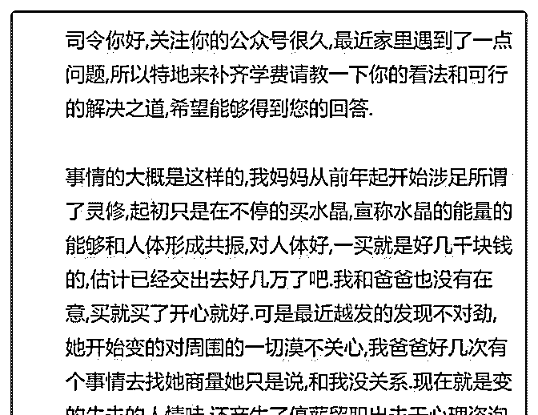
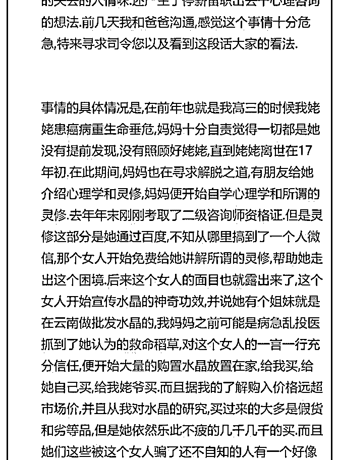
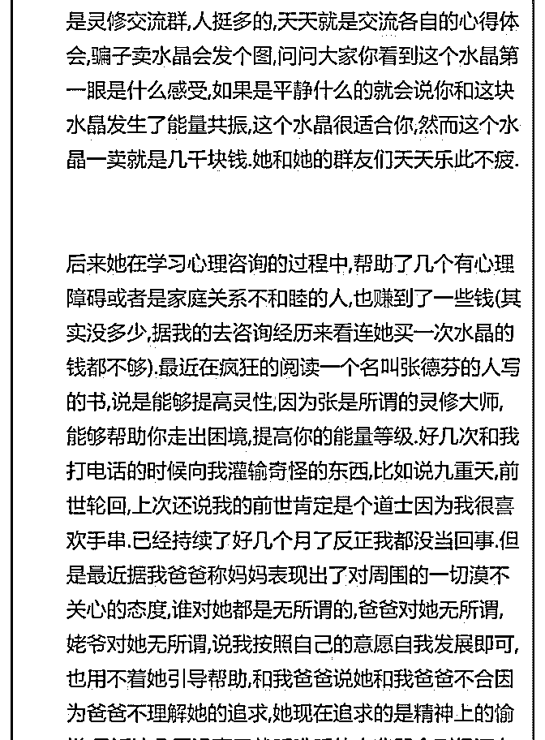
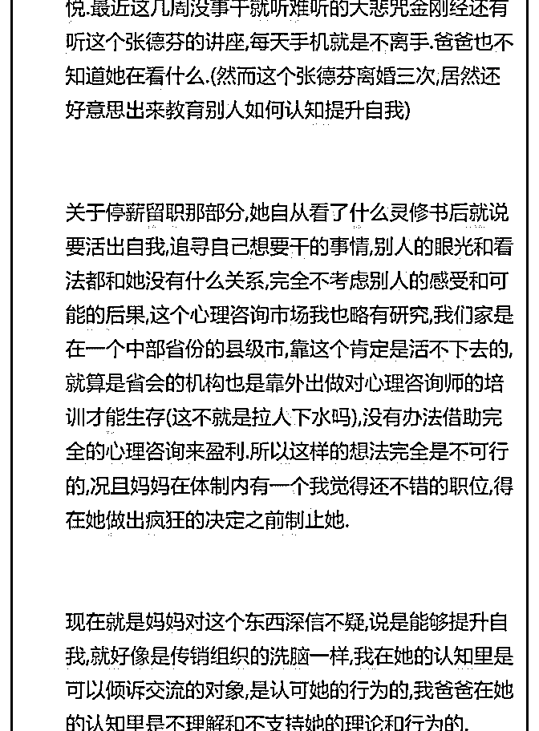

# 司令你好，因为问题

(提问)匿名用户 : 司令你好，因为问题叙述有点长，就写成了 长图，抱歉。希望能得到你的解答。谢谢。

2019-03-12

回答：张德芬和当年的于丹一样，有针对性的对一些失意的

女性进行心理按摩，都是些非常粗浅的东西，找不到出口的

人容易上钩。有一次，有一个上类似灵修的女性朋友还送了

我一本书，就是张翻译的什么心灵大师的书。我翻了一下，

除了用了几个概念和名词以外，其它毫无逻辑性，全他妈扯

淡的。催眠不能过于复杂，只能无比简单。它的核心是一种

抚慰，不是逻辑。事物本身是什么样子的？无关紧要，紧要

的是受众内心得到暂时的满足。那姑娘也是找不到出口，她

以为她抓住了救命稻草。因为在生活中还比较光鲜，所以一

般人看不出来她陷入自己编制的困境。这样的人会表现出一

一种让人不可思议的疯狂行为。所以慢慢的大家都不愿意理

她。而在工作上有求于她的人，会无条件认同她的一切。因

为人家是有目的的，有利益驱动，这是一种伪装。但是高智

商在这个时候毫无用处。反而会疏远真正把她当朋友的人，

试图让她清醒的人。她会退回到一个虚幻的人群编织的小圈

子里面去寻找认可。 F3：精神结构 里面阐述过，能够形成结

构力量的三种元素，其中有一个就是情绪。它能够把不存在

的东西当作存在的东西作为形成新的生存策略的依据。而且

会形成循环叠加。所以，在宗教的洗脑和爱情之中。人只需

要相信而不需要思考。因为高频的快速循环需要让一切趋于

简单。换句话说，就是高频次的简单重复。这种高密度高频

次的简单重复。而且在一个共同的圈子里相互佐证——虽然

每一个人的证据都是别人虚假的行为。但是没有人去深究那

个行为的动机是否真实，只以这个人的行为本身来佐证。因

为高频的短刺激作用下的大脑无法处理反馈过长的链条，更

无法追踪溯源，对每一个链条背后的逻辑进行验证。他只要

形成简单的回路和验证，就会把它当作新的事实，再递归的 进行下一轮循环。所以，这看起来几乎是无解的死循环。自 杀式恐怖分子也是这么训练出来的，最后恐怖分子对整个世 界的认知是一个完全扭曲的，但是在他的那个扭曲中又是自 洽的。 戒毒首先要隔离，一边供养毒品一边戒毒是没有用 的。在他那个已经形成结构力量的循环叠加并能在形式上相 互佐证的氛围中，你的任何却说都是非常乏力的。因为你必 须要以高于他的那个密度进行反向刺激。显然你这个个体做 不到。一个人的能量是有限的，那边的漩涡吸附的更多一 些，对你们的关注就肯定会更少。这就像一个女生谈恋爱以 后，她就从她的闺蜜圈里面逐渐消失了一样。因为高强度高 密度的亲密互动所消耗的能量占据了她绝大部分。此消彼 长，她就从原有的连接中消失了。 你要救回你的母亲，给她 情感的抚慰，主动的帮助她从一个死循环中走出来，这些都 是后续的事情。首先应该摧毁她的那个组织，那个带着变相 传销性质的组织。他们应该是违法的，可以举报。但不要冲 动行事，应该收集证据，务必一击即中。如果不能一网打 尽，特别是让传销头子逃脱了，她一定会把这些人拉到外地 更隐蔽的地方去。我估计那个卖水晶的人绝对不是一个人， 这是他们的一套经营手法，应该背后有一个链条。很多保健 品也是这个套路。他们要针对的人群都是先摸底的，目标客 户有着清晰的画像。因为有着同类的状况，所以嫉妒在相互 之间引起共鸣，这种相互之间的约束比它自己宣称那些扯淡 的充满着逻辑矛盾的东西更有内在制约力。而且能在高频的 短刺激这个氛围下，大脑和内心会形成一种高频次的依赖。 就是平乐和密度达不到这种水准，反而心里面会空虚没招没 了——为什么刷抖音的人不能停下来就是这个原因。他停下 来那个大脑的那种短反馈强刺激高频度的那种消耗的快感就 没了，一旦这个高频刺激停下来就会本能的不爽。所以，要 切断持续强化的外部环境，包括传销头目和她所处的那个同 类组成的氛围，这种约束和伦理道德的约束是一回事，它们 相互约束又相互支撑——扬汤止沸，不如釜底抽薪。 所以这

里有两个关键点需要摧毁。第 1 个就是那个传销头目。要让她 诈骗性质的真实面目以及背后的利益链条揭示出来。由此摧 毁它所营造的神圣性。让大义的名分失去光环。第 2 个关键节 点就是形成相互制约，不断强化的那个氛围。要摧毁和隔 离，打破相互叠加不断强化的结构力量持续施加的影响。 第 3 步才是用亲情的关怀和抚慰去替代原有畸形的抚慰。在这个 过程中，你们的能量级要高于她自己。让他从与你们的互动 中寻找到一种安慰，并强化这种互动。以非理性战胜非理 性。(14 赞)

评论区：

白马非马 : 还有一个人是李欣频，也是搞什么灵修……

ydss : 难怪游戏使人上瘾，也是高频短刺激啊

無華 : 还有一个是胡因梦，我买过她翻译的书

白马非马 : 厉害了

林恒羽 : 在大学后期，我特别迷茫，也接触了这些，什么胡因梦张德芬克里希那穆提占星术等等……真是误了不少时日，

直到读了阿特拉斯耸耸肩和经济学后，一下子就击碎了这些灵修。

时光 : 额，以前有个什么数字办公室专门管这些，近年来又泛滥了吗？停薪留职是在单位上班吧，这样下去压根不用停薪

留职会被直接开除的。

