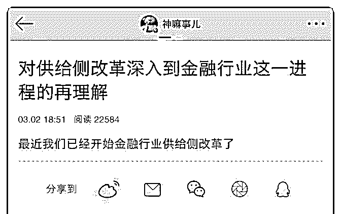
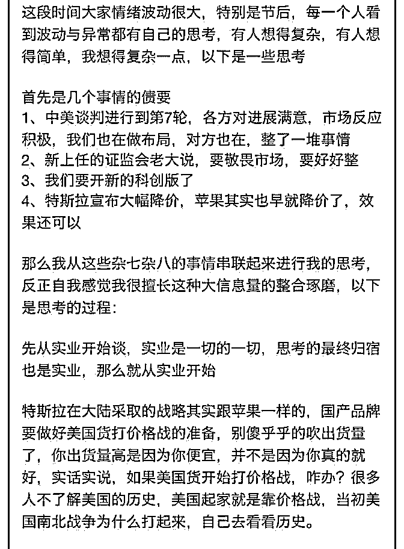
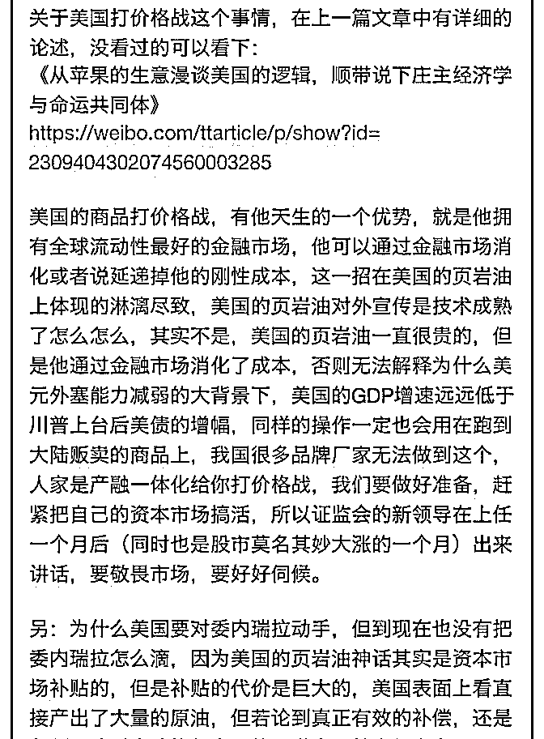
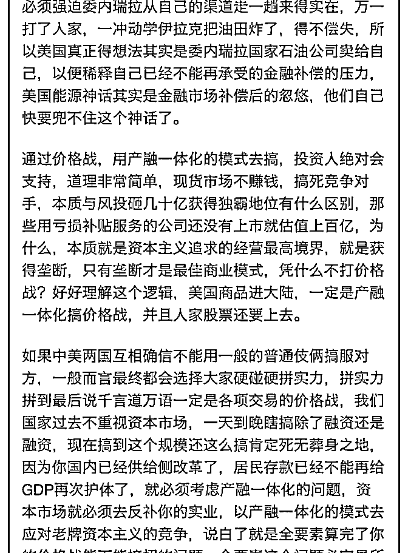
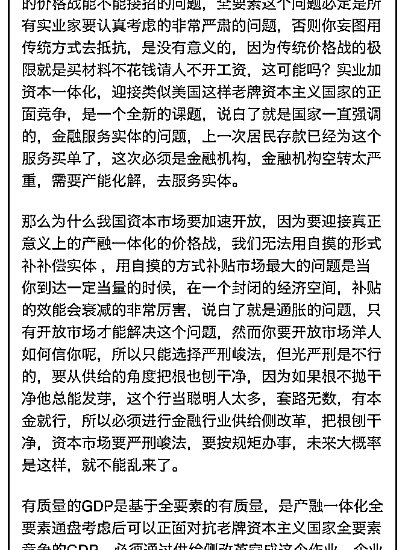
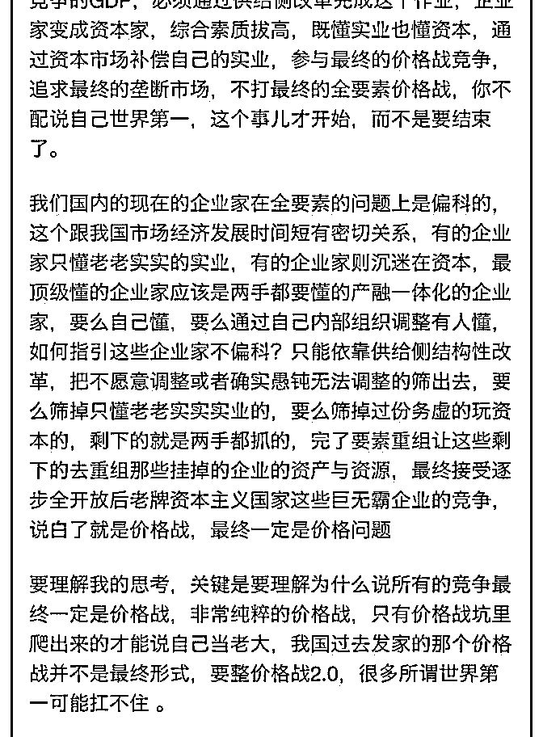
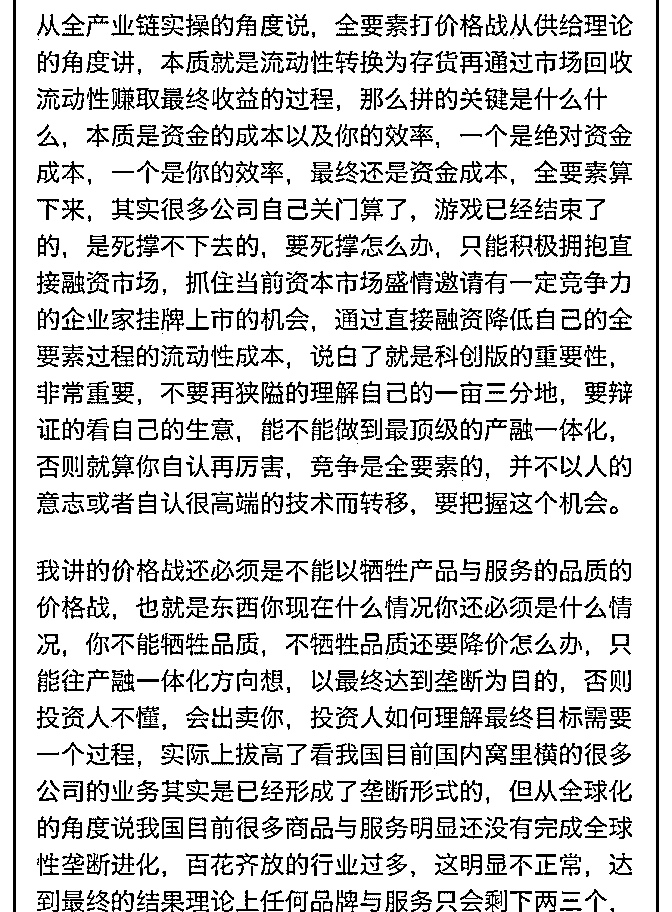
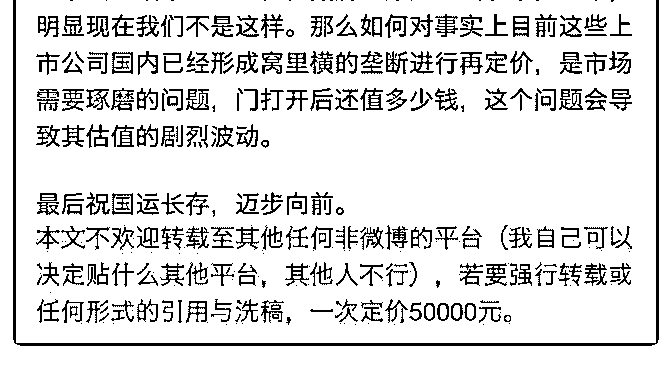

# 司令，请问什么是产

(提问)匿名用户 : 司令，请问什么是产融一体化，请谈谈中国 的产融一体化。

2019-03-02

回答： 你是没有读懂，还是没有读过昨天这篇文章? 你转的

这篇文章，我刚刚看了。我有一个判断：作者对产业的理解

没有深入，有点想当然的自说自话。 金融本身就是有成本

的，金融投资是去放大挣钱效果，而不是去放大亏损。如果

一个产品本来就不挣钱，无论怎么样投钱都改变不了这个事

实。共享单车刚刚阵亡，投的钱少吗？滴滴的融资高达 400

亿。持续在亏损，刚刚裁员 2000 人。它是缺乏融资方式还是

融资的数量太少? 不要把企业家看成对金融一无所知的傻逼。

恰恰相反，企业家更了解自己行业处于什么周期，春江水暖

鸭先知，不管是正周期操作还是逆周期操作，高明的企业家

都远远的走在金融领域投资机构的前面——要知道现实世界

的顺序是我发现了这个机会，然后，我用严密的逻辑说服你

去投钱。不是你发现了行业中的机会跑过来找我说：你把这

个做了！这样的投资者有没有呢？有，但凤毛麟角！觉悟社

里面有一篇案例，是我阻止了一个基金经理朋友的错误投资

行为。他们的分析师团队得出的结论与现实存在偏差，因为

他们不能够理解产业里面真实的状况是怎么运行的。也不能

捕获那些不包含在统计数据里面的关键信号。你可以去看一

下。 作者将苹果和特斯拉降价作为价格战的发动标志。我要

大笑三声！特斯拉那个 100 万的车降价到 30 万，是因为他搭上

了中国完整的产业链体系。其实，这个事情 5 年前就可以做

到。但是伊隆.马斯克很傲慢，死活低不下这个头。然而美国

相关产业的产能有限，而且成本居高不下。将特斯拉领先 5 年

的技术白白的浪费了！结果让传统的汽车巨头全面介入新能

源汽车。依托他们成熟的产业链和工业体系，以及与产业深

度捆绑的金融配套体系，正在逐渐的将特斯拉逼入墙角。特

斯拉那个 100 万的车，曾经试驾过一次，真心不值这个价！它 的成本一方面是因为关税，另一方面是因为美国的生产体系 的成本决定的。去年他开始在上海建厂，依托中国完备的产 业链体系，同时特贸区是不收它的关税的。所以它的成本能 大幅降下来。 苹果就更不用说了。全球智能手机的需求量是 有一定限度的，而且这种需求按照价格区间次第分布的。也 就是说你那个价格区间的份额是有限的，不会无限的增大。 做过市场的人很清楚这一点。所以，苹果在不断的往奢侈品 方向转，因为产业配套越来越成熟，底层的技术和工艺也趋 于稳定，并没有突破性的进展。还记得我曾经去调查蓝牙音 箱发现的问题吗？产业有层级的，同一层级上的产品同质化 会越来越严重。不管你打什么品牌，最后都差不多。不但产 品功能差不多，甚至连成本结构都差不多！当苹果的出货量 突飞猛进的时候，它对供应链有绝对的把控权。当你的增长 停滞的时候，你就别想再发号施令当爷了！而华为却拥有完 备的配套设施，他自己垂直的配套设施可以通过技术创新和 工艺改进来直接降低成本。而苹果要降低成本的话，需要从 供应链各企业进行博弈。如果在增长停滞和大家的预期破灭 的时候，这个博弈会加剧成本会更高。所有苹果只有一个出 路，增加单品的利润率！这就决定了苹果会向奢侈品方向转 进。我们的这个判断是有事实依据作佐证的：负责苹果的那 个市场营销的那个副总裁原来是一个全球奢侈品的 CEO。但 是她的策略失败了！而且她刚刚辞职。所以苹果不得不开始 降价——这个降价行为其实是去续命的。当宝马汽车真的卖 的和比亚迪一个价的时候。你觉得他会对比亚迪具有巨大的 冲击?！生产一辆宝马和生产一辆比亚迪的成本结构是一样 的? 他的渠道的利润率是一样的? 他的市场营销的费用结构是 一样的? 他的工程师的薪资结构和企业运行成本是一样的? 结 构学教人用科学的方法观察和思考问题，而不是用玄学的方 式天马行空！ 关于能源结构，这点我们之前在星球里面已经 说过了。不用操心，不但官方有应对之策，连军方都没有闲 着。你以为马杜罗的翻盘，是凭他自己的本事？！只有幼儿

园小朋友才这样想。沙特为什么跑过来签协议？还要在全国 推广中文？因为沙特的产业结构不可能轻易的升级。他们只 能卖石油。我们社会基础结构升级以后会是最大的石油需求 方。美国以前是最大的石油进口方，现在它居然成为沙特和 俄罗斯在石油出口上的竞争对手了。他们一直想控制南美洲 的那些石油企业。因为大宗商品，尤其是粮食和能源的产量 和需求都是武器！ 我们正在建立新的金融体系的相关配套规 则。官方唯一关心的是规则，是制度设计，不是一时的涨 跌。如果维持在低位有利于吸引境外资本和确立规则，它会 毫不手软的让你亏损！ 任何复杂的产业，天然就有金融属性 的！地产有没有？必须有啊！房地产跟银行、融资平台、地 方债券等相关机构和体系都高度关联！金融传导体系的淤 积。很多东西是历史遗留的规则造成的。从一开始，资本市 场是一种内生型的，而不是外生型的设计。是为了收集民间 的资金去为国有企业解决融资问题。因为之前国有企业的资 金全部是直接拨款。后来朱相国觉得这种财政部门直接向央 行要钱的行为是在无条件的制造通胀。所以它在顶层结构上 引入了现代金融体系。如此一来，各级主体都必须有借有 还，不但要还本金，还要还利息。如果国企和地方政府能轻 易的还得起，还需要多此一举吗？所以得找一群羊来薅！于 是就搞了完全自己人玩的交易所。一个体系的发展会从原点 开始形成路径依赖。改弦更张就等于整个重构——盘根错节 的利益捆绑是轻易能够改动的吗？所以，这么多年来的博弈 都是充分利用每一次的股灾去推进规则的确立！官方在乎的 是它的规则能建立，不在乎涨跌。 不管是地产还是股市，接 下来的思路都由全面进攻改为重点进攻。推进某一项关键点 肯定是要放弃更多非关键点。接下来要推进的产业升级是在 没有路的地方开路。所需要的资金是巨大的。目前能用的工 具都用过了，手上的牌确实有限。 我认为会分两步走：第 1 步，建立一个各方面牵扯比较少的新战场，在新战场里面按 新规则执行。刚开始没人玩的时候甚至自己拿资金去分发给 那些契合战略方向的企业，而且会确立国有财团的控股和监

督机制。两个月前我们在觉悟社里说过：会通过金融机制把 钱给到背负使命的国企并通过财团化去控股那些符合战略方 向的多有制企业，而且这些企业无论是什么性质都必须建立 组织。通过党委去引导整个经济活动向着战略方向前进。 第 2 步，修改相关的底层金融法律，推动新规则在其它领域的确 立，并引导全球资本。在完成前面说的第一步以后，努力形 成一个正向的循环——就是让资金能够在新的规则中导入要 扶持的产业，同时通过组织去引导并监控这些企业的正向反 馈。让投入的资本能够获利。这种获利是基于产业实实在在 的发展。由此形成的示范效果和总结的经验将推广到其它领 域。借促进底层法律的修改和配套规则的逐渐确立，并最终 实现外向型的金融机制。在产业和贸易所能覆盖的国际区域 内引导全球资金的配置和流动！(22 赞)

评论区：

乔伊斯 : 所以科创板是不是这个新规则呢？

Kevin Yu : 司令说的金融国企类似银联吧。

我哥是刘德华 : 都是套路！

徐天护 : 有点深邃，好好揣摩下

swallow : 第一步明显指的是科创版，但第二步的改制国企要好好筛选一下

司令 : 判断是正确的， 刚 刚看到最新放风的消息：【原证监会主席肖钢：希望能将科创板和注册制试点制度纳入证券法】

心想事成 : 。 要出((≡ຶ ≡ຶ))：出来国事后。

