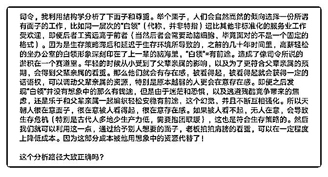

# 试着尝试学习用结构

(提问)。 : 试着尝试学习用结构学分析下，不知道正确与否。

2019-02-26

回答：逻辑有点乱，不知道你到底要说什么。(2 赞)

评论区：

Canon : 我发表点拙见。这个分析不太对，结构性的东西是要在看懂的基础上去分析，看懂的前提是看清。题主可能分析的

是尊重与物质之间的关系，也即心理需求和物质需求。这个可以参考马斯洛的需求层次，马斯洛将人类需求象阶梯一样从

低到高按层次分为五种，分别是：生理需求、安全需求、社交需求、尊重需求和自我实现需求。要进行结构解析，知识面

最好先广点，这样才能从多个学科角度分析，其次再找主要矛盾深入。如果有说错，望海涵。

小楼一夜听春雨 : 这些算是交作业给老师批改吗

。 : 有道理，不同情况不同分析[呲牙]

。 : 就是想尝试如何用结构学分析分析现实状况

