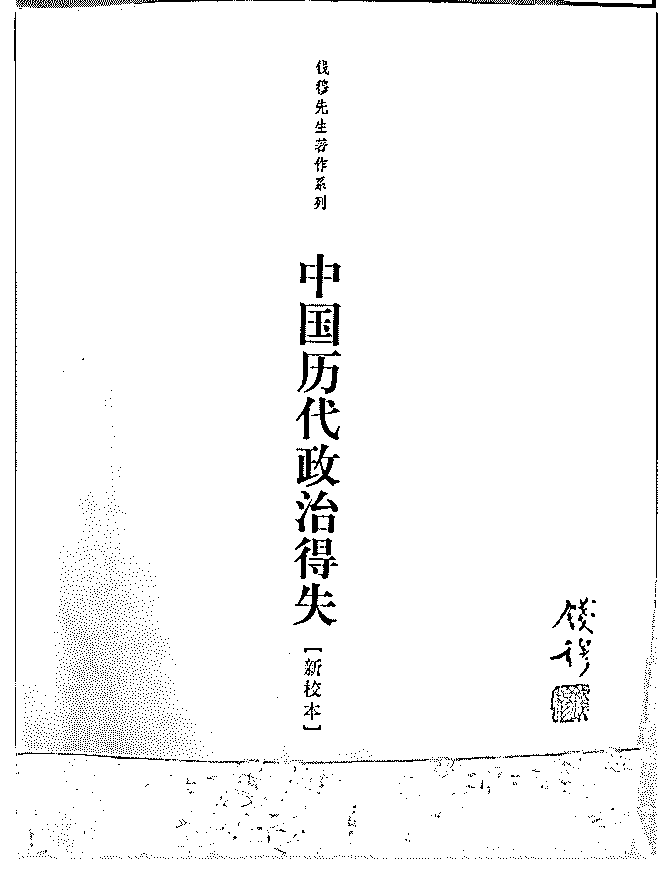

# 只有提问权限，那就

(提问)冥宙 : 只有提问权限，那就打扰下司令，推荐一本书给 圈里诸位朋友，钱穆先生的《中国历代政治得失》，可以作 为结构学的参考用书，书不厚，180 页，定价 16 元。一两天即 可读完，个人觉得对理解结构学及中国政治演变实在是非常 难得的一本好书！

2019-02-24

回答：[微笑] 本来我们在讨论一个硕士水平的研究课题。结

果一堆人跑过来说，你能不能先帮我把大学的知识补上。然

后另外有人跑过来说，你能不能把中学的知识先给我补上。

最后有人提出来说，你应该从小学开始写起... 没问题，可以

从源头，从 1+1 开始讲起，但是我现在没有时间。只能先往前

赶，把整个体系梳理出来，各个部分的逻辑论证慢慢完善。

我现在没法把时间花在某一个细节上的反复解释下。因为这

些都是传导体系在一个小节点。你们理解的人去为没理解的

人作出解释，行吗? 反正可以在下面跟帖。 如果你发现某一

本书能够补齐某一个传导体系的知识点。那你就在下面跟

帖，推荐给那个问问题的人。大家无论如何把 F 系列和 C 系列

好好理解一下，尤其是 F3 的基本原理建议好好读一下！(12 赞)

评论区： 冥宙 :

c z : 我补充个，《想象的共同体》《乡土中国》，齐美尔的《大城市与都市人格》，《农业与工业化》，杨继绳《中国当 代社会各阶层分析》。

核桃里的君王 : 我很奇怪，你为什么说 这本有利于理解结构学。 王梦梦，怡人 : 都市人格那本找不到。

罄 : 希望司令完成硕博课题， 至于 1+1 的问题，其他人好心想解释，估计也会被骂的！因为他们要你给出的标准答案，并且 一字不差!

Nuage : 哈哈哈哈哈哈这是高中的文综啊亲。您是理科生哦 问候林 : 哈哈哈哈，我补充一本《xxxxx》

