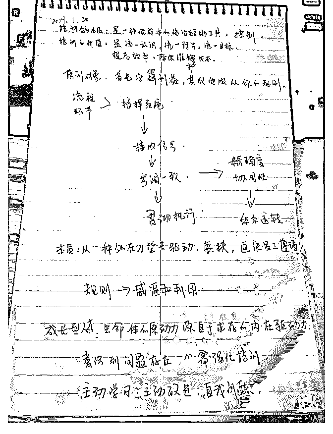

# 我尝试用我的方式去

(提问)小麦 : 我尝试用我的方式去认识你的思维方式和理顺思 想内容。

2019-02-23

回答：这个方法是错的。我发现很多人容易陷入一种权谋的

思维，就是因为只抓细节，抓些立竿见影的技巧。这件事情

变成这个样子是由底层逻辑决定的。底层逻辑决定了边界，

它是有一个本源的冲突，为了解决那个冲突才演化成这个样

子，才需要那些技巧性的东西！不要本末倒置。 我们中国人

的教育缺乏思辨的逻辑性。我们研究问题的时候了我会去追

踪溯源。中国人几乎个个都是阴谋家。热衷于权谋和厚黑学

的臆想。这叫有小聪明，没有大智慧。真正的大智慧一定是

正的，是阳谋，有章可循。 这篇文章就是外交和政治经济决

策的思路。我没有把他说成是个人心法。再高明的决策和实

操，其思维和决策都受其文化和时代条件的制约！有些人喜

欢宣称自己无比牛逼，自己善于揣测或模仿历史上某个高明

的政治人物。这种方式比较契合中国人的固有思维，三千七

百年来我们习惯于搞成一团浆糊，又自以为无比神秘。然而

不管是自然科学还是社会科学，它应该是严谨和清晰的，是

成体系的，是可以被有天赋和头脑的大众掌握的。而不是只

有某个人很牛逼，其他人完全不得其门而入。所以不要像一

个散户一样去研究问题。散户主要特征有：听小道消息，想

入非非和一厢情愿。(8 赞)

评论区：

Kevin Yu : 司令，唯一确认的只有总体方向，其余都在牵一发而动全身的环境下发生的。多一点，少一点都不行。 牵这根

头发是不是也相当于找到塌陷点然后踹一脚呢？

Canon : 我记得上一次司令类似的回答是“好好的一把屠龙宝刀被拆成好几个零件了”[捂脸]

霹里啪啦 : 保护的主要方式有：听小道消息，想入非非和一厢情愿。 这句话什么意思？

c z : 股票为例，如果你买股票听各种内幕，荐股就是这一种，科学的方法可以参考司令的另一篇文章：为什么是隆平高

科？ 其他处理问题的思路也类似，做判断居于底层分析而不是欲望和怂恿。 说白了就是实事求是，结构学帮你看清事实。

白马非马 :

Yavinpa : 最后一段说的是 TT 么，TT 这几天要打喷嚏了[捂脸]

林恒羽 : 司令，我也有这样的疑惑，包括看《国富论》的时候感觉脑容量不够，会采取边摘录边用自己方式总结的办

法……有没什么好的学习方式能让我们初学者更好上脑？求指导[流泪]

林恒羽 : 那个问题就是我提的

