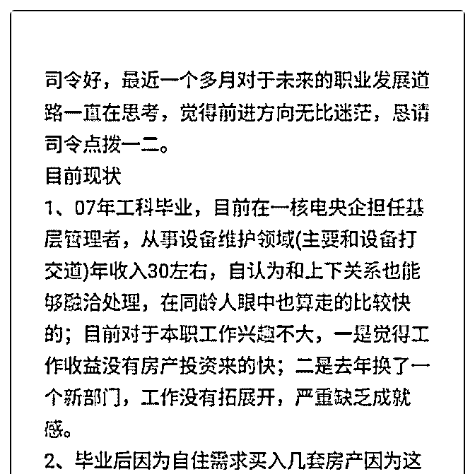
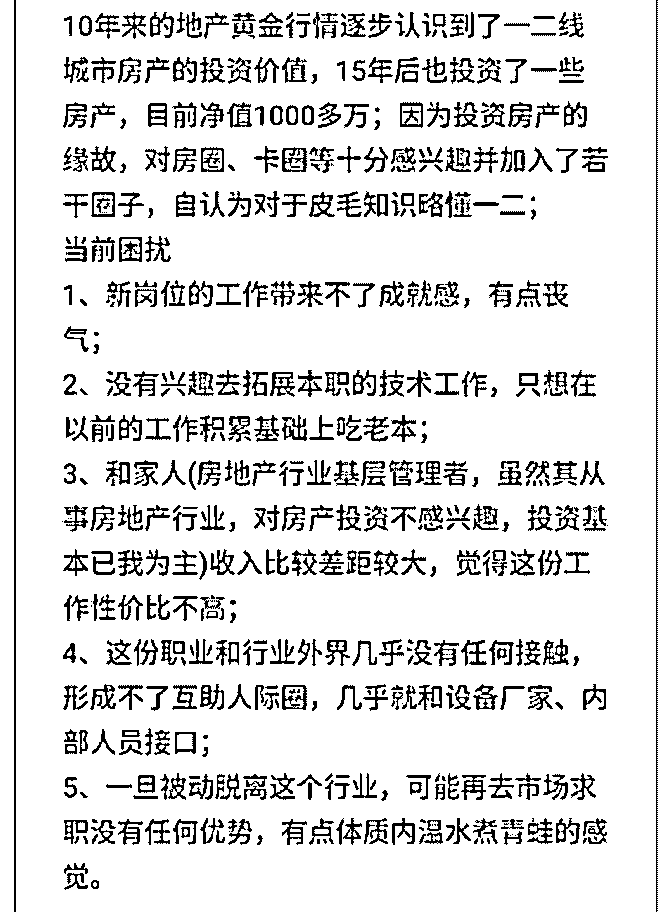
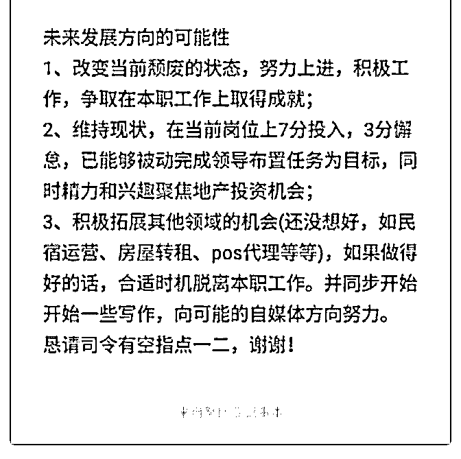

# 司令好，关于我职业

(提问)匿名用户 : 司令好，关于我职业发展道路的迷茫，请点 拨一二，谢谢！

2019-02-23

回答：你或许不知道你要什么，但是你很清楚你讨厌什么。

你与这份工作的关系就像你跟一个人的关系呀，你们走向破

裂只是迟早的事情。因为你对它已经充满了嫌弃和鄙视。 从

2001 年到 2014 年之间，中国超发的货币呈直线拉升。这超发

的货币没有地方可去，大量流向房地产。当然城市化进程和

数亿人从农村迁移到城市的住房需求也是真实的。这种真实

的需求和超发的货币相互叠加，形成了烈火烹油的态势。这

事情嘛，总要有人做，它必然吸附一部分人投身其中，早期

的勇敢者必然是前期的获利者。这波红利的好处和坏处都是

显而易见的，但是，身处其中的人往往不这么看。三个人一

起进电梯上了 16 楼。有一个进的电梯以后就不停数楼层。有

一个进的电梯以后就不停的在电梯里面跳跃。还有进到电梯

以后就直接蹲着不动。结果他们三个都到了 16 楼。跳跃的人

认为是自己不停的跳跃上来的。蹲着的人认为自己是因为趴

着不动才上来的。数楼层的人是因为自己不停的在说才上来

的。其实他们通通都是因为进了电梯才上得来的！但没有人

会承认这一点。 我认识几个搞煤矿的人，那煤炭处于周期疯

长的时候，他们确实挣了一大波。只有一个做过 20 年企业的

人讲清楚了他为什么要买那些矿，而且跟我讲清楚了，他是

以什么样的逻辑判定会涨。其他人都讲不清楚，讲了两三句

就开始吹牛逼。几年过去了，除了那个讲清楚的以外，其他

人又还回去了！ 早两年互联网行业拿钱容易的时候。你随便

碰到个什么人，他都能给你侃侃而谈。今天再去看那些人的

时候，你会发现他们要么自己搞的东西砸手里破产了，要么

连人带部门都被人裁了！ 你并不清楚你要什么，我感觉你内

心深处也并不相信你自己在某个地方富有天赋，否则你早就

去发挥你的天赋了。每个人都会认为自己对复杂的事情更擅 长，而对简单的事情没兴趣。因为复杂的事物没有标准，而 简单的事物很直观。科学研究证明或者证伪。就是说，我做 出了某个实验，我把步骤写下来，给你讲清楚，你能理解和 掌握以后你也能重现，这才叫科学。那种只会一味的说我多 么多么牛逼的人，那叫玄学，玄学才可以信口开河。玄学是 逃避者的避难所，就如同总是通过鄙视去寻找优越感一样！ 过不了几年，很多人会把自己误打误挣到的钱都通通还回去 的。潮水退去的时候，许多人会发现自己没穿裤子。我暂时 没法给你什么建议，因为你目前存在一种强烈的想逃避的冲 动，但是你又不清楚自己要什么。你甚至不清楚你自己真正 擅长什么。我跟以前从事制造业的老板聊过，他们说现在逐 渐找不到人了。因为年轻的人不愿意做制造业。他们大量的 淤积在那些没有什么太多门槛的行业里面。这两年股市火的 时候，从业人员也是暴涨，互联网行业也是如此。那个门槛 越降越低，很多其它行业的人都转行冲到这里来，因为预期 很高。那些毕业一年屁都不懂却坚持要 2 万的毕业生，此时此 刻可能正在送外卖。当互联网和金融领域开始回落的时候， 那些没有门槛进来的人，也被毫无门槛的挤出去了。我见过 一些没有准备好，甚至没有做过中层以上干部的创业者。他 们还真以为在名片上印个 CEO 就能跟昔日的领导平起平坐 了。现实反手就是一个耳光——潮水一退又变成茅草屋了。 你目前处于和心浮气躁，茫然焦虑和急于求成的状况。我觉 得此时此刻跟什么方案都没用。那天跟一个机构的老大喝 茶。聊起了罗永浩和他的挣钱宝。我看了一眼罗永浩的挣钱 宝。我对他说罗永浩彻底死了。他很惊讶问为什么？我说， 罗永浩一直以来设计东西追求逼格，追求一种非常克制的贵 族范。但是今天他搞的这个狗屁挣钱宝，完全是利用和刺激 人性的贪婪，把他原有的一切全部推翻。这说明什么？说明 一个人的心态失衡了。你的心态完全失衡的人... 就真的完 了！ 他先是惊讶，然后表示认同。 未来做什么不要紧，你不 能在心态失衡的状况下，不能在逃避和焦虑的状况下做关于

未来的决定。那样会很扯淡。也不会有什么好的结果！你看 过下棋吗？高手过招，从来不大喊大叫。(25 赞)

评论区：

温心 : 司令能赐教一下那个存活下来的煤老板以怎样的逻辑判断煤价会涨吗？很感兴趣

司令 : 他非常清晰的说出了关键区域的煤矿的产量和产能。他也清晰的说出了煤矿的运输路线和覆盖区域。他还清晰的说

出了每一个区域的地方的政策对当地煤矿开采成本和产量的影响，以及主要消耗单位的下游需求量，还有运输的和储存的

状况。因为他做了几十年的企业，在他脑子中有一个清晰的结构以后，他有很多渠道去获取那些关键点上面所需要的数

据。那些东西只是来验证判断的。他给我讲了他买的攀枝花的一个煤矿，他以那个案例展开那个结构中的每一个节点。细

节我都不记得了，但是他的那个逻辑我看清楚了。我就确定他是有备而来的。所以当时在煤价非常低的时候他 All In. 我上

个项目的一个投资人跟他是好朋友，当时还嘲笑他。劝他应该投互联网和项目，而不是去买正在跌的煤矿。正是因为如

此，我才去找他想听一下他为什么要那么做。听完以后我觉得他胸有成竹并不盲目。那个人 14 岁开始出来，作为合伙人把

一家公司从零做到上市，后来退出来了套现二十三亿，是个老江湖。

温心 : 谢谢这么晚还回复，我也等你和思考猜测了一个小时根据学习你的结构学的应用。跟你学习的快一年时间，感觉我

的气质都变了，万分感谢[抱拳]

