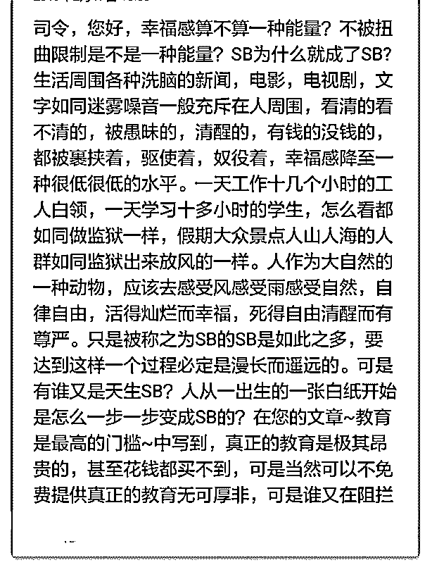

# 司令您好，这是图一

(提问)匿名用户 : 司令您好，这是图一。

2019-02-20

回答：幸福感是什么？它怎么产生？ 我觉得 这个回答里面已

经包含了一些你所想要的答案。 另外我从你的表述中看到了

愤怒。不是你一个人这样，我发现所有从水库过来的人都有

这个特征。极度的鄙视你们口中的 SB. 根据结构学的原理，这

是人为塑造的，可能是另外一种操纵... 如果你需要去向你鄙

视的群体寻找优越感，从本质上来说，你把自己与鄙视的人

摆在同一位置。按道理说，他蠢他的，你聪明你的，井水不

犯河水！ 你问我有没有可能有一天实现奥派所说的社会。奥

地利经济学派是不是一个放之四海皆准的真理？他在多大规

模的程度上有效？是否经历过现代化的社会实践过？这主要

论述是什么？我想这些问题你应该都没有深入的去思考和探

索。我相信庙堂之上不都是蠢货。江湖之中也绝非都是闲

者。否则庙堂很容易被取代。有些东西是违背直觉的，而人

一旦有了立场，往往容易形成自我遮蔽。原理我已经在 f3 里

面详细的阐述过，可以用来佐证的事实，在生活中比比皆

是！ 结构学研究生命体在其生存结构中的存续之道。我不会

草率的说应该怎么样。我只是去搞清楚他正在怎么样，为什

么这样？世界上脉都号不准就开方子的郎中到处都是。先要

号准脉。假如一个投资的决策，一个项目如果是由你来决

策，也由你来承担责任和支付成本。你就不会那么轻率的得

出结论，而会慎重的去探索本质。 当你觉得别人是傻逼的时

候，为什么不多想一步？傻逼为什么会成为傻逼？傻逼行为

背后到底是什么东西在左右着他？结构学的研究强调追踪溯

源，哪怕傻逼也是很好的研究对象。因为傻逼也会自然而然

的遵循底层逻辑。你们有时候提的问题实在是... 但是我还是

会去思考，你为什么会这样想？然后我再用听得懂的语言去

解释。(19 赞)

评论区：

热咖啡 M : 读司令的文章，不能带任何的情绪，平淡、上善若水，方有所悟！

machelshan* : 用司令的话讲我们的教育有个严重的缺失，我们不在乎完整的逻辑，我们的情感教育里面缺乏理性，我们的

生活教育中缺乏经济概念，我们的科学教育中缺乏逻辑观念，几十年的雕塑驯养拆穿了真相估计有人会不适应，科学无法

普及。

热咖啡 M : 显然，这是人为的，众生皆为工具，再不济，可做韭菜、燃料…

machelshan* : 韭菜也要做最肥绿的，燃料也要做燃烧的最充分那些，儒家的有所作为[呲牙]

TK : 水库是世界是坏的，我就不能变好！ 司令是即使世界是坏的，但我们也要做好！

罄 : 总被 sb 觉得 sb 也很好啊！ 为什么听见 sb 就觉得不好呢？

依依东望.Isabe* : 善哉司令 像个正常人类一样长期说人话，而又包含智慧和中立的洞察的风格已经不多见，每天看司令答

对和文已经是一种幸福。那些真鄙视也好假鄙视也罢，时间长了还是腻人

核桃里的君王 : 很简单，因为体质的需要所以有人工作是几个小时。 初中 高中正是男性荷尔蒙发育的时候，这个时候的人

就需要关进监狱里，如果让他们无所事事就会闹事。 这一切都是秩序的需要，所以有的人必须去死，有的人必须当 sb。

