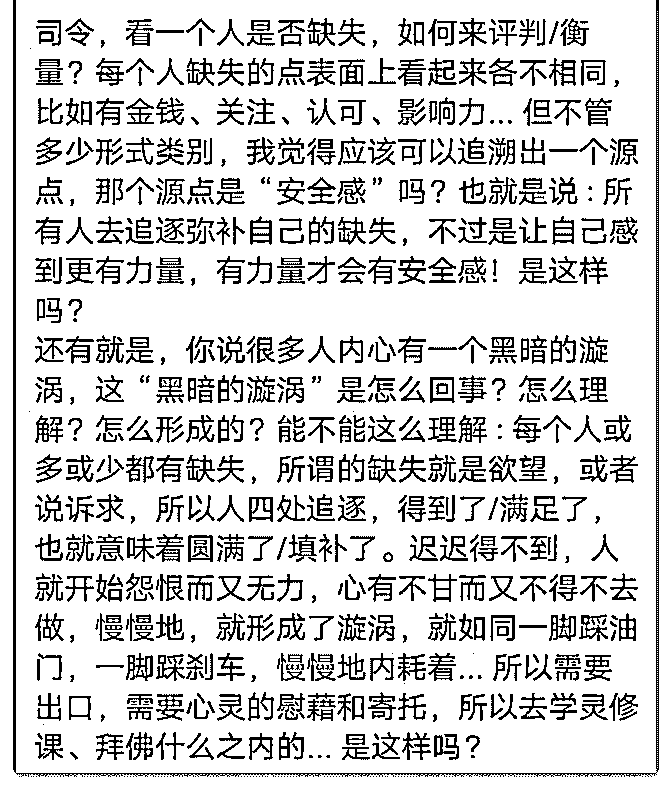

# 司令，因为篇幅的原

(提问)匿名用户 : 司令，因为篇幅的原因，所以问题用截图的 方式发了出来... 谢谢

2019-02-20

回答：要搞懂理论就去读 F3, 那天晚上我吃了你们的烧鸡。一

口气写出来的，逻辑还比较严密，也阐述清楚了。结构是一

种有序的平衡。平衡被打破了。而且精神结构的特征会再平

衡打破以后形成循环叠加自我强化的扭曲，它像多米诺骨牌

一样，引发连锁反应。又像递归函数一样，把结果当成新的

基准参数传进去。 你告诉我安全感是什么？生命体在微观和

宏观上呈现出同样的结构特征。你恢复个体安全感的操作和

一个国家恢复秩序的操作其实本质上是一样的——都是回到

有序和平衡。都是抓关键节点，都是利用结构力量去矫正结

构力量造成的扭曲。用非理性对抗非理性。 关于你的问题，

我就举个例子吧，这样你可能比较容易懂。如果一个女生看

童话故事长大，他的生活环境过于单一，经历没有任何波

动，都是在别人安排好的步骤中按部就班。那么就会形成一

种获得是理所当然的认知和心态。比如说她的日常开销都有

父母包办，房子车都是父母提供，平时衣来伸手饭来张口习

惯了，平时父母都很关注他，有一点小情绪，父母的马上感

受得到并及时的满足她。她会觉得这是理所当然的，因为一

辈子都这么过来的。有一天她到年纪了，突然结婚了。她会

突然之间觉得哪都不顺！她会觉得他的生活品质瞬间下降

了。她会觉得她的诉求没有人及时的察觉和满足，她会发现

需要她自己独立处理的麻烦事越来越多。她会觉得她不幸

福！这就是没有安全感。因为以前的那种生存结构的平衡状

态，是由父母的物质精神方方面面的付出在维系着，而她是

看不见感受不到的。等她作为一个独立的个体，从母体中脱

离的时候。那些她没有支付成本就拥有的平衡瞬间全部坍塌

了，这种塌陷会引发循环叠加。她只会一味的感觉到哪里都

不对，完全不知所措。她会期待一个不存在的完美拯救者出 现。能够瞬间让她在任何方面都恢复到平衡状态。这就是她 要的安全感！否则就会有一个不断塌陷形成的破坏力量，不 断怂恿了她去寻找出口(10 赞)

评论区：

核桃里的君王 : 吃烧鸡不配啤酒吗

司令 : 下次吧[得意]

c z : 这个妹子要恢复秩序具体要怎么操作，利用非理性对抗呢

唐宁 : 我女朋友就是这样分手的。[捂脸][捂脸]。哭闹是换不来股权的。我又没让她叫爸爸

大山 : 咦，好基友的既视感

swallow : 所以，巨细无遗的对孩子的照顾到底是对还是错？

司令 : 绝对是错的！

核桃里的君王 : 你想多了

