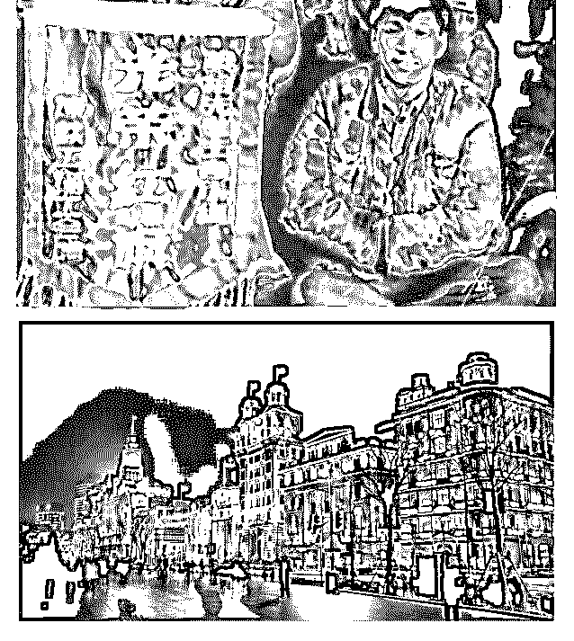

# 40 年前的今天的凌

司令 : 40 年前的今天的凌晨，对越自卫反击战正式发动。在我 们一无所有的时候。父辈们用鲜血向美国纳了个投名状。从 此开启了资金产业和技术转移的序幕，外部需求的牵引和外 部落差的挤压逐渐打破内部社会和产业结构，才有了今天的 基础。

大家都说巴菲特是股神，都推崇巴菲特的价值投资。但是大 家忘记了一件事情。就是这第 2 次世界大战以来到现在，美国 本土从未受过威胁——不管世界如何动荡，美国都是资金避 险的最好去处。在连续的七十年里，美国处于社会上升阶 段。这才是巴菲特价值投资能够躺赢的基础。

筚路蓝缕，纪念那些先辈们牺牲和付出！

2019-02-17(35 赞)

评论区：

罄 : 每次危机美国都把内部矛盾顺利转移出去了!

airyxia : 全球经济发展的大周期，一些大国市场经济的发展，以及融入国际化。

airyxia : 司令，美国 70 年经济发展，是内需为主，还是外贸为主？

温心 : 照片前两张是谁？

