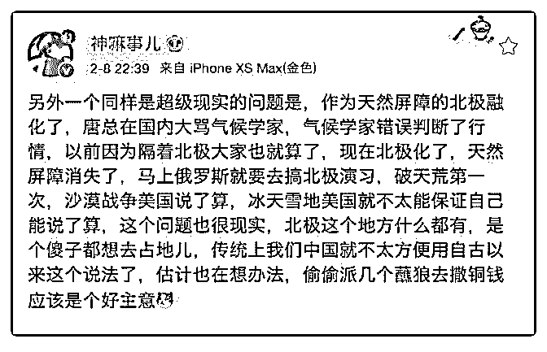

# 司令，北极融化会对

(提问)匿名用户 : 司令，北极融化会对中美俄关系会产生什么 影响？中美俄三国可能会采取什么行动呢？

2019-02-08

回答：我们正在努力开通直达欧洲的北冰洋航线。我们与俄

罗斯合作，这条线基本上在俄罗斯的领土内航行，美国无力

干涉。商贸还是别的，这条线路开通，对中俄欧都有利，唯

一对美国不利。我记得有几个补给点都是在俄罗斯境内。好

像有七个，具体数量我记不清了。 另外，我们的军用地图和

民用地图是不一样的。民航从美国过来是从太平洋过来。但

是导弹防御是防御从北极打过来。我们会去做一些科学考

察，建立一些监测点。(7 赞)

