# 昨天有一个很长的回

司令 : 昨天有一个很长的回答不知道谁保存了，今天觉悟社这 个回答也被莫名其妙删除了，还好有人及时保存！ 昨天那个谁保存了，贴出来一下！

2019-02-08(16 赞)

评论区：

Dilink（撸房帮* : 感谢司令的长文分享

核桃里的君王 : 在整个工业化社会结构中，需要的是一个个受过良好教育的人，而不是一个个大学生。所以现在国家提倡

对生孩子。因为在以经济实力为标准的情况下，普通人根本娶不到老婆。家庭瓦解，宗族时代来临。没有家庭就没有工业

化社会。这就是我们为什么提倡一夫一妻。

霹里啪啦 : 请问，为什么没有家庭就没有工业化社会呢

核桃里的君王 : 人是原子化状态，才会靠拢集体国家。如果宗族还没有灭绝，那么人第一效忠对象是自己的家族而不是集

体国家。一个国家是少数人把持的，你可以看看 gmd 的下场。 没有利益就没有效忠。组织的运行靠关系的远贵亲疏那么离

灭绝也不远了。 还有一个，现代社会运行是靠大多数人，一个坦克出厂，牵扯，开采 冶炼 石油 化工 电子 运输。这根本不

是一个或者几个家族能干的。这些人除了占着茅坑不拉屎，没有其他用处了。

核桃里的君王 : 说实话按照我国的人口基数，死一半人都不嫌多，谁让享福的人太多，羊都不够用了。

Yanye Tang : 这种客观事实和观点的交流，为什么有人会要删掉呢？

Canon : 那么长的回答，辛苦了[玫瑰]

德隆思然照明*专业高* : 从现实社会观察，失去庞大人口基数深厚社会底蕴，不论经济或社会都要比现在调零。社会上升

是整体螺旋上升，不是废此厚彼，就算现在也是源源不断吸取底层能量，不要自己成了高端人群就看不见这个国家社会是

靠什么支撑发展的。我们反对一刀切，反对过尤不及。要看到底层脉络，社会是一个整体，不是单个点

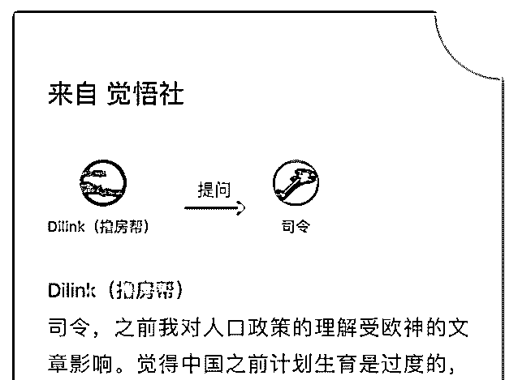

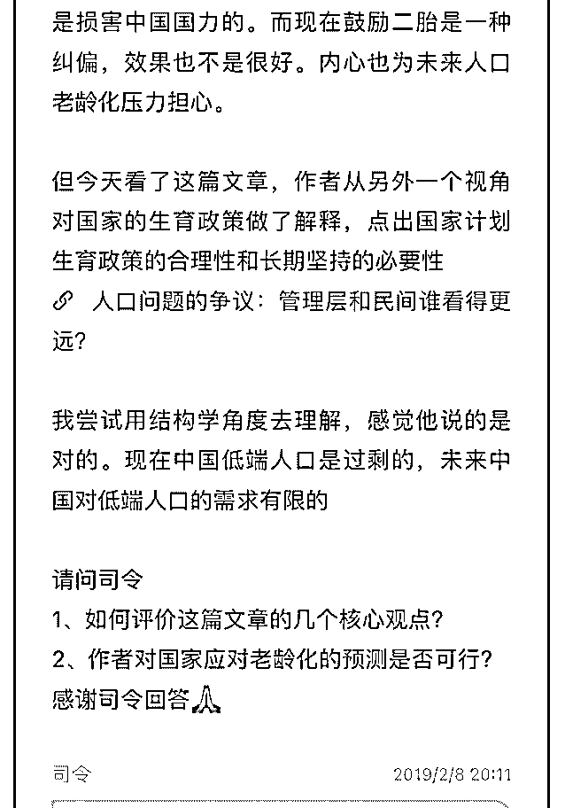

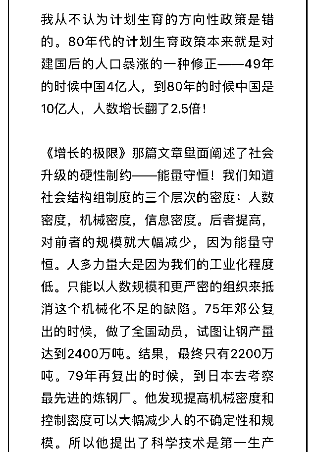

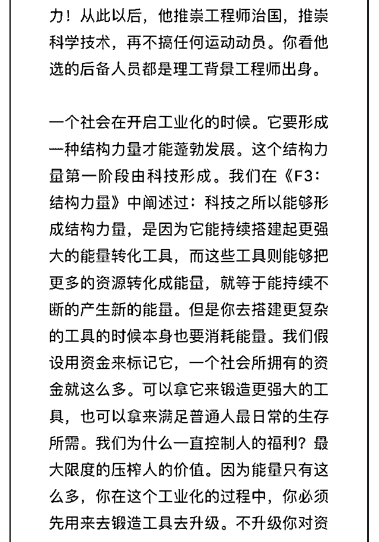

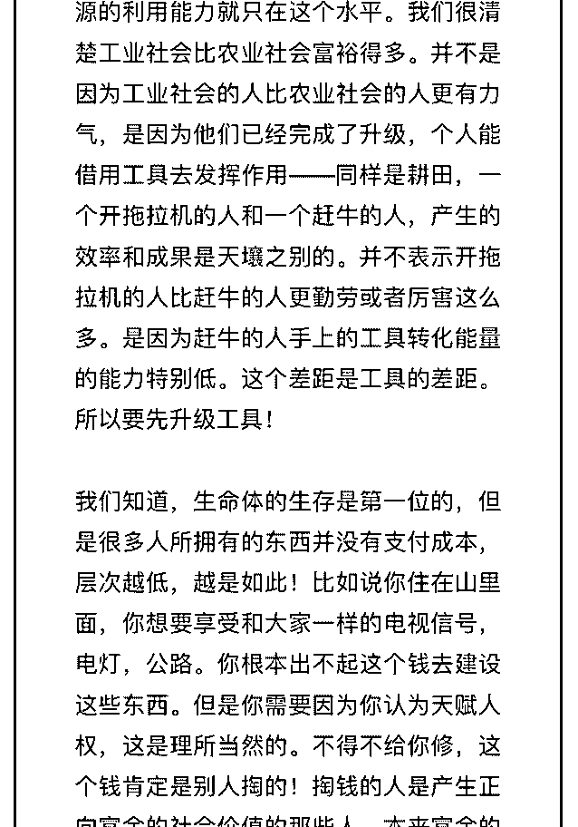

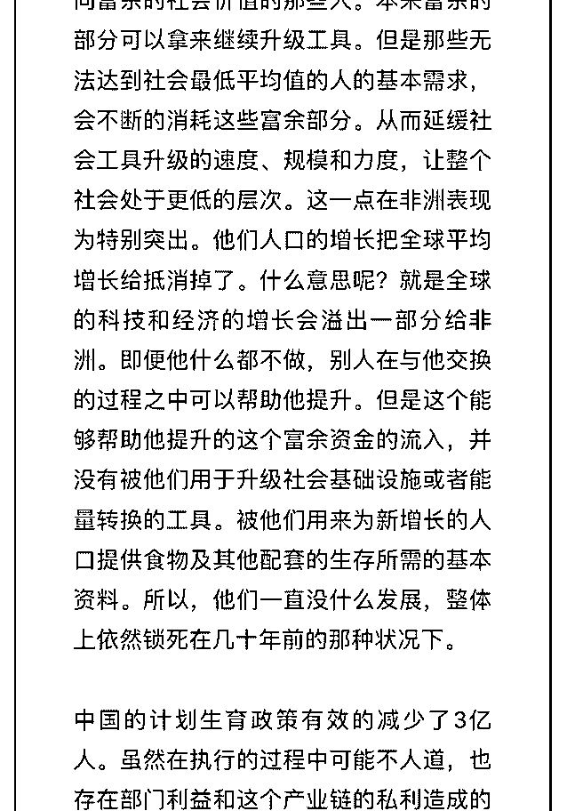

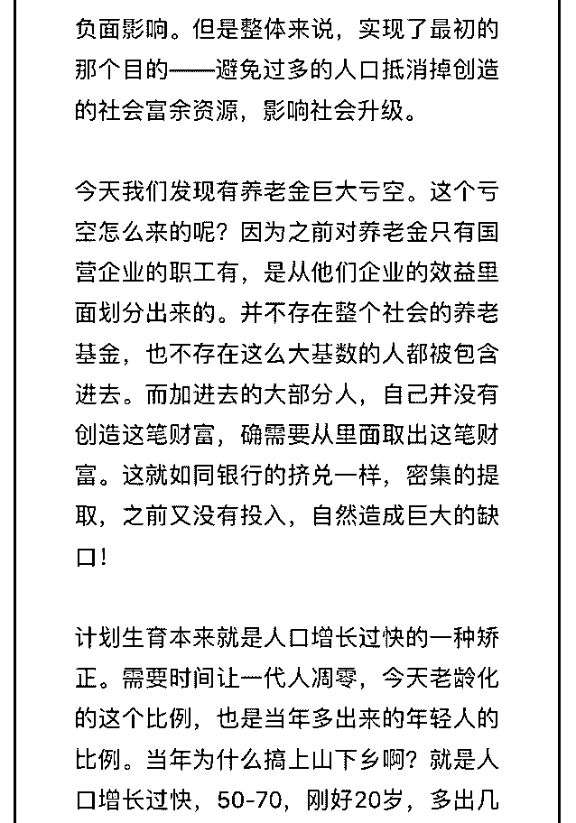

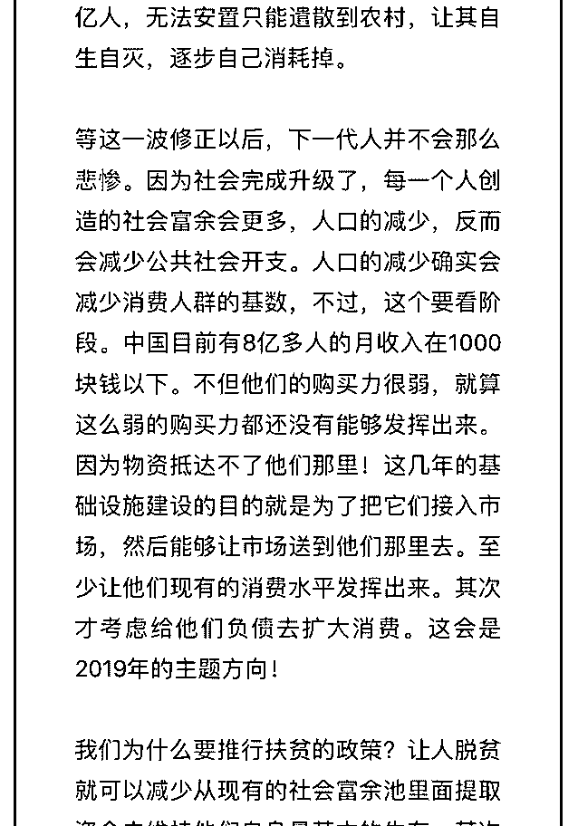

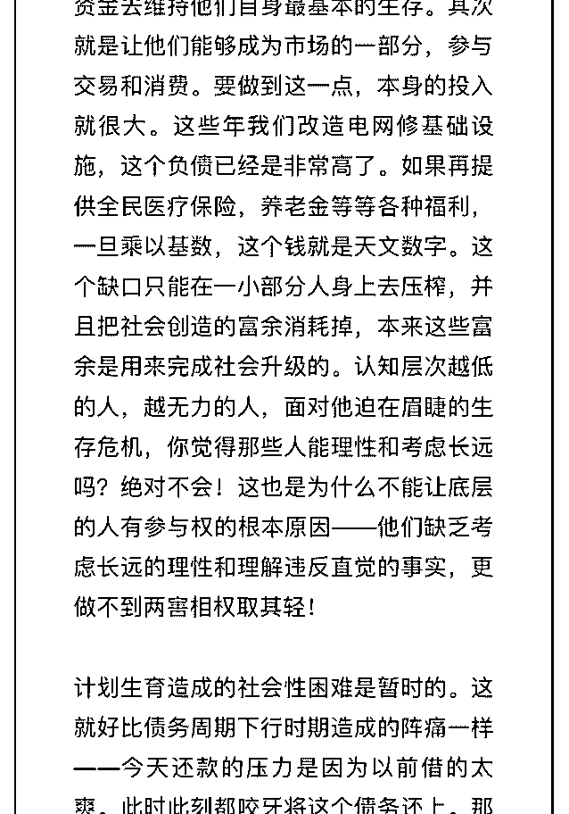

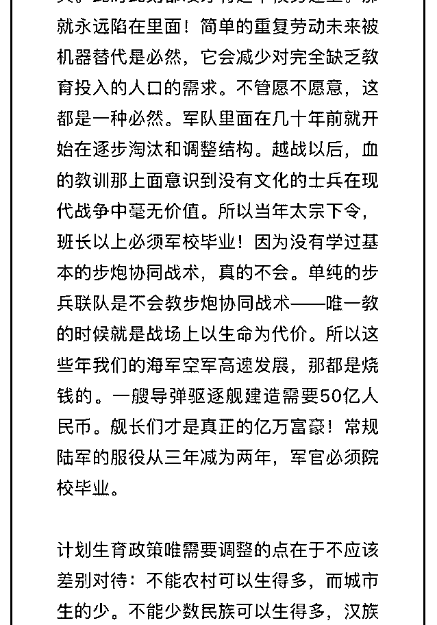

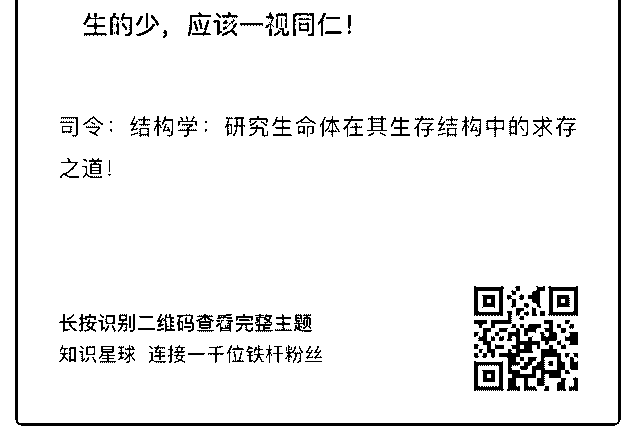