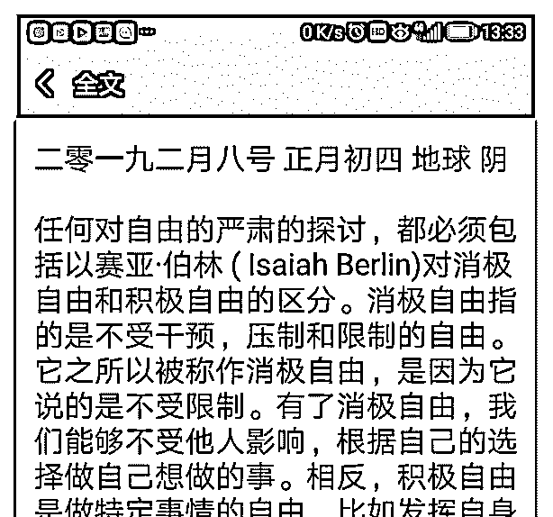
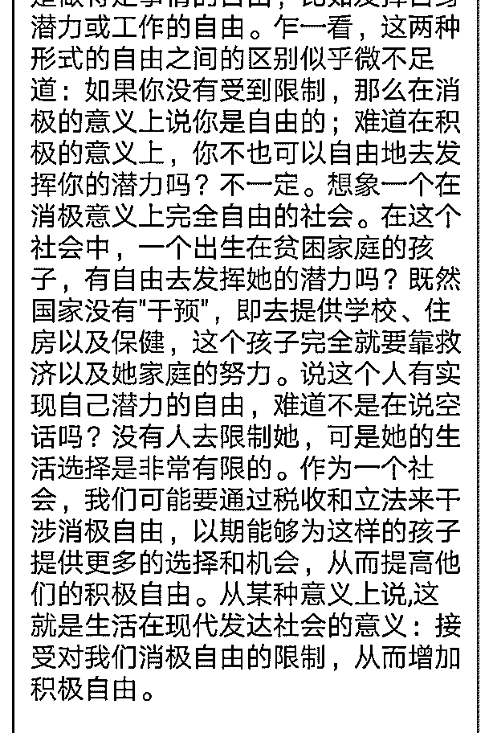

# 司令，新年好! 在

(提问)Xiao : 司令，新年好! 在朋友圈看见一个发文说： “任何对自由的严肃的探讨，都必须包括以赛亚·伯林 ( Isaiah Berlin ) 对消极自由和积极自由的区分。消极自由指的是不受 干预，压制和限制的自由。它之所以被称作消极自由，是因 为它说的是不受限制。有了消极自由，我们能够不受他人影 响，根据自己的选择做自己想做的事。相反，积极自由是做 特定事情的自由，比如发挥自身潜力或工作的自由。乍一 看，这两种形式的自由之间的区别似乎微不足道。。。。。” 我看了几遍，没有看明白其中道理，也不敢苟同，您同意她 的看法吗，谢谢!

2019-02-08

回答：你没有看明白又不敢苟同，这从何说起的？对于不清

楚的事情作出判断，这就是我们这个社会常见的情况。这也

是对外部生存环境自我抽象的一种扭曲。 他的意思是说：人

会陷在自己的生存结构之中，这个生存结构包括它的现实生

存环境，以及自身对这个生存环境的自我抽象，继而形成了

一种生存策略。人可以通过理性的认知，识别和修正自己的

生存结构，继而以更合适的生存策略去打破外部裹挟。但是

绝大多数的人不具备这样的能力。而且迫在眉睫的生存危

机，会造成他对生存环境识别和抽象时的扭曲，形成一种短

视的恶性循环的生存策略。然后永远锁死在那个困境之中！

比如说你有开车的天赋，但是你们村里面没有车可开，你连

摸能动的机械的机会都没有。迫在眉睫的生存环境和你能够

解决当下生存问题的出路非常有限。你的认知和思维也被逐

渐压缩到一个非常浅的巷子里——你就天天刨地勉强填饱肚

子。 这个时候必须要借用外部力量的输入，才能打破这个禁

锢和束缚。外部力量输入有两种：你总是开启智慧，让你意

识到你可以不刨地，用别的方式也能解决生存问题，还能改

进你的生存环境。还有一种方式是外面人直接出钱出力给你

们建工厂，把你招到厂里面去，培训你开车拉货。这就是打 破结构的两种力量——内在的力量和外在的力量。 国家的公 共设施建设，甚至一项扶贫项目。就是在用外力摧毁原有社 会生存结构。同时以市场的方式去教育和改进他们的大脑。 让他们主动的摆脱原有认知惯性，去接受新的事物，看到更 大的世界，作出正确的选择。从而改变自身的生存环境和命 运。(7 赞)

评论区：

Xiao : 司令好像可以用生存结构学去解释一切，也不错哦，很好的回答。谢谢!

司令 : 不是去解释一切，是结构学处于最底层。

罄 : 结构学是显微镜下的动态跟静态

airyxia : 司令，你觉得例子没啥区分啊，都是先看清生存环境做选择啊，内部力量和外部力量的本质区别是啥？

Xiao : 内部力量就是人自身内部的力量，外部就是自身之外，来自外部的力量

Xiao : 你天天都在呀，女生还是男生

罄 : 看手机有信息，有信息就评论了评论! 顺便思考了司令的话是何角度是什么观点！ 然后就跟司令同步成长[偷笑]

airyxia : 人身内部，人身外部有什么区别？内部是指人的自我认知发生变化，主动选择？

