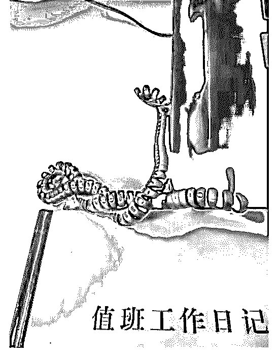

# 我问他在哪里，他给

司令 : 我问他在哪里，他给我拍了一张不泄露信息的办公室照 片。红色的加密电话一下就告诉我他在哪里。 “委内瑞拉那边要变天，你们准备介入吗？”

“在等命令！” “如果委内瑞拉丢了，沙特，委瑞瑞拉，再加上美国，份额差 不多过半了吧？如此一来又多了一个武器：油价！这可是我 们的命脉，我们只有 90 天的储备，对吧?” “嗯，司令员也值班！” “我看到普京都跳起来了，一旦份额过半，把油价打低，他就 会死的很惨。”

“嗯，我们在等命令！” “不可能直接出兵吧。”

“哥，这涉及到机密。我只能说：如果要我们死，我就去 死！”

“啥都不说了，新年快乐！”

“也祝你新年快乐！我觉得... 你应该来我们这。你的报告我们

领导看了，他说你应该来我们这，可以特招”

“暂时不行，研究还不够，另外，我需要在外面验证。感谢你

们在那些世人看不见的地方默默付出。最理所当然的东西最

为珍贵！”

“哥，我只能用一句官腔回答你了：为人民服务！”

“......”

2019-02-04(30 赞)

评论区：

凡 : 如果，就。

黄 河 : 过年向战斗在第一线的战士致敬！

白马非马 : 特招！[强]

c z : 委内瑞拉丢了的传导过程是怎么样的

ALEX : 科学的普及才是最大的功劳，也期待 19 年司令可在深圳举报线下见面会[呲牙]

司令 : 没这个必要！我不想成为社群的中心，这容易形成自我遮蔽性。成为社群中心的应该是结构学本身，而不是任何个

人！但我去做一个项目的时候，我也是把大家团结在一件事周围，而不是一个人周围！

。 : 按照和司令学的结构学，发现委内瑞拉的所以关键支点都破裂了，必然变天

。 : 中俄也没啥可能真介入，毕竟美帝后花园

