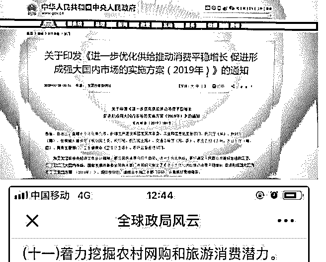
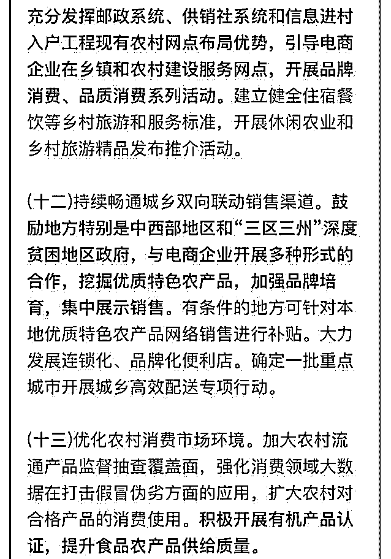

# 最后一个政策预判也

最后一个政策预判也被验证了！

[A24](https://mp.weixin.qq.com/s/B_q8aF5gIQA7Igr8Cl1cHQ)[：刘士余去供销社干什么](https://mp.weixin.qq.com/s/B_q8aF5gIQA7Igr8Cl1cHQ)[?](https://mp.weixin.qq.com/s/B_q8aF5gIQA7Igr8Cl1cHQ) [几次成功的结构学预判](https://mp.weixin.qq.com/s?__biz=MzAxNDk1NjI2Mw%3D%3D&mid=2247484266&idx=1&sn=02ab915e029cbe24d91712f741b3f37c&chksm=9b8a20e2acfda9f4498a5c76204c101ab26e7311f2fb7d3043de108d4ff6e18d72a1c889a569&xtrack=1&scene=0&subscene=131&clicktime=1549001909&ascene=7&devicetype=android-25&version=2700003c&nettype=cmnet&abtest_cookie=BQABAAgACgALABMAFAAFAJ6GHgAjlx4AWpkeAJuZHgCdmR4AAAA%253D&lang=en&pass_ticket=7ikghGLAmRyV9a%252BfAEOVv7enUIJlGsVbmkfvP788TN44bd4AaagNZYf2Q2urDeQh&wx_header=1)

2019-02-01(19 赞)

评论区：

司令 : 感谢小伙伴提供的证据。

F : [强]

罄 : 充分利用土地 农产品，旅游 借力供销社电商等帮他们消化，让他们有钱后消费过剩产能。 节约国家外购农产品成本，

扩大需求。 提高相应金融产品把他们需求发挥到最大。 以此来弥补已经塌陷的贸易结构!

大山 : 一声叹息

TK : 机会在哪里？做平台还是？

