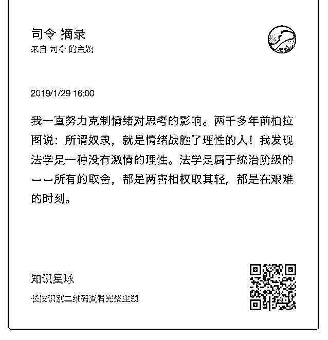
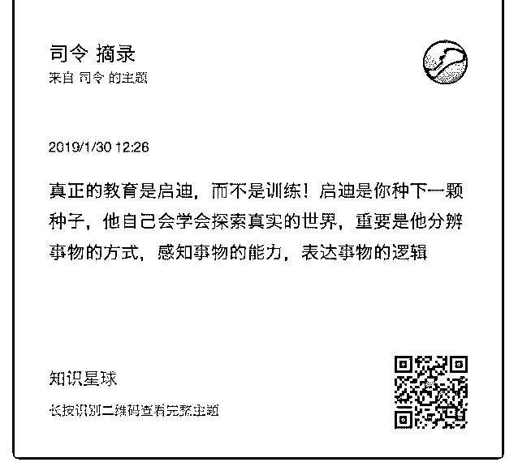
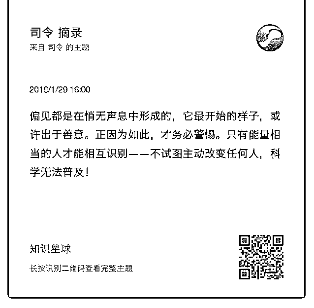

# 去理解反人性的东西

司令 : 去理解反人性的东西，跳出来观察，用理性去思考问 题。抽丝剥茧，追踪溯源，找出从原点到现实的严密逻辑

——如果大夫把脉都号错了，别指望能治好病！ 2019-01-30(20 赞)

评论区：

罄 : 司令你还会讲不同意识形态的逻辑吗[疑问]

核桃里的君王 : 你这是要成仙吗。

王布斯 : 反人性太难了

宁静致远 : 朝九晚五是反人性的，但是大多数人还是不得不去做，因为没钱花没饭吃的恐惧天天在驱使着你。见笑。

罄 : 我把司令说的忘光了[发呆]只有个我自己理解的框架在，但是我知道我的框架地图是不对的，总觉得司令还没说完整!

框架差一点，内芯差很多，还有血液怎么流动的没说，不知道是不是司令这个体系里面的东西!

猫姐 : 这个摘录很好啊，适合在社群里传播

司令 : 难道你们没有这个功能吗？长按选择就可以了。莫非只有我有！

司令 : 还没说完，不是说了，放出第一部分！这是原理啊

