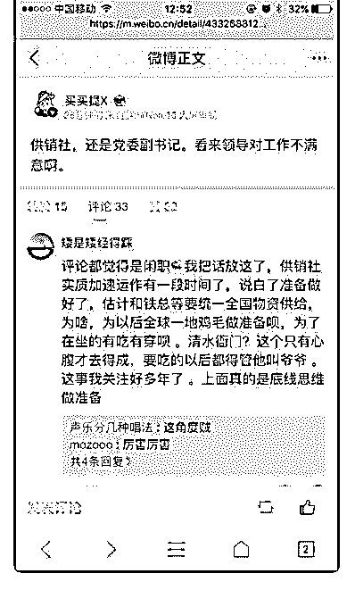

# 司令，对供销社有了

(提问)匿名用户 : 司令，对供销社有了解吗？

2019-01-26

回答：2019 年的机会何在呢？两个字：渗透！ 我觉得上面很

肯定他的成绩。其实他是对的，因为他不提前引爆的话，那

么到真正危机来的时候引爆，那就会死的很难看。而且在这

个引爆的过程中，他做了很多体制性的改革，这种事情必须

在危机中才推得动。否则有那么多利益相关方的牵扯，谁能

推得动政策！ 在精华里面有个问题。有人问我为什么当年解

放区的经济比国统区还好。大家无法真正的理解真实的事情

况。凭着一些概念性的东西去理解曾经发生的事情。就好比

49 年以后的很多政策，他并不是那一刻想出来的。他其实是

在 30 年建立格局统治的时候。就已经在实施而且非常有效的

政策。包括政治政策，经济政策，军事政策，宣传政策以及

社会治理的方式。49 年以后只是把那些成功案例在规模上放

大到全国而已。唯一没有想到的地方是，之前的很多政策在

发展过程中从来没有在大城市里面实施过。这是一种完全不

一样的经济和社会形态，所以才产生了一些不适。 当年在农

村做的几件事情。第 1 件事情就是没收地主的土地，重新分给

农民，这个叫土改。在土改之前，农村的土地兼并非常的严

重。也就是说人民公社那种大锅饭，早在几十年前就在农村

实施了。大家都为地主家工作，还不一定有公社食堂让你吃

饱。许多农民没有土地，也没有生产工具。他们叫长工或者

短工。有一丁点土地的叫自耕农，这个很少。即便有一点点

土地的自耕农，他也只能混个温饱，因为他缺乏将他多余产

出的东西进行销售的能力。 当时的组织在农村做的第 2 件事情

就是建立生产资料的调济体系。就是他会组织互助队，土地

分下去以后，你们家的人不够，那个组织去给你调配人员调

配。你们家没有耕牛，他会去调配，从别的地方调牛过来。

总而言之，他建立的那套机制是围绕将人和地最大限度的发

挥作用，产生经济价值。 当时组织在农村做的第 3 件事情是。 建立供销合作社。为什么叫供销合作社呢？统购统销。你每 一个地方的农民生产多余的东西。政府建立了一套跨越所有 统治区域，深入到每一个毛细血管的流通体系。我们还没有 详细讲交易结构。交易能够达成一个很重要的原因就是交易 成本。在旧时代任何一个路有拦路抢劫的，你这条商路就断 了。但人活不下去肯定会去拦路抢劫。组织在基层建立秩 序。让人员回归生产。都是穷人对吧，是被迫的，也算革命 行为，回来就行了。现在有活干，有饭吃。秩序建立以后有 自卫队，民兵和正规军。他们保持商路的畅通。在那套统购 统销的流通体系中，是真的没有中间商赚差价。因为所有的 中间商都是政府。只要政府的高效和廉洁，它就保证了物资 的流通成本最低。 当年美国援助国统区的物资经常在黑市交 易。就是有中间商赚差价。所以东西到不了需要的人手中。 而解放区的东西在另一套规则下运行。东西虽然匮乏，但是 以最大限度的利用了人和物的生产和流通。当时解放区一直 处于封闭之中。那么大的人口基数，频繁的战争。它居然没 有崩溃而且还欣欣向荣。所以在当时的情况下，它把组织都 发挥到最大的极限。确实是解放生产力的，也是激发商业潜 力的。 中国在上一次发生外部的需求锐减的时候。就搞了家 电下乡啊，各种乱七八糟的东西。他在加强市场的渗透，在 激发需求，会提高个体的负债，创造需求去抵消外部减少的 份额！ 改革开放这 40 年，供销社体系已经瘫痪了。因为用不 着。目前在供销社体系流通的只有化肥农药和种子。所以你 会发现这种东西的价格基本恒定。因为需求是明确的供应也 是固定的。 F3：结构力量，讲过结构力量三要素之一，就包 括性价比最高的传导体系。还有一个会自我强化的驱动力激 励制度，这个很快就会看到。会在金融和信贷上设计出相应 的这种刺激机制。另外就是一个共识。这个故事很明显，就 是加强渗透，促进律师提供信贷，拉住生产和就业。 我们看 到了两个事情。第 1 个事情，金融在放水。我说的放水不是降 准这种破事。真正的放水是可以发政府债券区到二级市场购

买资产。政府债券这种东西是以政府信用做担保的。换句话 说他是没有抵押的。也意味着，如果愿意的话可以无限度发 行。我们在讲结构力量三要素的时候。科技金融和情绪都能 形成自我叠加的结构力量。因为金融能够把未来的钱拿到今 天来解决眼前的冲突。这个未来没有确定的时间刻度。他只 受制于一个点：那就是债务的利息超过了当下的收入，所以 会引发债务危机。我们政府的信用度和控制度是很高的。所 以他这个债可以发很多，他在放水，这个放的水是用来干事 的。 社会结构完成升级以后。经济才会上一个台阶。那么产 业必须升级。才能产生更高的附加值。当产业和科技的升级 是需要巨大资金投入的。我们现在产业的配套已经有了，我 们具有全产业链的工业基础。但是升级的突破还没有。所以 这部分会加大投入，这个资金是用在这个产业升级。而产业 升级是远水救不了近火。他只会为未来增长提供坚实的基 础，这种未来的增长可以把今天透支的债务还上！ 那眼前的 困境怎么办呢？只能加大渗透的力度。加上市场的规模扩 大，将人群扩大，将门槛降低。我认为供销社体系会重建。 包括农村合作社这种金融体系也会重建。包括邮政这种流通 体系也会重建。总而言之，就是把货物资金和需求渗透到更 广大的群体那里去让他们成为消费的主力，改善他们的生 活，可以借钱给他们。 拼多多超越京东，代表了一种趋势， 一种非常明确的信号。拼多多今天所干的事情还只是九牛一 毛。但是她清晰的传递了一个信息。今天会以国家的力量来 把这个趋势加大力度。(22 赞)

评论区：

温心 : 有种重回计划经济的恍惚感

Dilink（撸房帮* : 历史是滚动的，所有有利于增加组织度，解放生产力，提升科技度的做法都是为了解决问题。 实事求是

是一种信仰，计划经济只是表面的符号，高层看待问题应该也必须是这种视角，就像司令一样。[呲牙]

武威.Z : 赞

